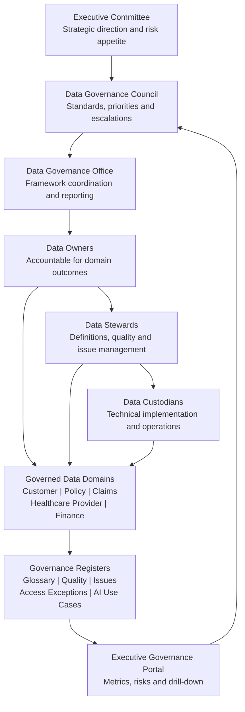
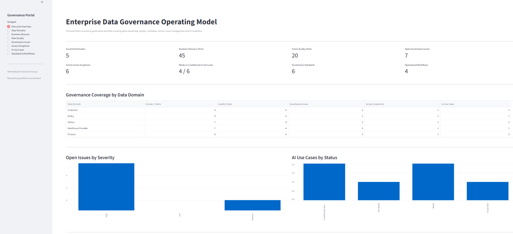
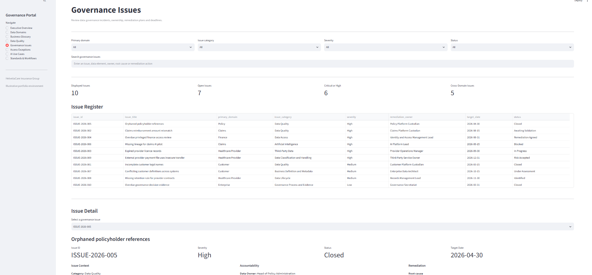
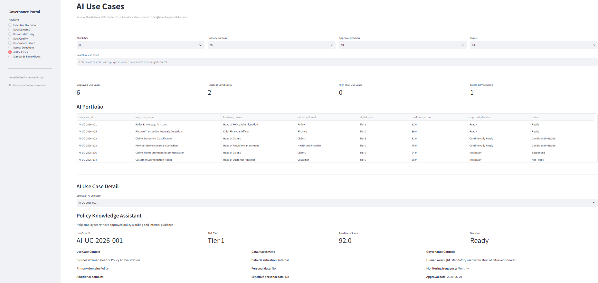
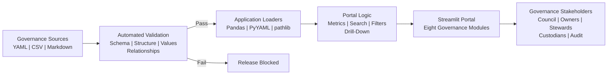

Project status: Active
Last validated: August 2026

# Enterprise Data Governance Operating Model

A portfolio implementation of a DAMA-aligned data-governance operating model for a fictional regulated Swiss health insurer.

The repository demonstrates how governance policy can be translated into clear accountability, governed data domains, controlled registers, operational workflows, automated validation and executive reporting.

> **Portfolio status:** Functional prototype using synthetic data only.  
> **Fictional organisation:** HelvetiaCare Insurance Group.

---

## Business Problem

Regulated organisations often have governance policies but struggle to convert them into repeatable operational controls.

Typical weaknesses include:

- unclear accountability for data decisions;
- inconsistent business definitions;
- undocumented data-quality rules;
- unresolved governance issues;
- unmanaged access exceptions;
- AI initiatives progressing without formal data-readiness assessment;
- fragmented reporting across spreadsheets and documents.

This project addresses those weaknesses through an integrated operating model combining governance documentation, structured registers, automated controls and a Streamlit governance portal.

---

## Who This Project Is For

The operating model is designed for stakeholders such as:

- Data Governance Councils;
- Chief Data Officers and Data Governance Leads;
- Data Owners and Data Stewards;
- Data Custodians and platform teams;
- Risk, Compliance and Internal Audit;
- AI governance and model-risk teams;
- regulated financial-services and insurance organisations.

---

## Governance Scope

The project covers five governed data domains:

| Data domain | Illustrative scope |
|---|---|
| Customer | Customer identity, contact information, consent and segmentation |
| Policy | Insurance contracts, coverage, premiums and policy status |
| Claims | Claim notifications, assessments, decisions and payments |
| Healthcare Provider | Provider identity, credentials, contracts and network status |
| Finance | Payments, accounting records, reconciliations and financial reporting |

Each domain defines:

- a Data Owner;
- a Data Steward;
- Data Custodians;
- business purposes;
- critical data elements;
- authoritative systems;
- principal risks;
- governance controls;
- governance KPIs.

---

## Operating Model



The complete operating-model diagram is available in:

```text
diagrams/governance_operating_model.md
```

---

## Governance Assets

### Framework

The framework defines the mandate and decision structure supporting the operating model.

It includes:

- organisation context;
- data-governance charter;
- governance principles;
- operating model;
- decision rights;
- Data Governance Council terms of reference.

### Roles and Accountability

The repository defines the responsibilities of:

- Data Owners;
- Data Stewards;
- Data Custodians;
- the Data Governance Council;
- the Data Governance Office.

A RACI matrix maps governance activities to accountable and responsible roles.

### Business Glossary

The governed glossary contains 45 synthetic business terms covering:

- definitions;
- data domains;
- ownership;
- authoritative sources;
- sensitivity;
- critical-data-element status;
- quality dimensions;
- related terms;
- approval status.

### Data Quality Register

The data-quality register contains 20 governed rules across the five operational domains.

Each rule defines:

- business meaning;
- quality dimension;
- control logic;
- target percentage;
- warning threshold;
- critical threshold;
- monitoring frequency;
- accountable roles;
- failure severity;
- lifecycle status.

### Governance Issues Register

The issues register captures:

- issue source and category;
- affected data elements;
- severity;
- root cause;
- containment action;
- remediation plan;
- target date;
- review dates;
- ownership;
- related data-quality rules;
- closure status.

### Access Exceptions Register

The access-exception process records:

- requesting user or account;
- system and access level;
- business justification;
- risk assessment;
- data classification;
- segregation-of-duties conflicts;
- external-access indicators;
- compensating controls;
- permanent remediation;
- approval status;
- expiry and review dates.

### AI Use Case Register

The AI governance register assesses:

- business purpose;
- business ownership;
- AI risk tier;
- degree of automation;
- intended users;
- data sources;
- personal and sensitive data;
- external processing;
- dataset version;
- lineage status;
- data-quality status;
- human oversight;
- monitoring frequency;
- readiness score;
- approval decision;
- related governance issues.

---

## Governance Standards

The repository includes six controlled standards:

1. Metadata Standard
2. Data Quality Standard
3. Data Classification Standard
4. Data Access Standard
5. Data Issue Management Standard
6. AI Data Readiness Standard

These standards establish minimum governance expectations and mandatory controls.

---

## Operational Workflows

Four workflows translate governance requirements into repeatable procedures:

1. Glossary Approval
2. Data Issue Management
3. Access Exception
4. AI Use Case Assessment

Each workflow defines roles, decision points, evidence requirements, escalation and closure expectations.

---

## Streamlit Governance Portal

The application provides eight connected pages.

### Executive Overview

Displays enterprise-level indicators including:

- governed domains;
- glossary coverage;
- active data-quality rules;
- open governance issues;
- active access exceptions;
- AI readiness;
- controlled standards;
- operational workflows.

### Data Domains

Provides domain-level drill-down into:

- ownership;
- critical data elements;
- systems;
- risks;
- controls;
- KPIs;
- related standards.

### Business Glossary

Supports filtering and search by:

- domain;
- sensitivity;
- approval status;
- criticality;
- business term;
- definition;
- owner;
- authoritative source.

### Data Quality

Provides:

- rule inventory;
- quality dimensions;
- targets and thresholds;
- severity;
- ownership;
- control logic;
- status filters.

### Governance Issues

Provides:

- issue prioritisation;
- severity and status filters;
- remediation ownership;
- target dates;
- root cause;
- containment actions;
- remediation plans.

### Access Exceptions

Provides:

- risk and status filters;
- external-access indicators;
- expiry dates;
- access justification;
- compensating controls;
- permanent remediation;
- accountable roles.

### AI Use Cases

Provides:

- AI risk classification;
- readiness scores;
- approval decisions;
- data assessments;
- human oversight;
- monitoring requirements;
- accountable roles.

### Standards & Workflows

Renders the complete controlled-document library directly inside the portal.

---

## Portal Demonstration

### Executive Governance Overview

The executive dashboard consolidates governance coverage, active controls, material issues, access exceptions and AI-readiness indicators.



### Governance Issue Management

The issue-management page supports risk-based filtering and provides record-level visibility into ownership, root cause, containment and remediation.



### AI Governance Assessment

The AI-use-case page connects business purpose and risk classification with data readiness, human oversight, approval decisions and accountable roles.



---

## Application Architecture



The detailed architecture and control-flow diagram is available in:

```text
diagrams/governance_portal_architecture.md
```

---

## Controls and Audit Design

The control design is a central feature of the project.

### Structural Controls

CSV files are validated at raw-record level to detect:

- missing fields;
- surplus fields;
- malformed headers;
- duplicate columns;
- invalid file structures.

This prevents parsing libraries from silently ignoring malformed data.

### Schema Controls

Automated tests verify:

- required columns;
- mandatory YAML fields;
- expected domain files;
- expected standards;
- expected workflows;
- expected register structures.

### Controlled-Value Validation

Tests enforce permitted values for fields such as:

- domain;
- severity;
- status;
- sensitivity;
- quality dimension;
- risk level;
- approval decision.

### Referential Controls

Relationships between governance objects are validated, including:

- issues linked to data-quality rules;
- AI use cases linked to governance issues;
- governed domains used consistently across registers;
- accountable roles aligned with domain definitions.

### Application Smoke Tests

Static smoke tests confirm that:

- `app.py` contains valid Python syntax;
- all eight page-rendering functions exist;
- every navigation label is present;
- all governed data sources are referenced.

---

## Technology Stack

| Component | Purpose |
|---|---|
| Python | Application and validation logic |
| Streamlit | Interactive governance portal |
| pandas | Register loading, filtering and metrics |
| PyYAML | Governed domain definitions |
| pytest | Automated control suite |
| Markdown | Framework, standards, roles and workflows |
| Mermaid | Operating-model and architecture diagrams |
| Git and GitHub | Version control and portfolio publication |

---

## Repository Structure

```text
enterprise-data-governance-operating-model/
│
├── app.py
├── README.md
├── requirements.txt
│
├── data/
│   ├── access_exceptions.csv
│   ├── ai_use_cases.csv
│   ├── data_quality_rules.csv
│   └── governance_issues.csv
│
├── diagrams/
│   ├── governance_operating_model.md
│   └── governance_portal_architecture.md
│
├── domains/
│   ├── claims_domain.yaml
│   ├── customer_domain.yaml
│   ├── finance_domain.yaml
│   ├── policy_domain.yaml
│   └── provider_domain.yaml
│
├── framework/
│   ├── data_governance_charter.md
│   ├── decision_rights.md
│   ├── governance_council_terms.md
│   ├── governance_principles.md
│   ├── operating_model.md
│   └── organisation_context.md
│
├── glossary/
│   └── business_glossary.csv
│
├── roles/
│   ├── data_custodian.md
│   ├── data_owner.md
│   ├── data_steward.md
│   └── raci_matrix.csv
│
├── standards/
│   ├── ai_data_readiness_standard.md
│   ├── data_access_standard.md
│   ├── data_classification_standard.md
│   ├── data_issue_management_standard.md
│   ├── data_quality_standard.md
│   └── metadata_standard.md
│
├── tests/
│   ├── test_app_smoke.py
│   └── test_governance_data.py
│
└── workflows/
    ├── access_exception.md
    ├── ai_use_case_assessment.md
    ├── data_issue_management.md
    └── glossary_approval.md
```

---

## Installation

### 1. Clone the repository

```powershell
git clone <repository-url>
cd enterprise-data-governance-operating-model
```

### 2. Create a virtual environment

```powershell
python -m venv .venv
```

### 3. Activate it in Windows PowerShell

```powershell
.venv\Scripts\Activate.ps1
```

### 4. Install the dependencies

```powershell
python -m pip install --upgrade pip
python -m pip install -r requirements.txt
```

---

## Run the Automated Controls

```powershell
python -m pytest -v
```

The application should only be treated as release-ready when the complete test suite passes.

---

## Run the Governance Portal

```powershell
python -m streamlit run app.py
```

Streamlit will display the local application address in the terminal.

---

## Example Review Scenarios

A reviewer can use the portal to:

1. identify the most severe open governance issues;
2. inspect the accountable Data Owner and Data Steward;
3. trace an issue to a related quality rule;
4. assess an access exception and its compensating controls;
5. review an AI use case’s readiness score and human oversight;
6. inspect the relevant governance standard or workflow;
7. review enterprise metrics through the executive dashboard.

---

## Design Decisions

### Human-readable source files

Governance assets are stored in YAML, CSV and Markdown so that business and governance users can review them without specialist database tools.

### Validation before visualisation

The test suite acts as a quality gate. Malformed or inconsistent governance records should be corrected before they are displayed in the portal.

### Accountability built into every register

Governance records identify responsible Data Owners, Data Stewards and Data Custodians rather than documenting issues without clear ownership.

### AI governance integrated with data governance

AI use cases are not maintained as an isolated technology inventory. They are connected to data domains, ownership, quality, lineage, risk and issue management.

### Synthetic data only

The repository contains no real customer, patient, employee, provider or insurer data.

---

## Limitations

This is a portfolio prototype rather than a production governance platform.

Current limitations include:

- file-based storage rather than a governed database;
- no authentication or role-based access control;
- no workflow engine or automated approval routing;
- no connection to enterprise metadata platforms;
- no live data-quality execution engine;
- no API integration with operational systems;
- no immutable audit-log database;
- no production deployment configuration.

---

## Roadmap

Potential production extensions include:

- PostgreSQL-backed governance registers;
- role-based access control;
- approval workflows and notifications;
- integration with Microsoft Purview, Collibra or Informatica;
- automated data-quality execution;
- API-based metadata ingestion;
- immutable decision and audit logging;
- issue ageing and SLA reporting;
- model-risk and EU AI Act control mapping;
- CI/CD validation through GitHub Actions;
- cloud deployment.

---

## Portfolio Disclaimer

HelvetiaCare Insurance Group is fictional.

All data, systems, people, organisational roles, governance issues, access exceptions and AI use cases in this repository are synthetic and created exclusively for demonstration and portfolio purposes.
