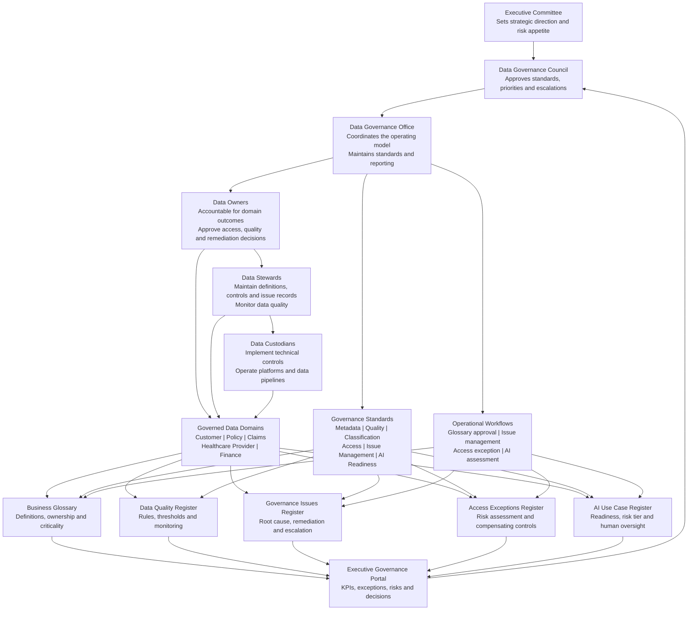

# Enterprise Data Governance Operating Model

This diagram shows how HelvetiaCare Insurance Group translates enterprise data-governance policy into accountable domain-level execution, operational controls and executive oversight.

## Accountability model

| Governance layer | Primary responsibility |
|---|---|
| Executive Committee | Sets strategic direction and enterprise risk appetite |
| Data Governance Council | Approves standards, resolves escalations and prioritises remediation |
| Data Governance Office | Coordinates the framework, reporting and governance processes |
| Data Owners | Remain accountable for data outcomes and material decisions |
| Data Stewards | Maintain definitions, controls, quality rules and issue records |
| Data Custodians | Implement and operate technical data controls |
| Governed domains | Apply governance requirements to business data assets |

> This operating model is fictional and uses synthetic portfolio data only.