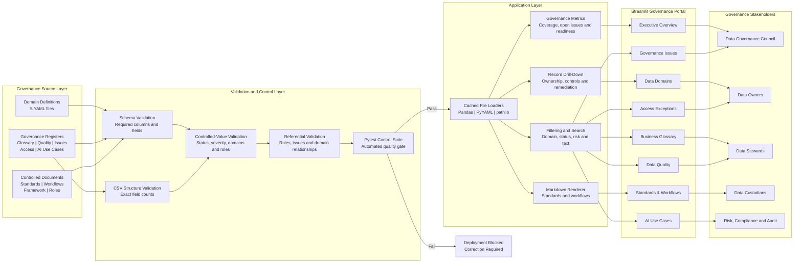

# Governance Portal Architecture

The portal separates governance content, validation controls and presentation logic. Source registers remain human-readable, while automated tests prevent malformed or inconsistent records from reaching the dashboard.

## Architectural principles

| Principle | Implementation |
|---|---|
| Separation of concerns | Governance definitions, validation rules and presentation logic are maintained separately |
| Human-readable governance assets | YAML, CSV and Markdown files can be reviewed without specialist software |
| Automated quality gate | Pytest validates structures, controlled values and relationships before release |
| No silent schema failure | Raw CSV rows are checked for missing or surplus fields |
| Traceable accountability | Registers connect decisions to Data Owners, Data Stewards and Data Custodians |
| Controlled AI readiness | AI use cases include risk tier, data readiness, human oversight and approval status |
| Synthetic portfolio environment | No real customer, patient, employee or insurer information is used |

> This architecture is an illustrative portfolio implementation for the fictional HelvetiaCare Insurance Group.