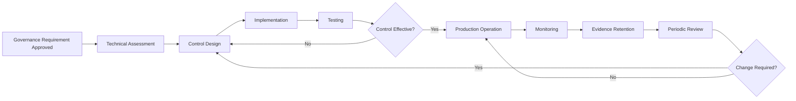

# Data Custodian Role Profile

## 1. Purpose

The Data Custodian is responsible for implementing and operating the technical controls required to store, process, protect, integrate and maintain enterprise data.

The role translates approved business and governance requirements into technical configurations, system controls, monitoring activities and operational evidence.

The Data Custodian supports the Data Owner and Data Steward but does not determine the business meaning, ownership or permitted purpose of data.

---

## 2. Role Positioning

The Data Custodian operates within the federated Data Governance model of HelvetiaCare Insurance Group.

The Data Custodian:

- Manages data within assigned systems or platforms
- Implements approved governance controls
- Maintains technical metadata
- Supports data-quality monitoring
- Operates access and security controls
- Supports data integration and transfer
- Produces evidence that technical controls operate
- Coordinates technical remediation
- Escalates technical risks and control failures

The role may be performed by:

- Application owners
- Platform managers
- Database administrators
- Data engineers
- Integration specialists
- Infrastructure teams
- Cloud platform teams
- Security administrators
- External service providers

---

## 3. Appointment

A Data Custodian should:

- Understand the relevant systems and data platforms
- Understand system architecture and integrations
- Be able to implement technical controls
- Understand access-management principles
- Understand data-quality validation
- Maintain reliable technical documentation
- Produce evidence of control execution
- Work effectively with business and control stakeholders
- Escalate technical limitations and risks
- Support audit and assurance activities

The relevant technology or platform owner appoints the Data Custodian in consultation with the Data Owner and Data Steward.

---

## 4. Core Responsibilities

The Data Custodian is responsible for the following areas.

### 4.1 Data storage and processing

The Data Custodian:

- Operates approved data-storage platforms
- Maintains technical availability
- Supports reliable data processing
- Monitors system performance
- Implements approved retention configurations
- Supports backup and recovery
- Protects data from unauthorised technical alteration
- Maintains processing records where required

### 4.2 Access-control implementation

The Data Custodian:

- Implements approved access decisions
- Configures role-based access controls
- Maintains privileged-access controls
- Supports periodic access reviews
- Removes or changes access when instructed
- Retains access-control evidence
- Escalates inappropriate or excessive access
- Supports segregation-of-duties controls

The Data Custodian implements access decisions but does not independently determine the legitimate business purpose.

### 4.3 Technical metadata

The Data Custodian:

- Maintains system and technical metadata
- Documents data structures
- Records field names and formats
- Identifies source and target systems
- Documents interfaces and transformations
- Maintains lineage information where available
- Supports mapping between technical fields and business terms
- Escalates metadata gaps

### 4.4 Data integration

The Data Custodian:

- Implements approved system interfaces
- Maintains data-transfer controls
- Monitors interface failures
- Supports reconciliation between source and target systems
- Documents transformation logic
- Protects data during transfer
- Supports dependency analysis
- Coordinates remediation of integration failures

### 4.5 Data-quality controls

The Data Custodian:

- Implements approved validation rules
- Executes automated data-quality checks
- Produces quality-control results
- Monitors technical threshold failures
- Identifies affected records
- Supports root-cause analysis
- Implements approved remediation
- Retains control-execution evidence

The Data Custodian does not independently approve business quality thresholds.

### 4.6 Security and protection

The Data Custodian:

- Applies technical protection according to data classification
- Supports encryption requirements
- Implements system logging
- Protects credentials and privileged accounts
- Supports vulnerability remediation
- Monitors technical security events
- Escalates suspected unauthorised access
- Coordinates with Information Security

### 4.7 Data lifecycle

The Data Custodian:

- Implements retention configurations
- Supports data archiving
- Executes approved deletion or disposal activities
- Maintains evidence of deletion
- Prevents unauthorised retention
- Supports legal or regulatory holds
- Documents lifecycle processes
- Escalates conflicting retention requirements

### 4.8 Backup and recovery

The Data Custodian:

- Maintains backup procedures
- Monitors backup completion
- Tests restoration processes
- Documents recovery capabilities
- Retains testing evidence
- Escalates failed backups
- Supports business continuity requirements
- Coordinates recovery after incidents

### 4.9 Technical issue management

The Data Custodian:

- Investigates system-related data issues
- Identifies technical root causes
- Estimates remediation effort
- Implements approved fixes
- Documents technical changes
- Provides validation evidence
- Escalates unresolved technical constraints
- Supports closure of governance issues

### 4.10 Audit and control evidence

The Data Custodian provides evidence including:

- Access logs
- System configuration records
- Validation results
- Reconciliation reports
- Backup reports
- Recovery-test records
- Interface monitoring results
- Change records
- Incident records
- Remediation evidence
- Technical metadata
- Control-execution timestamps

---

## 5. Operational Activities

The Data Custodian performs or coordinates the following recurring activities.

### Daily or event-driven activities

- Monitor system and interface failures
- Review failed validation controls
- Respond to access-change requests
- Investigate technical data issues
- Escalate security or availability concerns
- Support urgent remediation
- Retain evidence of material control execution

### Weekly activities

- Review unresolved technical issues
- Review failed data transfers
- Monitor outstanding access actions
- Coordinate with Data Stewards
- Review technical remediation progress
- Confirm scheduled control execution

### Monthly activities

- Provide data-quality control results
- Report recurring technical failures
- Review technical metadata changes
- Provide evidence for governance reporting
- Review open remediation actions
- Participate in the Domain Governance Forum when required

### Quarterly activities

- Support access reviews
- Review technical control effectiveness
- Review integration and reconciliation controls
- Review critical data-element implementation
- Support retention and lifecycle reviews
- Test selected recovery procedures

### Annual activities

- Support governance maturity assessments
- Review technical role assignments
- Review system documentation
- Support control-design reviews
- Review recovery capabilities
- Support standards and procedure updates

---

## 6. Decision Rights

The Data Custodian may:

- Implement approved technical controls
- Configure system validation rules
- Recommend technical control improvements
- Identify technical risks
- Propose remediation options
- Suspend a failed technical process where authorised
- Request clarification of governance requirements
- Escalate infeasible or conflicting requirements
- Produce and retain technical evidence
- Recommend changes to control frequency or implementation

The Data Custodian may not independently:

- Approve business definitions
- Assign Data Ownership
- Approve critical data elements
- Approve data-quality thresholds
- Authorise material new data usage
- Accept material business risk
- Approve governance exceptions
- Grant access without authorised approval
- Close material governance issues without validation
- Change enterprise governance standards

---

## 7. Technical Control Lifecycle

The Data Custodian supports the following technical control lifecycle:

For each control, the Data Custodian ensures that the following information exists:

- Control identifier
- Governance requirement
- Affected system
- Affected data element
- Control description
- Control type
- Control frequency
- Technical owner
- Evidence produced
- Failure threshold
- Escalation route
- Last execution date
- Last review date
- Current status

---

## 8. Control Types

### Preventive controls

Preventive controls aim to stop an error or unauthorised action before it occurs.

Examples include:

- Mandatory field validation
- Approved reference values
- Access restrictions
- Segregation of duties
- Input format validation
- Duplicate prevention
- Workflow approval requirements

### Detective controls

Detective controls identify errors or control failures after they occur.

Examples include:

- Data-quality monitoring
- Duplicate-record reports
- Reconciliation controls
- Access-log monitoring
- Exception reports
- Failed-interface alerts
- Metadata-completeness checks

### Corrective controls

Corrective controls support remediation after an issue is identified.

Examples include:

- Data correction workflows
- Record reprocessing
- Access revocation
- Configuration correction
- Interface replay
- Backup restoration
- Root-cause remediation

---

## 9. Technical Evidence Requirements

Technical evidence must be:

- Attributable to a named system, process or role
- Dated and time-stamped
- Complete
- Protected from unauthorised alteration
- Retained for the required period
- Accessible for governance review
- Sufficient to demonstrate control execution
- Linked to the relevant control or issue

Examples include:

| Evidence type | Example |
|---|---|
| Validation result | Report of failed and passed quality rules |
| Access evidence | Approved request and implemented role |
| Reconciliation report | Comparison of source and target totals |
| Backup evidence | Successful backup completion log |
| Recovery evidence | Documented restoration-test result |
| Change evidence | Approved change record and deployment result |
| Interface evidence | Transfer log and exception report |
| Security evidence | Privileged-access review record |
| Remediation evidence | Before-and-after validation results |

---

## 10. Access-Control Responsibilities

The Data Custodian supports the access-control lifecycle below.

### Request

The requester identifies:

- Data required
- Business purpose
- Required access level
- Duration
- Relevant system
- Authorising manager or sponsor

### Approval

The appropriate business authority approves or rejects the request.

Additional review may be required from:

- Data Owner
- Data Protection
- Information Security
- Compliance
- Risk Management

### Implementation

The Data Custodian:

- Verifies the approval
- Configures the appropriate access
- Applies the least-privilege principle
- Records implementation
- Confirms completion

### Review

The Data Custodian supports periodic review of:

- Active users
- Privileged users
- Inactive accounts
- Temporary access
- Conflicting roles
- Unused permissions

### Revocation

The Data Custodian removes access when:

- Employment or assignment ends
- The business purpose no longer exists
- The approval expires
- A manager requests removal
- A security concern is identified
- The access is found to be inappropriate

---

## 11. Data-Quality Control Responsibilities

The Data Custodian supports implementation of data-quality rules approved by the Data Owner.

Each implemented rule should include:

| Field | Description |
|---|---|
| Rule ID | Unique control identifier |
| Data element | Element being tested |
| Quality dimension | Completeness, validity, accuracy, consistency, timeliness or uniqueness |
| Rule logic | Technical validation logic |
| Threshold | Approved tolerance |
| Frequency | Daily, weekly, monthly or event-driven |
| System | Platform where the rule operates |
| Technical owner | Responsible Data Custodian |
| Business owner | Responsible Data Owner |
| Steward | Responsible Data Steward |
| Failure action | Required response |
| Evidence | Output retained |
| Status | Draft, active, suspended or retired |

---

## 12. Change Management Responsibilities

The Data Custodian supports controlled changes to systems and data processes.

Before implementation, the Data Custodian should assess:

- Affected data domains
- Critical data elements
- Data-quality implications
- Metadata changes
- Access-control implications
- Integration dependencies
- Retention requirements
- Reporting impacts
- Analytics and AI impacts
- Testing requirements
- Rollback arrangements

Following implementation, the Data Custodian should retain:

- Approved change record
- Test evidence
- Deployment evidence
- Updated technical documentation
- Updated metadata
- Validation results
- Known limitations
- Outstanding remediation actions

---

## 13. Incident Responsibilities

Where a technical incident affects data, the Data Custodian:

1. Records the incident.
2. Identifies affected systems and data.
3. Supports containment.
4. Preserves relevant evidence.
5. Notifies the Data Steward and system owner.
6. Coordinates with Information Security where required.
7. Assesses data integrity and availability.
8. Supports business-impact assessment.
9. Implements approved remediation.
10. Produces validation evidence.
11. Supports post-incident review.
12. Updates controls where necessary.

Material incidents must be escalated according to the relevant incident-management process.

---

## 14. Key Relationships

| Stakeholder | Nature of relationship |
|---|---|
| Data Owner | Approved business requirements and escalation |
| Data Steward | Operational coordination and issue management |
| Chief Data Office | Governance framework and reporting |
| Data Governance Council | Material technical constraints and escalations |
| Application Owner | System accountability |
| Data Architecture | Data structures, lineage and integration |
| Enterprise Architecture | Technology standards and dependencies |
| Data and AI Centre of Excellence | Tooling, automation and AI enablement |
| Information Security | Security controls and incidents |
| Data Protection | Personal-data handling requirements |
| Compliance | Regulatory control requirements |
| Risk Management | Risk assessment and remediation |
| Change Management | Controlled technical implementation |
| Internal Audit | Evidence and assurance |
| External service providers | Outsourced technical processing |

---

## 15. Required Competencies

A Data Custodian should demonstrate:

- Strong understanding of assigned systems or platforms
- Technical control implementation
- Access-management knowledge
- Data-quality validation knowledge
- Metadata and lineage awareness
- Data integration knowledge
- Security and protection awareness
- Incident-management capability
- Change-management discipline
- Documentation skills
- Root-cause analysis
- Stakeholder communication
- Evidence-management discipline
- Ability to translate business requirements into technical controls

---

## 16. Suggested Technical Skills

Depending on the assigned systems, relevant skills may include:

- SQL
- Python
- Data-quality tools
- Metadata platforms
- Data catalogues
- ETL and integration tools
- APIs
- Cloud platforms
- Identity and access management
- Logging and monitoring tools
- Database administration
- Workflow automation
- Version control
- Test automation
- Reporting and dashboard tools

The role does not require expertise in every technology listed above.

---

## 17. Performance Measures

Data Custodian effectiveness may be measured through:

- Percentage of controls executed on schedule
- Number of unresolved control failures
- Percentage of access actions completed within target
- Percentage of interfaces successfully processed
- Number of failed reconciliations
- Percentage of technical metadata completed
- Number of overdue remediation actions
- Backup success rate
- Recovery-test success rate
- Number of unauthorised access events
- Average technical issue-resolution time
- Completeness of control evidence
- Timeliness of technical documentation updates

---

## 18. Evidence of Effective Custodianship

Evidence may include:

- System inventories
- Technical metadata
- Access-control records
- Validation-rule configurations
- Quality-control results
- Interface monitoring reports
- Reconciliation reports
- Backup records
- Recovery-test results
- Change records
- Incident records
- Remediation evidence
- Security logs
- Updated technical documentation

---

## 19. Role Boundaries

The Data Custodian does not:

- Own the business meaning of data
- Replace the accountability of the Data Owner
- Replace the coordination role of the Data Steward
- Approve business usage independently
- Accept material business risk
- Define quality thresholds without business approval
- Grant access without authorised approval
- Replace Information Security or Data Protection
- Treat technical availability as proof of data quality
- Close material governance issues without sufficient validation
- Change governance requirements without approval

---

## 20. Example Role Assignments

| Data domain | Example Data Custodians |
|---|---|
| Customer | CRM Platform Manager, Customer Master Data Manager |
| Policy | Policy Administration Platform Manager, Product Configuration Manager |
| Claims | Claims Platform Manager, Claims Technology Team |
| Healthcare Provider | Provider Management Platform Manager, Contract System Owner |
| Finance | General Ledger Platform Owner, Finance Systems Manager |

These assignments are illustrative and relate only to the fictional HelvetiaCare Insurance Group.

---

## 21. Appointment Record

| Field | Description |
|---|---|
| Assigned system or platform | Technical area of responsibility |
| Assigned data domains | Relevant enterprise data domains |
| Appointed Data Custodian | Name and role |
| Effective date | Date the appointment becomes effective |
| Appointed by | Technology or platform owner |
| Scope | Defined technical responsibilities |
| Supported Data Owner | Relevant accountable business role |
| Supported Data Steward | Relevant operational governance role |
| Review date | Date the appointment is reviewed |
| Status | Proposed, active, temporary or retired |

---

## 22. Document Control

| Field | Value |
|---|---|
| Document owner | Chief Data Office |
| Approval body | Data Governance Council |
| Version | 1.0 |
| Status | Illustrative portfolio version |
| Review frequency | Annual |
| Next review | To be determined |

---

This document forms part of a fictional portfolio project and does not represent the role structure of a real insurance organisation.