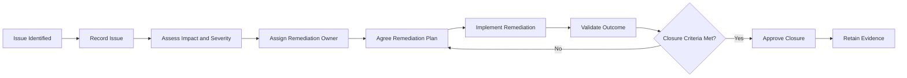

# Data Steward Role Profile

## 1. Purpose

The Data Steward coordinates the operational implementation of Data Governance within an assigned enterprise data domain.

The role ensures that governance requirements are translated into practical activities, including:

- Maintaining business definitions
- Coordinating metadata
- Monitoring data quality
- Managing data issues
- Supporting remediation
- Preparing governance reporting
- Maintaining governance evidence
- Supporting business and technology change

The Data Steward acts as the principal operational link between the Data Owner, business teams, Data Custodians, control functions and data consumers.

---

## 2. Role Positioning

The Data Steward operates within the federated Data Governance model of HelvetiaCare Insurance Group.

The Data Steward:

- Supports the accountable Data Owner
- Coordinates governance activities across the domain
- Maintains core governance artefacts
- Monitors whether governance requirements are applied
- Facilitates issue resolution
- Prepares decisions for approval
- Escalates matters that exceed operational authority
- Promotes consistent governance practices

The Data Steward does not replace the accountability of the Data Owner.

---

## 3. Appointment

A Data Steward should:

- Understand the relevant business domain
- Understand the principal data flows and systems
- Be able to work across business and technology teams
- Possess sufficient authority to coordinate remediation
- Understand data-quality concepts
- Be able to document governance decisions and evidence
- Communicate complex topics clearly
- Apply enterprise standards pragmatically
- Escalate issues diplomatically and effectively

The Data Owner appoints the Data Steward in consultation with the Chief Data Office.

---

## 4. Core Responsibilities

The Data Steward is responsible for the following areas.

### 4.1 Business glossary

The Data Steward:

- Creates and maintains business-term records
- Coordinates definition development
- Identifies conflicting definitions
- Consults business subject-matter experts
- Prepares definitions for approval
- Records approval status
- Maintains definition history
- Coordinates retirement or replacement of terms
- Promotes use of approved terminology

### 4.2 Metadata management

The Data Steward:

- Maintains required business metadata
- Identifies authoritative data sources
- Records data ownership and stewardship
- Documents data classifications
- Links terms to systems and processes
- Identifies metadata gaps
- Coordinates metadata remediation
- Supports metadata-completeness reporting

### 4.3 Critical data elements

The Data Steward:

- Proposes critical data elements
- Documents the business rationale for criticality
- Coordinates review with business experts
- Records ownership and stewardship
- Defines proposed quality dimensions
- Coordinates control requirements
- Maintains the critical data-element inventory
- Prepares changes for Data Owner approval

### 4.4 Data quality

The Data Steward:

- Defines proposed business quality requirements
- Coordinates development of quality rules
- Reviews quality results
- Identifies threshold breaches
- Investigates recurring failures
- Coordinates remediation actions
- Prepares quality reporting
- Escalates material or persistent quality concerns
- Maintains evidence of quality reviews

### 4.5 Data issue management

The Data Steward:

- Records identified data issues
- Coordinates initial assessment
- Proposes issue severity
- Identifies affected data elements
- Assigns or recommends remediation owners
- Tracks target resolution dates
- Monitors issue status
- Escalates overdue or high-risk issues
- Coordinates validation of remediation
- Prepares issues for closure approval

### 4.6 Governance reporting

The Data Steward:

- Prepares domain governance KPIs
- Maintains the domain issue register
- Tracks remediation actions
- Reports ownership and metadata coverage
- Reports quality-rule performance
- Identifies governance trends
- Prepares materials for the Domain Governance Forum
- Supports reporting to the Data Governance Council

### 4.7 Governance decisions

The Data Steward:

- Identifies decisions required
- Coordinates stakeholder consultation
- Prepares decision papers
- Documents available options
- Records recommendations
- Maintains the decision log
- Tracks decision conditions
- Monitors implementation actions
- Retains supporting evidence

### 4.8 Governance exceptions

The Data Steward:

- Records exception requests
- Confirms the affected requirement
- Documents the business rationale
- Coordinates risk assessment
- Identifies compensating controls
- Tracks approval status
- Records expiry dates
- Monitors remediation actions
- Escalates expired or repeatedly renewed exceptions

### 4.9 Business and technology change

The Data Steward supports change initiatives by:

- Identifying affected data assets
- Confirming ownership
- Assessing metadata impacts
- Identifying critical data elements
- Defining quality requirements
- Reviewing data migration implications
- Supporting acceptance criteria
- Confirming governance evidence before implementation
- Escalating unresolved governance gaps

### 4.10 Analytics and artificial intelligence

The Data Steward supports analytics and AI use cases by:

- Identifying relevant data sources
- Confirming ownership
- Documenting data limitations
- Assessing metadata completeness
- Reviewing quality results
- Supporting data-lineage documentation
- Identifying sensitive data
- Supporting AI data-readiness assessments
- Escalating material risks or unclear usage

---

## 5. Operational Activities

The Data Steward performs or coordinates the following recurring activities.

### Daily or event-driven activities

- Record newly identified data issues
- Respond to governance questions
- Support definition and metadata requests
- Coordinate urgent quality failures
- Review new exception requests
- Support material change initiatives
- Escalate high-severity concerns

### Weekly activities

- Review open data issues
- Follow up on remediation actions
- Monitor overdue items
- Review glossary and metadata changes
- Coordinate with Data Custodians
- Prepare decisions requiring Data Owner review

### Monthly activities

- Prepare governance KPI reporting
- Facilitate the Domain Governance Forum
- Review data-quality performance
- Review high-severity and overdue issues
- Update the governance action log
- Review open exceptions
- Report material concerns to the Data Owner

### Quarterly activities

- Review critical data elements
- Review quality rules and thresholds
- Review metadata completeness
- Support access-review activities
- Assess recurring issue themes
- Recommend governance improvements

### Annual activities

- Support the governance maturity assessment
- Review domain ownership and stewardship
- Review standards and procedures
- Support the Data Governance Charter review
- Develop the domain improvement plan
- Review training and awareness requirements

---

## 6. Decision Rights

The Data Steward may:

- Create and update draft business terms
- Propose business definitions
- Propose critical data elements
- Propose data-quality rules
- Record and assess data issues
- Assign operational remediation actions where authorised
- Request supporting evidence
- Coordinate stakeholder consultation
- Recommend issue severity
- Recommend issue closure
- Prepare governance exception requests
- Escalate matters to the Data Owner

The Data Steward may not independently:

- Approve material business definitions
- Approve critical data elements
- Accept material data risk
- Approve high-risk governance exceptions
- Approve material data usage
- Close high-severity issues without Data Owner approval
- Override control-function requirements
- Change enterprise governance standards

---

## 7. Issue Severity Assessment

The Data Steward coordinates issue severity assessment using the following criteria.

### Low severity

A low-severity issue:

- Has limited operational impact
- Affects a small number of records
- Does not affect customers materially
- Does not affect regulatory or financial reporting
- Can be resolved through routine operations

### Medium severity

A medium-severity issue:

- Affects an important process or system
- Has measurable operational impact
- May affect several teams or data consumers
- Requires coordinated remediation
- May create moderate reporting or customer risk

### High severity

A high-severity issue:

- Affects critical data
- Creates material customer, regulatory or financial risk
- Affects multiple systems or domains
- Could compromise analytics or AI outputs
- Requires senior management attention
- Requires urgent remediation or formal risk acceptance

The Data Owner approves high-severity classification.

---

## 8. Data Issue Lifecycle

The Data Steward coordinates the issue lifecycle below.

For each issue, the Data Steward ensures that the following information exists:

- Issue identifier
- Data domain
- Affected data element
- Issue description
- Business impact
- Severity
- Root cause
- Responsible remediation owner
- Accountable Data Owner
- Target resolution date
- Current status
- Remediation plan
- Validation result
- Closure evidence

---

## 9. Governance Artefacts Maintained

The Data Steward maintains or coordinates the following artefacts:

- Business glossary
- Domain metadata register
- Critical data-element inventory
- Data-quality rule register
- Data issue register
- Governance action log
- Decision log
- Governance exception register
- Domain KPI dashboard
- Domain maturity action plan
- Governance meeting records
- Remediation evidence
- AI data-readiness records

Each artefact must remain:

- Current
- Complete
- Traceable
- Version-controlled
- Assigned to a named owner
- Available for governance review and audit

---

## 10. Key Relationships

| Stakeholder | Nature of relationship |
|---|---|
| Data Owner | Approval, accountability and escalation |
| Chief Data Office | Framework guidance and enterprise reporting |
| Data Governance Council | Escalated decisions and material issues |
| Data Custodian | Technical controls, systems and evidence |
| Business subject-matter experts | Definitions and business requirements |
| Data Architecture | Data structures, lineage and integration |
| Data and AI Centre of Excellence | Tooling, automation and AI readiness |
| Data Protection | Personal-data requirements |
| Compliance | Regulatory interpretation |
| Information Security | Security classification and access controls |
| Risk Management | Risk assessment and escalation |
| Technology teams | Implementation and remediation |
| Data consumers | Data limitations and appropriate use |

---

## 11. Domain Governance Forum Responsibilities

The Data Steward coordinates the operational preparation of the Domain Governance Forum.

Before each meeting, the Data Steward:

- Prepares the agenda
- Updates governance KPIs
- Reviews open issues
- Identifies overdue actions
- Prepares decision papers
- Updates the exception register
- Identifies escalation items
- Distributes meeting materials

During the meeting, the Data Steward:

- Presents governance performance
- Explains material issues
- Records decisions
- Confirms action owners
- Records target dates
- Identifies matters requiring escalation

After the meeting, the Data Steward:

- Issues meeting records
- Updates the decision log
- Updates the action register
- Tracks remediation progress
- Retains supporting evidence
- Escalates unresolved matters

---

## 12. Required Competencies

A Data Steward should demonstrate:

- Strong understanding of the assigned business domain
- Data Governance knowledge
- Data-quality knowledge
- Metadata and glossary management skills
- Process and control awareness
- Analytical thinking
- Issue-management capability
- Stakeholder coordination
- Diplomatic communication
- Documentation discipline
- Ability to interpret governance requirements
- Ability to translate requirements into practical actions
- Confidence escalating material concerns
- Familiarity with analytics and AI data risks

---

## 13. Suggested Technical Skills

A Data Steward does not need to be a software developer but should be comfortable using:

- Data catalogues
- Business glossaries
- Data-quality dashboards
- Issue-management tools
- Workflow tools
- Spreadsheet and reporting tools
- SQL for basic data investigation
- Data-visualisation tools
- Metadata repositories
- Collaboration platforms
- Governance reporting tools

For more advanced stewardship roles, familiarity with Python, APIs and workflow automation may support scalable governance implementation.

---

## 14. Performance Measures

Data Steward effectiveness may be measured through:

- Percentage of glossary terms with complete metadata
- Percentage of critical data elements with approved definitions
- Percentage of quality rules executed on schedule
- Number of overdue data issues
- Average issue-resolution time
- Percentage of remediation actions completed within target
- Number of expired governance exceptions
- Timeliness of governance reporting
- Completeness of decision records
- Domain governance maturity improvement
- Stakeholder feedback
- Completion of required training

---

## 15. Evidence of Effective Stewardship

Evidence may include:

- Updated glossary records
- Approved definition proposals
- Critical data-element records
- Quality-rule documentation
- Data-quality review reports
- Issue assessments
- Remediation tracking
- Governance meeting materials
- Decision papers
- Exception records
- KPI reports
- Maturity action plans
- AI data-readiness assessments
- Audit-trail records

---

## 16. Role Boundaries

The Data Steward does not:

- Replace the accountability of the Data Owner
- Approve material risk acceptance
- Operate every technical control
- Own all data-remediation activity
- Replace Data Protection, Compliance or Information Security
- Make enterprise policy decisions independently
- Approve material new data usage without authority
- Assume that documentation alone proves effective governance
- Close material issues without sufficient evidence
- Alter business definitions without approval

---

## 17. Example Role Assignments

| Data domain | Data Steward |
|---|---|
| Customer | Customer Data Steward |
| Policy | Policy Data Steward |
| Claims | Claims Data Steward |
| Healthcare Provider | Provider Data Steward |
| Finance | Finance Data Steward |

These assignments are illustrative and relate only to the fictional HelvetiaCare Insurance Group.

---

## 18. Appointment Record

| Field | Description |
|---|---|
| Data domain | Assigned enterprise data domain |
| Appointed Data Steward | Name and role |
| Effective date | Date the appointment becomes effective |
| Appointed by | Relevant Data Owner |
| Scope | Defined stewardship responsibilities |
| Delegated authority | Documented operational authority |
| Supporting Data Custodians | Relevant technical roles |
| Review date | Date the appointment is reviewed |
| Status | Proposed, active, temporary or retired |

---

## 19. Document Control

| Field | Value |
|---|---|
| Document owner | Chief Data Office |
| Approval body | Data Governance Council |
| Version | 1.0 |
| Status | Illustrative portfolio version |
| Review frequency | Annual |
| Next review | To be determined |

---

This document forms part of a fictional portfolio project and does not represent the role structure of a real insurance organisation.