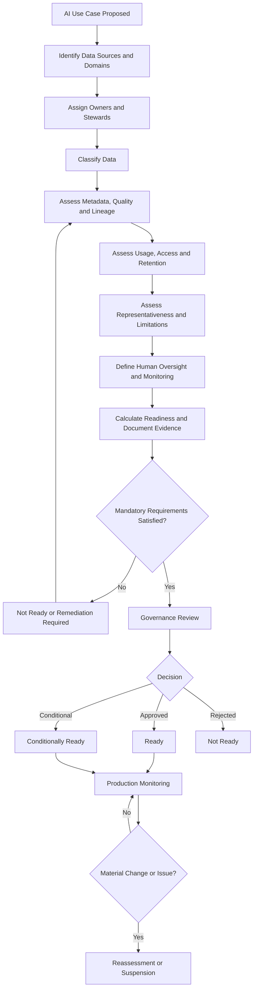

# AI Data Readiness Standard

## 1. Purpose

This standard defines the minimum Data Governance requirements that must be satisfied before enterprise data is approved for use in a material artificial intelligence use case at HelvetiaCare Insurance Group.

The standard ensures that AI initiatives use data that is:

- Clearly owned
- Appropriately classified
- Sufficiently documented
- Fit for the intended purpose
- Measurably reliable
- Traceable to approved sources
- Used under authorised conditions
- Protected throughout its lifecycle
- Supported by appropriate human oversight
- Monitored for material data-related risks

The standard applies the enterprise Data Governance framework to artificial intelligence without transferring business accountability to technology or model-development teams.

---

## 2. Scope

This standard applies to data used in:

- Generative AI
- Predictive models
- Classification models
- Recommendation systems
- Natural-language processing
- Document extraction
- Fraud-detection models
- Claims-support tools
- Customer-service assistants
- Decision-support systems
- Automated workflows using AI outputs
- Model training
- Model evaluation
- Retrieval-augmented generation
- Prompt-grounding datasets
- Knowledge bases
- Vector databases
- Fine-tuning datasets
- External AI services
- Third-party AI solutions

The standard applies whether the AI capability is:

- Developed internally
- Procured from a supplier
- Hosted in the cloud
- Embedded in an enterprise application
- Used experimentally
- Used in production
- Customer-facing
- Employee-facing
- Fully automated
- Human-supervised

---

## 3. Objectives

The AI Data Readiness Standard aims to:

1. Establish clear accountability for data used in AI.
2. Confirm that data is suitable for the intended use case.
3. Identify and document material data limitations.
4. Protect Personal, Sensitive Personal and Restricted data.
5. Ensure that data sources and transformations are traceable.
6. Assess data quality and representativeness.
7. Prevent unauthorised reuse of enterprise data.
8. Support explainability and auditability.
9. Define minimum approval requirements.
10. Support responsible deployment and monitoring.
11. Enable proportionate governance according to use-case risk.
12. Produce evidence for governance review and assurance.

---

## 4. AI Data Governance Principles

### 4.1 Business accountability remains explicit

Every AI use case must have:

- A named business owner
- An accountable Data Owner for each material data domain
- A responsible Data Steward
- Identified technical custodians
- A defined decision authority

AI development teams do not automatically own the business data they use.

### 4.2 Data must be fit for the intended purpose

Data that is suitable for one purpose may be unsuitable for another.

Readiness must be assessed against:

- The intended AI task
- The affected business process
- The decisions influenced
- The population affected
- The required level of reliability
- The consequences of error

### 4.3 Data use must be authorised

Availability of data does not create permission to use it.

Each use case must document:

- Approved business purpose
- Permitted data usage
- Applicable restrictions
- Access authority
- Retention requirements
- External-processing conditions

### 4.4 Data limitations must be visible

Known limitations must be documented and communicated to:

- The business owner
- Model-development teams
- Data consumers
- Decision-makers
- Human reviewers
- Relevant governance bodies

### 4.5 Sensitive data requires enhanced protection

Personal, Sensitive Personal and Restricted data requires controls proportionate to its classification and use.

### 4.6 Traceability must be maintained

Material data sources, preparation steps, transformations and exclusions must be reconstructable.

### 4.7 Human oversight remains necessary

Automation does not remove the need for accountable human judgement where outputs may materially affect:

- Customers
- Claims
- Payments
- Coverage
- Reporting
- Compliance
- Business decisions
- Individual rights or interests

### 4.8 Readiness is not a one-time assessment

Data readiness must be reassessed when:

- Data sources change
- Definitions change
- Transformations change
- The intended purpose changes
- The population changes
- The model is materially updated
- Quality deteriorates
- A material issue occurs
- External requirements change

---

## 5. AI Use-Case Risk Tiers

HelvetiaCare uses three illustrative AI data-risk tiers.

### Tier 1 — Limited data risk

A Tier 1 use case:

- Uses Internal or low-risk Confidential data
- Does not materially affect customers
- Does not make or recommend material decisions
- Does not use Sensitive Personal or Restricted data
- Has limited operational impact
- Includes straightforward human review

Examples:

- Internal document summarisation using approved non-sensitive material
- Internal policy search
- Drafting support using controlled enterprise content
- Metadata description suggestions reviewed by a Data Steward

### Tier 2 — Moderate data risk

A Tier 2 use case:

- Uses important operational data
- May use Personal data
- Influences business decisions
- Supports customer or claims processes
- May combine several data sources
- Requires structured human oversight
- Could create moderate harm if data is materially incorrect

Examples:

- Claims-document classification
- Provider anomaly detection
- Customer-service response assistance
- AI-assisted data-quality issue categorisation
- Internal decision-support analytics

### Tier 3 — High data risk

A Tier 3 use case:

- Uses Sensitive Personal or Restricted data
- Influences material customer outcomes
- Supports automated or high-impact decisions
- Affects claims, coverage, payments or regulatory reporting
- Uses complex derived or combined data
- Could create significant harm if data is biased, incomplete or incorrect
- Requires senior governance review

Examples:

- AI-supported claims approval
- Health-risk prediction
- Fraud detection affecting customer treatment
- Automated prioritisation of sensitive cases
- AI-generated inputs to financial or regulatory reporting

Risk tiering must be documented and approved.

---

## 6. Minimum Readiness Requirements

Before approval, every material AI use case must demonstrate:

1. A defined business purpose.
2. A named business owner.
3. Identified data domains.
4. Confirmed Data Owners and Data Stewards.
5. Documented data sources.
6. Approved data classification.
7. Documented permitted usage.
8. Defined quality requirements.
9. Completed quality assessment.
10. Documented transformations.
11. Documented known limitations.
12. Appropriate access controls.
13. Defined retention requirements.
14. Appropriate human oversight.
15. Defined monitoring.
16. A completed approval record.

Tier 2 and Tier 3 use cases require additional evidence according to risk.

---

## 7. AI Use-Case Data Inventory

Each use case must maintain a data inventory containing:

| Field | Description |
|---|---|
| Use-case ID | Unique identifier |
| Use-case name | Approved name |
| Business purpose | Intended business outcome |
| Business owner | Accountable use-case owner |
| AI risk tier | Tier 1, Tier 2 or Tier 3 |
| Data domain | Relevant enterprise domain |
| Dataset name | Approved dataset name |
| Data Owner | Accountable business role |
| Data Steward | Responsible governance role |
| Data Custodian | Technical implementation role |
| Authoritative source | Approved source system |
| Data classification | Highest applicable classification |
| Personal data | Yes or No |
| Sensitive Personal data | Yes or No |
| Critical data elements | Relevant governed elements |
| Data period | Time period represented |
| Geographic scope | Relevant geographic coverage |
| Population scope | Population represented |
| Transformation summary | Main preparation activities |
| Permitted usage | Approved use conditions |
| Known limitations | Documented weaknesses |
| Retention requirement | Approved retention rule |
| External processing | Yes or No |
| Approval status | Draft, Under Review, Approved, Conditional or Rejected |
| Review date | Scheduled reassessment date |

---

## 8. Data Source Requirements

Each material data source must be:

- Identified
- Approved
- Assigned to a data domain
- Linked to a Data Owner
- Linked to a Data Steward
- Classified
- Assessed for quality
- Documented in metadata
- Traceable through the preparation process
- Reviewed for permitted usage

The use of an unapproved or unknown source requires escalation.

Where data originates externally, the assessment must also consider:

- Supplier reliability
- Contractual usage rights
- Update frequency
- Data provenance
- Known exclusions
- Quality assurances
- Geographic restrictions
- Further-sharing restrictions
- Incident notification
- Termination and deletion requirements

---

## 9. Authoritative Source Assessment

For each material data element, the assessment must identify:

- Authoritative source
- Source-system owner
- Extraction method
- Extraction date
- Refresh frequency
- Reconciliation controls
- Known source limitations
- Alternative sources
- Conflict-resolution method

Where no single authoritative source exists, the use case must explain:

- Which sources are combined
- Which source takes priority
- How conflicts are resolved
- Which reconciliation controls operate
- Who approves the approach

---

## 10. Data Ownership Requirements

Each dataset must have:

- An accountable business owner
- A responsible Data Steward
- One or more supporting Data Custodians
- A documented ownership scope
- Defined escalation paths

Where several domains contribute data:

- A lead Data Owner must be identified
- Supporting Data Owners must be documented
- Shared responsibilities must be defined
- Cross-domain conflicts must be escalated
- Approval must reflect all materially affected domains

---

## 11. Data Classification Requirements

All AI datasets must have an approved classification.

The assessment must consider:

- Original source classification
- Combined dataset sensitivity
- Derived attributes
- Ability to identify individuals
- Potential inference of sensitive information
- Model outputs
- Prompt content
- Retrieved documents
- Logging data
- Stored conversations
- External processing

The highest applicable classification governs the dataset unless effective segregation exists.

AI-generated or derived outputs may require a higher classification than the original inputs.

---

## 12. Data Minimisation

The use case must use only the data necessary for the approved purpose.

The assessment must ask:

- Is every data element necessary?
- Can less sensitive data be used?
- Can data be aggregated?
- Can direct identifiers be removed?
- Can data be pseudonymised?
- Can synthetic data satisfy testing needs?
- Can historical coverage be reduced?
- Can access be limited to a smaller population?
- Can output detail be reduced?

Unnecessary data must not be included merely because it is available.

---

## 13. Data Quality Assessment

The quality assessment must consider the dimensions relevant to the use case:

- Accuracy
- Completeness
- Consistency
- Timeliness
- Validity
- Uniqueness
- Referential Integrity
- Traceability
- Representativeness

For each relevant dimension, the assessment must record:

- Business requirement
- Measurement method
- Current result
- Approved threshold
- Status
- Known limitations
- Required remediation
- Responsible owner

---

## 14. Data Quality Assessment Template

| Field | Description |
|---|---|
| Data element | Element being assessed |
| Quality dimension | Relevant dimension |
| Business requirement | Required condition |
| Measurement logic | Assessment method |
| Current result | Measured performance |
| Threshold | Approved target |
| Status | Green, Amber or Red |
| Impact | Effect on the AI use case |
| Remediation | Required action |
| Owner | Responsible role |
| Evidence | Supporting result |

A Red result requires formal review before the use case may proceed.

---

## 15. Representativeness

The assessment must determine whether the data sufficiently represents the population and conditions relevant to the intended use.

It must consider:

- Population coverage
- Geographic coverage
- Time-period coverage
- Product coverage
- Customer groups
- Provider groups
- Rare events
- Missing groups
- Historical changes
- Operational changes
- Sampling methods
- Data-collection practices

Material gaps must be documented.

Where data is not representative, the use case must identify:

- Affected outputs
- Affected populations
- Potential business impact
- Required limitations
- Additional human review
- Remediation or monitoring

---

## 16. Historical Bias and Data-Generation Context

The assessment must consider whether historical data reflects:

- Previous business policies
- Historical access limitations
- Manual decision patterns
- Legacy-system constraints
- Inconsistent data capture
- Past errors
- Historical exclusions
- Previous customer-treatment patterns
- Operational workarounds
- Regulatory changes

Historical data must not be assumed to represent an objective or unbiased ground truth.

Material concerns must be recorded and reviewed with appropriate stakeholders.

---

## 17. Missing and Invalid Data

The assessment must document:

- Missing-value rates
- Invalid-value rates
- Fields with systematic absence
- Population-specific missingness
- Imputation methods
- Default values
- Excluded records
- Business consequences of missing data

Missing or invalid data must not be silently replaced without documented logic.

Material imputation or substitution methods require:

- Business rationale
- Technical documentation
- Testing
- Approval
- Monitoring

---

## 18. Duplicate and Conflicting Records

The assessment must consider:

- Duplicate individuals
- Duplicate claims
- Duplicate providers
- Duplicate transactions
- Conflicting source records
- Conflicting identifiers
- Multiple records representing the same event
- Duplicate documents in retrieval collections

Resolution logic must be:

- Documented
- Repeatable
- Tested
- Approved
- Traceable

---

## 19. Data Lineage

Lineage must identify:

- Original source
- Extraction process
- Intermediate systems
- Transformations
- Enrichment
- Aggregation
- Filtering
- Manual adjustments
- Dataset creation
- Model input
- Output destination
- Downstream use

Tier 2 and Tier 3 use cases require documented end-to-end lineage for material data elements.

---

## 20. Transformation Documentation

Each material transformation must record:

| Field | Description |
|---|---|
| Transformation ID | Unique identifier |
| Input source | Original dataset or field |
| Output field | Resulting dataset or field |
| Logic | Transformation rule |
| Business rationale | Reason for the transformation |
| Technical owner | Implementing role |
| Business reviewer | Reviewing role |
| Version | Current transformation version |
| Test evidence | Validation evidence |
| Known limitations | Documented restrictions |
| Status | Draft, Active, Suspended or Retired |

Transformations must not materially change business meaning without approval.

---

## 21. Data Preparation Controls

Data preparation must include controls proportionate to risk.

Examples include:

- Source-count reconciliation
- Record-count reconciliation
- Duplicate detection
- Missing-value checks
- Reference-value validation
- Date-range validation
- Transformation testing
- Sensitive-data detection
- Classification validation
- Dataset-version control
- Approval checkpoints
- Processing logs

Tier 3 use cases require formal evidence that preparation controls operated successfully.

---

## 22. Dataset Versioning

Each material dataset version must have:

- Unique version identifier
- Creation date
- Data period
- Source versions
- Transformation version
- Quality-assessment result
- Approval status
- Known limitations
- Responsible Data Custodian
- Applicable use cases
- Retirement status

A model or AI process must be traceable to the dataset version used.

---

## 23. Metadata Requirements

The dataset metadata must include:

- Dataset identifier
- Dataset name
- Description
- Business purpose
- Business owner
- Data domains
- Data Owners
- Data Steward
- Data Custodian
- Authoritative sources
- Classification
- Critical data elements
- Quality results
- Lineage
- Transformations
- Limitations
- Permitted use
- Retention
- Approval status
- Review date

Tier 2 and Tier 3 use cases may not proceed where material metadata gaps prevent appropriate assessment.

---

## 24. Access Control

Access to AI datasets must follow the Enterprise Data Access Standard.

The assessment must confirm:

- Approved users and roles
- Approved purpose
- Least-privilege access
- Export restrictions
- External-party access
- Service-account access
- Privileged access
- Review frequency
- Expiry conditions
- Revocation process
- Logging

Access to Sensitive Personal or Restricted AI datasets requires enhanced approval and monitoring.

---

## 25. Development and Testing Data

Production data should not be used in AI development or testing unless:

- A valid need is documented
- Use is approved
- The environment is approved
- Data is minimised
- Access is restricted
- Data is masked, pseudonymised or anonymised where practical
- Retention is limited
- Secure deletion is planned
- Activity is logged
- Risks are assessed

Synthetic data should be preferred where it provides sufficient realism.

---

## 26. External AI Services

Before data is submitted to an external AI service, the assessment must determine:

- Data classification
- Information submitted
- Provider
- Processing location
- Retention conditions
- Model-training conditions
- Reuse conditions
- Security controls
- Access by provider personnel
- Sub-processors
- Incident notification
- Deletion capability
- Contractual restrictions
- Output ownership
- Audit evidence

Sensitive Personal or Restricted data must not be submitted to an external service without explicit approval and appropriate controls.

---

## 27. Generative AI and Prompt Data

For Generative AI use cases, the assessment must consider data included in:

- System prompts
- User prompts
- Retrieved context
- Uploaded files
- Conversation history
- Tool outputs
- Model responses
- Logs
- Feedback records
- Evaluation datasets

Controls must prevent:

- Unauthorised sensitive data submission
- Retrieval from unapproved sources
- Exposure of confidential instructions
- Retention beyond approved requirements
- Uncontrolled reuse of conversations
- Unsupported factual output based on poor-quality context

---

## 28. Retrieval-Augmented Generation

A Retrieval-Augmented Generation use case must document:

- Approved source documents
- Document owners
- Source classifications
- Indexing process
- Chunking approach
- Metadata filters
- Refresh frequency
- Access-control inheritance
- Retrieval testing
- Citation or source-attribution approach
- Handling of retired content
- Handling of conflicting documents
- Logging and monitoring

The retrieval index must not provide access to information that the user is not authorised to access in the source system.

---

## 29. Knowledge-Base Governance

A knowledge base used by AI must have:

- Defined scope
- Approved content owners
- Content-review process
- Version management
- Expiry or review dates
- Classification
- Access controls
- Source references
- Quality checks
- Retired-content process
- Issue-reporting process

Uncontrolled document collections must not be treated as authoritative enterprise knowledge.

---

## 30. AI Output Data

AI outputs must be assessed for:

- Classification
- Accuracy limitations
- Confidentiality
- Personal or Sensitive Personal content
- Potential inference
- Permitted storage
- Permitted sharing
- Retention
- Human-review requirements
- Downstream use

An AI output must not automatically be treated as approved enterprise data.

Where outputs are stored or reused, they require:

- Defined ownership
- Metadata
- Classification
- Quality controls
- Traceability
- Retention requirements

---

## 31. Human Oversight

Human oversight must be designed according to risk.

It may include:

- Mandatory review before action
- Four-eyes approval
- Exception-based review
- Sampling
- Specialist review
- Customer-facing confirmation
- Escalation for low-confidence outputs
- Manual override
- Suspension authority

The use case must identify:

- Human reviewer
- Reviewer competence
- Information available to the reviewer
- Decision authority
- Escalation path
- Evidence retained
- Conditions requiring intervention

Tier 3 use cases require documented and testable human-oversight controls.

---

## 32. Data Readiness Statuses

The approved readiness statuses are:

### Draft

The assessment is incomplete.

### Under Review

The assessment is being reviewed by relevant stakeholders.

### Ready

All mandatory requirements are satisfied.

### Conditionally Ready

The use case may proceed subject to documented conditions, controls and deadlines.

### Not Ready

Material requirements are not satisfied.

### Suspended

Previous approval is temporarily withdrawn because of a material change or issue.

### Retired

The use case or dataset is no longer active.

---

## 33. Readiness Scoring

The readiness assessment may score the following dimensions:

| Dimension | Weight |
|---|---:|
| Ownership and accountability | 10% |
| Metadata completeness | 10% |
| Data quality | 20% |
| Lineage and traceability | 15% |
| Classification and protection | 10% |
| Permitted usage | 10% |
| Representativeness and limitations | 10% |
| Access and retention controls | 5% |
| Human oversight | 5% |
| Monitoring and issue management | 5% |

Illustrative scoring scale:

| Score | Meaning |
|---|---|
| 5 | Fully satisfied and evidenced |
| 4 | Satisfied with minor limitations |
| 3 | Partially satisfied |
| 2 | Material gaps remain |
| 1 | Requirement largely absent |
| 0 | Not assessed or unacceptable |

The overall score does not override mandatory requirements.

A high average score cannot compensate for a critical unresolved issue involving:

- Ownership
- Sensitive-data authorisation
- Permitted usage
- Material quality failure
- Missing lineage
- Inadequate human oversight
- Uncontrolled external processing

---

## 34. Illustrative Readiness Thresholds

| Status | Indicative result |
|---|---|
| Ready | At least 85% and no critical requirement failure |
| Conditionally Ready | 70% to 84% with approved conditions |
| Not Ready | Below 70% or any unresolved critical requirement |
| Suspended | Material deterioration after approval |

Final approval remains a governance decision rather than a purely mathematical result.

---

## 35. Conditional Approval

Conditional approval may be granted where:

- The business value justifies controlled progression
- Material risks are understood
- Interim controls exist
- Required remediation is defined
- Owners and deadlines are assigned
- Monitoring is enhanced
- The approval has an expiry date

A conditional approval record must include:

- Conditions
- Risk rationale
- Interim controls
- Required actions
- Action owners
- Target dates
- Review date
- Suspension triggers

Conditional approval must not become a permanent substitute for remediation.

---

## 36. Approval Requirements

### Tier 1

Minimum approval:

- Business owner
- Data Owner
- Data Steward confirmation

### Tier 2

Minimum approval:

- Business owner
- Data Owner
- Data Steward
- Data and AI Centre of Excellence
- Data Protection or Information Security where applicable

### Tier 3

Minimum approval:

- Business owner
- Relevant Data Owners
- Data and AI Centre of Excellence
- Data Protection
- Information Security
- Compliance or Risk Management where applicable
- Data Governance Council or delegated senior authority

---

## 37. AI Data Readiness Workflow

---

## 38. Readiness Assessment Record

Each assessment must contain:

| Field | Description |
|---|---|
| Assessment ID | Unique identifier |
| Use-case ID | Related AI use case |
| Assessment date | Date completed |
| AI risk tier | Tier 1, Tier 2 or Tier 3 |
| Assessor | Responsible person or role |
| Business owner | Accountable use-case owner |
| Data domains | Affected domains |
| Data Owners | Accountable data roles |
| Data Steward | Governance coordinator |
| Dataset versions | Versions assessed |
| Overall score | Calculated readiness score |
| Mandatory failures | Critical unmet requirements |
| Known limitations | Material weaknesses |
| Conditions | Requirements attached to approval |
| Required actions | Remediation actions |
| Approval decision | Ready, Conditional or Not Ready |
| Approvers | Authorised decision-makers |
| Approval date | Date of decision |
| Expiry or review date | Required reassessment date |
| Evidence references | Supporting documentation |
| Status | Current lifecycle status |

---

## 39. Monitoring Requirements

After approval, monitoring must assess:

- Source-data changes
- Data-quality performance
- Missing-value trends
- Duplicate rates
- Population changes
- Classification changes
- Access changes
- New limitations
- Data drift
- Retrieval-quality changes
- External-provider changes
- Incident and issue trends
- Human-review findings
- Output reliability

Monitoring frequency must reflect risk.

Tier 3 use cases require formal periodic monitoring and governance reporting.

---

## 40. Data Drift

Data drift occurs when the characteristics of input data change over time.

Monitoring should consider:

- Distribution changes
- Population changes
- Product changes
- Seasonal changes
- Operational changes
- Source-system changes
- Definition changes
- New missing-value patterns
- New categories
- Changes in volume

Material drift may require:

- Reassessment
- Model review
- Threshold adjustment
- Additional controls
- Suspension
- New approval

---

## 41. AI Data Issues

A governance issue must be recorded when:

- An approved source becomes unreliable
- Data quality falls below threshold
- Sensitive data is used without approval
- Lineage becomes incomplete
- A material transformation changes
- A dataset is no longer representative
- Access becomes excessive
- Retention conditions are breached
- External processing changes
- Human reviewers identify repeated data-related errors
- AI outputs are materially affected by input-data limitations

The issue must follow the Enterprise Data Issue Management Standard.

---

## 42. Suspension Triggers

An AI use case must be considered for suspension when:

- A critical data source fails
- A High-severity data issue is identified
- Sensitive data usage is no longer authorised
- Material lineage is lost
- Quality deteriorates materially
- A dataset changes without assessment
- External-provider conditions change materially
- Human oversight is not operating
- AI outputs may create material customer or reporting harm

Suspension authority must be defined before production deployment.

---

## 43. Reassessment Triggers

Readiness must be reassessed when:

- A new source is introduced
- A source is removed
- A transformation changes
- Data classification changes
- A new population is included
- The business purpose changes
- The use case moves from pilot to production
- The AI risk tier changes
- A material incident occurs
- A material governance exception expires
- A supplier changes
- Retention or processing location changes
- A model is materially retrained

---

## 44. Review Frequency

| Use-case type | Minimum readiness review |
|---|---|
| Tier 1 | Annually or after material change |
| Tier 2 | At least annually and after material change |
| Tier 3 | At least every six months and after material change |
| Conditionally Ready | According to approval conditions |
| Suspended | Before reactivation |
| External AI service | Following material provider or contractual change |
| Retrieval-Augmented Generation | Following material knowledge-base change |

---

## 45. AI Data Readiness KPIs

| KPI | Description |
|---|---|
| Assessment coverage | Percentage of material AI use cases with completed readiness assessment |
| Ownership coverage | Percentage with confirmed Data Owners and Data Stewards |
| Source documentation | Percentage with complete source inventory |
| Quality assessment coverage | Percentage with completed data-quality assessment |
| Lineage coverage | Percentage with documented material lineage |
| Classification coverage | Percentage with approved dataset classification |
| Conditional-action completion | Percentage of actions completed within target |
| Overdue reassessments | Number past required review date |
| Suspended use cases | Number suspended for data-related reasons |
| High-severity AI data issues | Number of unresolved High issues |
| External-processing approval | Percentage with approved provider assessment |
| Human-oversight evidence | Percentage with documented operating evidence |

---

## 46. Illustrative Targets

| KPI | Target |
|---|---|
| Material AI use cases with readiness assessment | 100% |
| AI datasets with confirmed ownership | 100% |
| Tier 2 and Tier 3 datasets with documented lineage | 100% |
| Sensitive AI datasets with approved classification | 100% |
| Tier 3 use cases with defined human oversight | 100% |
| Conditional actions completed within target | At least 95% |
| Overdue Tier 3 reassessments | 0 |
| High-severity AI data issues without containment | 0 |
| Unapproved external AI data processing | 0 |
| Production use cases with undocumented dataset version | 0 |

---

## 47. Roles and Responsibilities

### Business Owner

The Business Owner is accountable for:

- Defining the use-case purpose
- Confirming expected business value
- Identifying affected processes and decisions
- Ensuring appropriate human oversight
- Accepting business accountability for deployment

### Data Owner

The Data Owner is accountable for:

- Approving data usage
- Confirming ownership
- Approving quality expectations
- Confirming classification
- Reviewing material limitations
- Approving readiness within delegated authority
- Sponsoring remediation

### Data Steward

The Data Steward is responsible for:

- Coordinating the readiness assessment
- Maintaining metadata
- Documenting data sources
- Coordinating quality assessment
- Recording limitations
- Coordinating approval evidence
- Monitoring reassessment dates
- Escalating material data concerns

### Data Custodian

The Data Custodian is responsible for:

- Implementing access controls
- Producing source and transformation evidence
- Maintaining technical metadata
- Supporting lineage
- Implementing quality controls
- Supporting versioning
- Producing processing logs
- Implementing technical remediation

### Data and AI Centre of Excellence

The Data and AI Centre of Excellence is responsible for:

- Providing assessment methods
- Supporting risk tiering
- Reviewing AI-specific data requirements
- Supporting monitoring design
- Reviewing use-case documentation
- Promoting reusable control patterns
- Supporting training and coaching

### Control and Advisory Functions

Relevant control functions:

- Review matters within their mandates
- Challenge risk assessments
- Recommend safeguards
- Review sensitive or external processing
- Retain independent escalation rights

---

## 48. RACI Summary

| Activity | Business Owner | Data Owner | Data Steward | Data Custodian | Data and AI Centre of Excellence |
|---|---|---|---|---|---|
| Define AI business purpose | Accountable | Consulted | Consulted | Informed | Responsible |
| Identify data sources | Consulted | Accountable | Responsible | Responsible | Consulted |
| Approve data usage | Consulted | Accountable | Responsible | Informed | Consulted |
| Classify AI dataset | Consulted | Accountable | Responsible | Consulted | Consulted |
| Assess data quality | Consulted | Accountable | Responsible | Responsible | Consulted |
| Document lineage | Informed | Consulted | Responsible | Responsible | Accountable |
| Assess representativeness | Accountable | Consulted | Responsible | Consulted | Responsible |
| Implement access controls | Informed | Accountable | Consulted | Responsible | Consulted |
| Define human oversight | Accountable | Consulted | Responsible | Informed | Responsible |
| Approve readiness | Accountable for use case | Accountable for data | Responsible | Consulted | Responsible |
| Monitor data readiness | Accountable | Accountable | Responsible | Responsible | Consulted |
| Escalate material data issue | Consulted | Accountable | Responsible | Consulted | Consulted |

---

## 49. Evidence and Auditability

Evidence may include:

- Use-case proposal
- Data inventory
- Ownership records
- Classification approval
- Data-quality assessment
- Lineage documentation
- Transformation records
- Dataset-version records
- Access approvals
- External-provider assessment
- Representativeness analysis
- Known-limitations record
- Human-oversight design
- Monitoring plan
- Readiness score
- Approval decision
- Conditional actions
- Reassessment records
- Issue records
- Suspension decisions

Evidence must remain:

- Complete
- Accurate
- Dated
- Attributable
- Version-controlled
- Protected from unauthorised alteration
- Accessible for governance review and assurance

---

## 50. Exceptions

An exception to this standard must:

- Identify the unmet requirement
- Explain the business rationale
- Assess the data and AI risk
- Identify compensating controls
- Assign an accountable owner
- Define remediation
- Have an expiry date
- Receive approval proportionate to the use-case risk tier

A Tier 3 use case may not proceed through an undocumented exception.

---

## 51. Non-Compliance

Material non-compliance must be:

1. Recorded as a Data Governance issue.
2. Assigned to an accountable Data Owner.
3. Assessed according to use-case and data risk.
4. Supported by containment and remediation.
5. Escalated where High severity or overdue.
6. Considered as a potential suspension trigger.
7. Reported through governance KPIs.
8. Reviewed for lessons and control improvement.

Repeated or deliberate non-compliance may be escalated to the Data Governance Council or executive management.

---

## 52. Document Control

| Field | Value |
|---|---|
| Document owner | Data and AI Centre of Excellence |
| Accountable executive | Chief Data Officer |
| Approval body | Data Governance Council |
| Version | 1.0 |
| Status | Illustrative portfolio version |
| Review frequency | Annual |
| Next review | To be determined |

---

This document forms part of a fictional portfolio project and does not represent the AI Data Readiness Standard of a real insurance organisation.