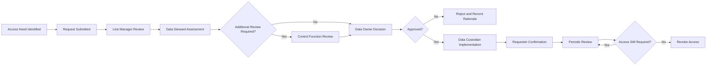
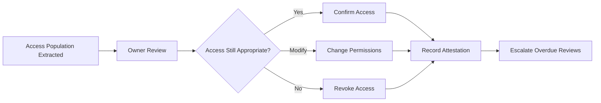

# Enterprise Data Access Standard

## 1. Purpose

This standard defines the minimum requirements for requesting, approving, implementing, reviewing and revoking access to enterprise data at HelvetiaCare Insurance Group.

The standard ensures that access is:

- Based on a legitimate business purpose
- Limited to authorised users
- Proportionate to data classification and risk
- Granted according to least privilege
- Reviewed periodically
- Removed when no longer required
- Documented and auditable

The standard supports secure and responsible use of data across business operations, reporting, analytics, automation and artificial intelligence.

---

## 2. Scope

This standard applies to access to:

- Business applications
- Databases
- Data warehouses
- Data lakes
- Reporting platforms
- Analytics environments
- Artificial intelligence environments
- Data catalogues
- Business glossaries
- File repositories
- Document-management systems
- Data extracts
- APIs
- Cloud platforms
- Test and development environments
- Archived data
- Data processed by external service providers

The standard applies to:

- Employees
- Contractors
- Temporary workers
- External consultants
- Service-provider personnel
- Technical accounts
- Service accounts
- Automated processes
- Applications accessing data through APIs

---

## 3. Objectives

The Data Access Standard aims to:

1. Ensure that access supports an approved business purpose.
2. Apply the principles of least privilege and need to know.
3. Protect personal, sensitive and restricted data.
4. Establish clear approval responsibilities.
5. Prevent conflicting or excessive access.
6. Ensure timely access implementation and revocation.
7. Maintain traceable access records.
8. Support periodic access reviews.
9. Strengthen privileged-access controls.
10. support secure access for analytics, automation and AI.

---

## 4. Access Principles

### 4.1 Legitimate business purpose

Access may be granted only where a valid and documented business purpose exists.

Convenience, curiosity or possible future use are not sufficient reasons for access.

### 4.2 Least privilege

Users and systems must receive only the minimum access required to perform an approved activity.

### 4.3 Need to know

Access must be limited to data necessary for the user's responsibilities.

### 4.4 Role-based access

Access should be assigned through approved business or technical roles where practical.

Individual access should be avoided where a standard role can meet the requirement.

### 4.5 Segregation of duties

Access must not create inappropriate combinations of responsibilities.

Potential conflicts must be assessed before approval.

### 4.6 Time limitation

Temporary access must have an expiry date.

Access must not remain active after the approved business need ends.

### 4.7 Classification-based protection

Access requirements must reflect the classification of the data.

Higher classifications require stronger approval, authentication, monitoring and review.

### 4.8 Traceability

Material access decisions and implementation actions must be documented.

### 4.9 Periodic review

Access must be reviewed according to classification, risk and role.

### 4.10 Prompt revocation

Access must be removed promptly when:

- Employment ends
- A contract ends
- A role changes
- A project ends
- An approval expires
- The business purpose no longer exists
- A security concern arises

---

## 5. Access Categories

HelvetiaCare recognises the following access categories.

### 5.1 Standard business access

Standard business access supports routine activities within an approved role.

Examples include:

- Customer-service access
- Policy-administration access
- Claims-processing access
- Finance-reporting access
- Provider-management access

Standard business access should be delivered through predefined role profiles.

### 5.2 Elevated access

Elevated access provides capabilities beyond standard business access.

Examples include:

- Bulk data export
- Mass record amendment
- Approval authority
- Access to sensitive reporting
- Advanced analytics access
- Access across multiple data domains

Elevated access requires additional justification and approval.

### 5.3 Privileged access

Privileged access enables administrative or technical control over systems and data.

Examples include:

- Database administrator access
- System administrator access
- Security administrator access
- Access-control administration
- Ability to alter system configurations
- Ability to bypass standard application controls

Privileged access requires enhanced controls.

### 5.4 Emergency access

Emergency access may be granted where urgent action is required to:

- Restore critical services
- Investigate a material incident
- Protect customers
- Prevent financial loss
- Address a significant security risk
- Meet an urgent regulatory requirement

Emergency access must be temporary, monitored and reviewed after use.

### 5.5 Machine and service-account access

Applications, automated processes and service accounts may access data only where:

- The technical purpose is documented
- The account has a named owner
- Permissions are restricted
- Credentials are protected
- Activity is logged
- Access is periodically reviewed
- Unused accounts are disabled

### 5.6 External-party access

External-party access includes access granted to:

- Consultants
- Contractors
- Suppliers
- Outsourcing providers
- Technology vendors
- Auditors
- Business partners

External access requires contractual, security and governance review where appropriate.

---

## 6. Access Requirements by Classification

| Classification | Minimum access requirement |
|---|---|
| Internal | Legitimate internal business need |
| Confidential | Role-based access and documented business purpose |
| Personal | Approved purpose and authorised role |
| Sensitive Personal | Strict need to know, enhanced approval and monitoring |
| Restricted | Explicit individual approval and strongest available controls |

### Internal

Internal data may be accessed by authorised employees and contractors with a legitimate business purpose.

### Confidential

Confidential data requires:

- Approved business purpose
- Role-based access where possible
- Appropriate line-management or business-owner approval
- Controlled export and sharing

### Personal

Personal data requires:

- Approved processing purpose
- Appropriate business role
- Data Owner or delegated approval
- Data minimisation
- Periodic access review

### Sensitive Personal

Sensitive Personal data requires:

- Strict need-to-know assessment
- Data Owner approval
- Data Protection consultation where required
- Enhanced authentication
- Detailed access logging
- More frequent review
- Restrictions on export and non-production use

### Restricted

Restricted data requires:

- Explicit individual approval
- Data Owner approval
- Information Security consultation
- Strong authentication
- Privileged-access controls where applicable
- Detailed monitoring
- Shorter review cycles
- Strict export restrictions

---

## 7. Access Request Requirements

Each access request must include:

| Field | Description |
|---|---|
| Request ID | Unique identifier |
| Requester | Person submitting the request |
| User or account | Person, system or service account requiring access |
| Employment or contract status | Relationship with HelvetiaCare |
| Business role | Current organisational role |
| Data domain | Relevant enterprise data domain |
| System or platform | Resource requiring access |
| Data classification | Classification of the data |
| Access level | Read, create, amend, approve, export or administer |
| Business purpose | Specific reason access is required |
| Start date | Date access should begin |
| End date | Expiry date where temporary |
| Line manager | Relevant manager |
| Data Owner | Accountable business owner |
| Additional reviewers | Security, Data Protection or Compliance where required |
| Segregation-of-duties assessment | Confirmation of conflict assessment |
| Status | Draft, submitted, approved, rejected, implemented or revoked |

Requests lacking sufficient information must be returned.

---

## 8. Access Approval Responsibilities

### 8.1 Line Manager

The Line Manager confirms:

- The request supports the user's responsibilities
- The access level is proportionate
- The business purpose is valid
- Temporary access has an appropriate expiry date
- The user has completed required training

### 8.2 Data Owner

The Data Owner is accountable for:

- Approving access to governed data
- Confirming appropriate usage
- Reviewing access to sensitive data
- Approving material or elevated access
- Ensuring that access aligns with data classification
- Escalating unusual or high-risk requests

### 8.3 Data Steward

The Data Steward is responsible for:

- Reviewing the data scope
- Confirming classification
- Coordinating the approval process
- Identifying additional reviewers
- Maintaining access-governance records
- Supporting periodic access reviews

### 8.4 Data Custodian

The Data Custodian is responsible for:

- Verifying that approval exists
- Implementing the authorised access
- Applying the correct technical role
- Recording the implementation
- Confirming completion
- Removing access when instructed
- Producing access-control evidence

### 8.5 Data Protection

Data Protection is consulted where:

- Personal or Sensitive Personal data is involved
- A new processing purpose is proposed
- Access is unusually broad
- External-party access is requested
- Analytics or AI use could affect individuals

### 8.6 Information Security

Information Security is consulted where:

- Privileged access is requested
- Restricted data is involved
- External access is proposed
- Authentication controls require review
- A security concern exists
- Emergency access is requested

---

## 9. Access Approval Matrix

| Access type | Requester or sponsor | Required approval | Additional consultation |
|---|---|---|---|
| Standard Internal access | User or manager | Line Manager | None unless risk requires |
| Confidential business access | User or manager | Data Owner or delegated authority | Data Steward |
| Personal data access | User or manager | Data Owner | Data Steward and Data Protection where required |
| Sensitive Personal access | Business sponsor | Data Owner | Data Protection and Information Security where required |
| Restricted data access | Senior business sponsor | Data Owner | Information Security and relevant control functions |
| Privileged access | Technology manager | System Owner | Information Security |
| Bulk export access | Business sponsor | Data Owner | Data Protection or Security depending on data |
| External-party access | Contract owner | Data Owner | Security, Data Protection, Procurement or Legal |
| Emergency access | Incident or service owner | Authorised emergency approver | Information Security |
| Service-account access | Technical owner | System Owner | Information Security where required |

---

## 10. Access Request Workflow

---

## 11. Implementation Requirements

Before implementing access, the Data Custodian must verify:

- The request is approved
- The approval has not expired
- The correct user or account is identified
- The correct role is selected
- The requested permissions match the approval
- Required segregation-of-duties checks are complete
- Required training is complete where applicable
- Additional conditions are understood

The Data Custodian must not implement access based solely on:

- Informal messages
- Verbal instructions
- Unapproved spreadsheets
- Assumptions based on another user's access
- Urgency without an approved emergency process

---

## 12. Role-Based Access Control

Role-based access should be used where practical.

Each access role must include:

| Field | Description |
|---|---|
| Role ID | Unique technical or business role identifier |
| Role name | Approved role name |
| Business purpose | Activities supported by the role |
| Data domains | Data covered |
| Systems | Relevant platforms |
| Permissions | Read, create, amend, approve, export or administer |
| Classification limit | Highest data classification accessible |
| Role owner | Accountable business or system role |
| Approval authority | Required approver |
| Segregation conflicts | Incompatible roles |
| Review frequency | Required review cycle |
| Status | Draft, active, suspended or retired |

Role permissions must be reviewed when:

- Business processes change
- Systems change
- Data classification changes
- Responsibilities change
- A control issue occurs
- Excessive access is identified

---

## 13. Least-Privilege Requirements

Least privilege requires that:

- Read-only access is used where amendment is unnecessary
- Export rights are restricted
- Approval authority is separated from transaction creation where appropriate
- Administrative rights are restricted
- Temporary elevated access expires automatically where possible
- Users do not inherit unrelated permissions
- Shared accounts are avoided
- Service accounts cannot be used interactively unless explicitly authorised
- Access to production environments is limited

Access must not be granted by copying all permissions from another user without validating the business need.

---

## 14. Segregation of Duties

Access must be assessed for incompatible responsibilities.

Illustrative conflicts include:

- Creating and approving the same payment
- Creating and approving the same claim adjustment
- Requesting and approving one's own access
- Developing and deploying unreviewed production changes
- Administering access and independently reviewing that access
- Creating a provider and changing its payment account
- Creating and approving financial journal entries

Where a conflict cannot be avoided:

- The conflict must be documented
- The risk must be assessed
- Compensating controls must be defined
- Appropriate approval must be obtained
- The exception must be time-limited where possible
- Monitoring must be implemented

---

## 15. Privileged Access

Privileged access must receive enhanced protection.

Requirements include:

- Named individual accounts
- Strong authentication
- Separate privileged and standard accounts
- Least-privilege permissions
- Time-limited access where practical
- Detailed activity logging
- Periodic access review
- Prompt revocation
- Monitoring of unusual activity
- Controlled credential storage
- Prohibition of credential sharing

Privileged access must not be used for routine business activity where standard access is sufficient.

---

## 16. Emergency Access

Emergency access may be used only where normal approval timelines would create unacceptable risk.

The emergency-access process must include:

1. A documented reason.
2. A named requester.
3. An authorised emergency approver.
4. Defined scope.
5. Defined duration.
6. Enhanced logging.
7. Automatic or prompt expiry.
8. Retrospective review.
9. Confirmation of actions performed.
10. Closure evidence.

Emergency access must not become a recurring substitute for standard access management.

---

## 17. Service Accounts and Machine Identities

Each service account must have:

- A unique identifier
- A documented technical purpose
- A named business or technical owner
- A defined system
- A defined access scope
- Protected credentials
- Rotation requirements
- Logging
- Review frequency
- An expiry or lifecycle status where applicable

Service accounts must not:

- Be shared across unrelated applications
- Use excessive permissions
- Remain active after the supported process is retired
- Use default credentials
- Be used by individuals for routine access
- Avoid monitoring or review

---

## 18. External-Party Access

Before granting external access, the organisation must confirm:

- The contractual relationship is valid
- The business purpose is documented
- The external identity is verified
- Access is limited to necessary systems and data
- Appropriate confidentiality obligations apply
- Security requirements are satisfied
- Data Protection requirements are satisfied
- An internal sponsor is accountable
- An expiry date exists
- Activity can be monitored
- Access can be revoked promptly

External access must be reviewed more frequently than equivalent internal access where risk is higher.

---

## 19. Access to Analytics and AI Environments

Access to analytics or AI environments must consider:

- Data classification
- Dataset purpose
- User role
- Ability to export or download data
- Ability to combine datasets
- Access to production data
- Access to Sensitive Personal data
- Model-training activities
- Output-generation risks
- Third-party tools
- Retention of derived data
- Ability to infer sensitive information

Access to Sensitive Personal or Restricted data for analytics or AI requires explicit approval and appropriate data-readiness assessment.

Access to an AI environment does not automatically authorise use of all available data.

---

## 20. Access to Non-Production Environments

Production data should not be accessible in development, testing or training environments unless:

- A valid need exists
- Use is approved
- The environment is appropriately protected
- Data is minimised
- Masking, pseudonymisation or anonymisation is used where practical
- Access is restricted
- Retention is limited
- Secure deletion is planned
- Usage is monitored

Synthetic data should be used where it can satisfy the requirement.

---

## 21. Data Export and Download

Export rights must be restricted according to risk.

Requests for export access must consider:

- Data classification
- Volume
- Purpose
- Destination
- Storage controls
- External sharing
- Retention
- Deletion
- Ability to combine datasets
- Ability to identify individuals
- Monitoring requirements

Bulk export of Sensitive Personal or Restricted data requires explicit approval.

Downloaded data remains subject to its original classification and handling requirements.

---

## 22. Access Review Requirements

Access reviews must confirm:

- The user or account remains active
- The business purpose still exists
- The access level remains proportionate
- The role remains appropriate
- Temporary access has not expired
- Privileged access remains justified
- External-party access remains valid
- Segregation conflicts remain controlled
- Unused access is removed
- Access to sensitive data remains necessary

---

## 23. Access Review Frequency

| Access category | Minimum review frequency |
|---|---|
| Standard Internal access | Annual |
| Confidential data access | Annual or risk-based |
| Personal data access | At least annual |
| Sensitive Personal data access | At least quarterly |
| Restricted data access | At least quarterly |
| Privileged access | Quarterly |
| External-party access | Quarterly |
| Emergency access | After each use |
| Service-account access | At least quarterly |
| Temporary access | At expiry and during periodic review |

Higher-risk access may require more frequent review.

---

## 24. Access Review Workflow

---

## 25. Access Attestation

Each access review must record:

| Field | Description |
|---|---|
| Review ID | Unique review identifier |
| Review period | Period covered |
| System | System being reviewed |
| Data domain | Relevant domain |
| Data classification | Highest classification involved |
| Reviewer | Authorised reviewer |
| User or account | Access subject |
| Current role | Assigned access role |
| Decision | Retain, modify or revoke |
| Rationale | Reason for the decision |
| Action owner | Person implementing any change |
| Target date | Completion deadline |
| Completion evidence | Proof of implementation |
| Review date | Date of attestation |
| Status | Open, completed or overdue |

---

## 26. Revocation Requirements

Access must be revoked when:

- Employment ends
- A contract ends
- A user's role changes
- A project ends
- Temporary access expires
- The business purpose ends
- Required training expires
- A serious policy breach occurs
- A security incident requires removal
- Access is found to be excessive
- An account is inactive
- A service or application is retired

Revocation must include:

- Request or trigger
- Affected user or account
- Access removed
- Implementation date
- Responsible Data Custodian
- Confirmation evidence
- Escalation if not completed within target

---

## 27. Joiner, Mover and Leaver Controls

### Joiner

For a new employee or contractor:

- Identity must be verified
- Employment or contract status must be confirmed
- Access must be based on an approved role
- Required training must be completed
- Start date must be respected
- Temporary contracts must include an expiry date

### Mover

When responsibilities change:

- Existing access must be reassessed
- Unnecessary permissions must be removed
- New access must be approved
- Segregation conflicts must be reassessed
- Sensitive and privileged access must not automatically transfer

### Leaver

When employment or engagement ends:

- Access must be disabled promptly
- Privileged access must receive priority
- Service-account ownership must be reassigned
- Active sessions or credentials must be terminated where required
- Company-managed data and devices must be returned or secured

---

## 28. Access-Control Evidence

Evidence may include:

- Access requests
- Approval records
- Role assignments
- Implementation records
- System access lists
- Privileged-access logs
- Access-review attestations
- Revocation records
- Segregation-of-duties assessments
- Emergency-access records
- Service-account inventories
- External-access records
- Training completion
- Exception approvals

Evidence must be:

- Complete
- Accurate
- Dated
- Attributable
- Protected from unauthorised alteration
- Available for governance review and audit

---

## 29. Access Issues

A governance issue must be recorded when:

- Access exists without approval
- Access exceeds the approved scope
- A former employee retains access
- Temporary access remains active after expiry
- Privileged access is not reviewed
- A shared account is used inappropriately
- External access lacks an active sponsor
- A segregation conflict is uncontrolled
- Sensitive data is accessible to an unjustified role
- Access-review actions remain overdue
- An inactive service account remains enabled

Each issue must include:

- Issue identifier
- User or account
- Affected system
- Data classification
- Description
- Business impact
- Severity
- Data Owner
- Data Steward
- Data Custodian
- Remediation action
- Target date
- Status
- Closure evidence

---

## 30. Access Incident Response

Suspected unauthorised access must be reported promptly.

The response must consider:

- User or account involved
- Systems accessed
- Data accessed
- Classification
- Actions performed
- Duration
- Whether data was altered, copied or shared
- Required containment
- Credential revocation
- Evidence preservation
- Data Protection or Security escalation
- Customer or regulatory impact
- Root-cause remediation

Access must be suspended where continued access creates unacceptable risk.

---

## 31. Access Exceptions

An exception to this standard must:

- Identify the affected requirement
- Include a business rationale
- Include a risk assessment
- Identify the affected data
- Identify the user, role or account
- Define compensating controls
- Have an accountable owner
- Have an expiry date
- Include a remediation plan
- Receive appropriate approval

Exceptions involving Sensitive Personal, Restricted or privileged access require appropriate specialist consultation.

Repeated renewal must be escalated.

---

## 32. Access KPIs

Access governance may be measured through:

| KPI | Description |
|---|---|
| Approved access coverage | Percentage of active access supported by valid approval |
| Access-review completion | Percentage of reviews completed within target |
| Revocation timeliness | Percentage of access revocations completed within target |
| Privileged-access review completion | Percentage reviewed on time |
| Temporary-access expiry compliance | Percentage removed by expiry date |
| External-access review completion | Percentage reviewed on time |
| Orphan account count | Number of accounts without an active owner |
| Inactive account count | Number of unused active accounts |
| Segregation conflict count | Number of unresolved conflicts |
| Overdue access actions | Number of review or revocation actions past target |

---

## 33. Illustrative Targets

| KPI | Target |
|---|---|
| Active access with valid approval | 100% |
| Sensitive Personal access reviewed on time | At least 98% |
| Restricted access reviewed on time | 100% |
| Privileged access reviewed on time | 100% |
| Leaver access revoked within target | 100% |
| Temporary access removed by expiry | 100% |
| Orphan privileged accounts | 0 |
| Uncontrolled segregation conflicts | 0 |
| High-severity access issues without an owner | 0 |
| External accounts without active sponsorship | 0 |

---

## 34. Roles and Responsibilities Summary

| Activity | Data Owner | Data Steward | Data Custodian | Line Manager | Data Protection | Information Security |
|---|---|---|---|---|---|---|
| Confirm business purpose | Accountable | Consulted | Informed | Responsible | Consulted where required | Consulted where required |
| Approve standard access | Accountable | Responsible | Consulted | Responsible | Consulted where required | Consulted where required |
| Implement approved access | Accountable | Consulted | Responsible | Informed | Informed | Consulted |
| Approve Sensitive Personal access | Accountable | Responsible | Consulted | Consulted | Consulted | Consulted |
| Approve privileged access | Consulted | Informed | Responsible | Consulted | Informed | Accountable |
| Conduct access review | Accountable | Responsible | Consulted | Consulted | Consulted where required | Consulted where required |
| Revoke access | Accountable | Consulted | Responsible | Responsible for trigger | Informed | Consulted |
| Review external access | Accountable | Responsible | Consulted | Consulted | Consulted | Consulted |
| Review access issue | Accountable | Responsible | Responsible for technical action | Consulted | Consulted | Consulted |
| Approve material exception | Accountable | Responsible | Consulted | Consulted | Consulted | Consulted |

---

## 35. Non-Compliance

Material non-compliance with this standard must be:

1. Recorded as a governance or security issue.
2. Assigned to an accountable owner.
3. Assessed according to data classification and impact.
4. Supported by a remediation plan.
5. Escalated when high-risk or overdue.
6. Reported through governance KPIs where appropriate.
7. Reviewed for root cause and control improvement.

Repeated or deliberate non-compliance may result in disciplinary, contractual or governance escalation.

---

## 36. Document Control

| Field | Value |
|---|---|
| Document owner | Chief Data Office |
| Approval body | Data Governance Council |
| Version | 1.0 |
| Status | Illustrative portfolio version |
| Review frequency | Annual |
| Next review | To be determined |

---

This document forms part of a fictional portfolio project and does not represent the Data Access Standard of a real insurance organisation.