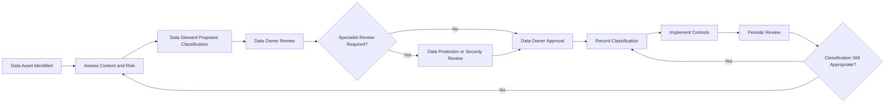

# Enterprise Data Classification Standard

## 1. Purpose

This standard defines how information and data must be classified, labelled, accessed, handled, shared, retained and protected across HelvetiaCare Insurance Group.

The classification framework ensures that controls are proportionate to:

- Data sensitivity
- Business criticality
- Customer impact
- Regulatory obligations
- Financial impact
- Security risk
- Operational risk
- Intended usage

The standard supports responsible data usage throughout the complete data lifecycle.

---

## 2. Scope

This standard applies to:

- Structured data
- Unstructured data
- Documents
- Emails
- Reports
- Databases
- Data warehouses
- Data lakes
- Data extracts
- Application data
- Analytics datasets
- Artificial intelligence datasets
- Source code containing data
- Backups
- Archives
- Portable media
- Data shared with external parties
- Data processed by service providers

The standard applies regardless of:

- Data format
- Storage location
- Technology platform
- Business function
- Geographic location
- Whether processing is internal or outsourced

---

## 3. Objectives

The Data Classification Standard aims to:

1. Establish consistent classification terminology.
2. Protect data according to sensitivity and risk.
3. Support appropriate access decisions.
4. Prevent unauthorised disclosure or alteration.
5. Improve handling of personal and health-related information.
6. Support secure data sharing.
7. Clarify protection requirements for analytics and AI.
8. Support data-retention and disposal decisions.
9. Produce evidence that classification controls operate.
10. Enable measurable governance and compliance.

---

## 4. Classification Principles

### 4.1 Classification is based on impact

Data must be classified according to the potential impact of:

- Unauthorised disclosure
- Unauthorised alteration
- Loss
- Destruction
- Unavailability
- Inappropriate reuse
- Incorrect interpretation

### 4.2 The highest applicable classification prevails

Where a dataset contains information with different classifications, the dataset must receive the highest applicable classification unless effective segregation exists.

### 4.3 Classification follows the data

Classification requirements continue to apply when data is:

- Copied
- Exported
- Transformed
- Aggregated
- Shared
- Archived
- Backed up
- Used for analytics or AI

### 4.4 Aggregation may increase sensitivity

Data that is individually low-risk may become more sensitive when:

- Combined with other datasets
- Linked to identifiable individuals
- Used to infer protected information
- Analysed at scale
- Used for profiling or automated decisions

### 4.5 Access does not change classification

Authorised access to data does not reduce its sensitivity or classification.

### 4.6 Classification must remain current

Classification must be reviewed when:

- Data content changes
- Business usage changes
- New sources are added
- Systems change
- Data is shared externally
- Analytics or AI use is proposed
- Legal or regulatory requirements change
- Data is anonymised, pseudonymised or aggregated

---

## 5. Classification Levels

HelvetiaCare uses the following classification levels:

1. Internal
2. Confidential
3. Personal
4. Sensitive Personal
5. Restricted

These values correspond with the classifications used in the enterprise business glossary.

---

## 6. Internal

### 6.1 Definition

Internal data is information intended for use within HelvetiaCare but whose unauthorised disclosure would normally have limited impact.

### 6.2 Examples

Examples include:

- Internal procedures
- General business instructions
- Approved reference values
- Non-sensitive organisational information
- Internal project plans
- General training material
- Non-sensitive system documentation
- Standard operational reports without personal data

### 6.3 Handling requirements

Internal data:

- May be accessed by employees with a legitimate business need
- Must not be published externally without approval
- Must be stored in approved enterprise systems
- Must be protected from unauthorised alteration
- Must follow applicable retention requirements
- May be shared internally through approved collaboration tools

### 6.4 Illustrative impact

Unauthorised disclosure could cause:

- Limited operational inconvenience
- Minor reputational impact
- Limited loss of productivity
- Limited internal confusion

---

## 7. Confidential

### 7.1 Definition

Confidential data is non-public business information whose unauthorised disclosure, alteration or loss could materially affect HelvetiaCare, its customers, providers or business partners.

### 7.2 Examples

Examples include:

- Insurance-contract data
- Claims amounts
- Financial transactions
- Commercial agreements
- Provider payment details
- Internal risk assessments
- Business strategies
- Non-public management reporting
- Detailed system architecture
- Governance issue records
- Audit findings
- Security-control information

### 7.3 Handling requirements

Confidential data must:

- Be accessed only according to legitimate business need
- Be protected through role-based access
- Be transmitted through approved secure channels
- Be stored only in approved systems
- Be protected against unauthorised copying
- Be encrypted where required by security standards
- Be reviewed before external sharing
- Be securely deleted when no longer required
- Be subject to appropriate logging and monitoring

### 7.4 Illustrative impact

Unauthorised disclosure could cause:

- Material financial loss
- Commercial disadvantage
- Customer or provider harm
- Significant operational disruption
- Regulatory concern
- Reputational damage

---

## 8. Personal

### 8.1 Definition

Personal data is information relating to an identified or identifiable individual.

A person may be identifiable directly or indirectly through one or more data elements.

### 8.2 Examples

Examples include:

- Name
- Residential address
- Correspondence address
- Contact information
- Customer identifier
- Policyholder identifier
- Date of birth where not combined with sensitive information
- Employment-related contact data
- Account relationships
- Online identifiers

### 8.3 Handling requirements

Personal data must:

- Be processed for an approved purpose
- Have an identifiable accountable Data Owner
- Be accessible only to authorised roles
- Be limited to the data necessary for the purpose
- Be protected during storage and transfer
- Be retained only for the required period
- Be shared externally only under approved conditions
- Be subject to Data Protection review where required
- Be corrected where materially inaccurate
- Be securely deleted or anonymised when no longer required

### 8.4 Illustrative impact

Unauthorised disclosure could cause:

- Loss of privacy
- Customer complaints
- Identity-related harm
- Regulatory concern
- Reputational damage
- Unauthorised profiling

---

## 9. Sensitive Personal

### 9.1 Definition

Sensitive Personal data is personal information requiring enhanced protection because unauthorised disclosure, misuse or alteration could cause significant harm to an individual.

### 9.2 Examples

Examples include:

- Health-related information
- Treatment information
- Medical claims data
- Diagnosis or procedure information
- Disability-related information
- Biometric information
- Highly sensitive identity information
- Sensitive customer assessments
- Information enabling significant profiling
- Combined datasets revealing sensitive characteristics

### 9.3 Handling requirements

Sensitive Personal data must:

- Be accessed strictly according to role and approved purpose
- Use enhanced access controls
- Be encrypted in transit
- Be encrypted at rest where required
- Be subject to stronger logging and monitoring
- Be excluded from uncontrolled test environments
- Be masked, pseudonymised or anonymised where practical
- Be reviewed before analytics or AI usage
- Be shared externally only following appropriate approval
- Be subject to defined retention and secure disposal
- Be protected from unnecessary duplication
- Receive enhanced incident escalation

### 9.4 Illustrative impact

Unauthorised disclosure could cause:

- Significant personal harm
- Discrimination
- Loss of privacy
- Financial harm
- Regulatory action
- Significant reputational damage
- Loss of customer trust

---

## 10. Restricted

### 10.1 Definition

Restricted data is information requiring the highest level of protection because unauthorised disclosure, alteration, loss or misuse could cause severe harm to individuals or the organisation.

Restricted classification may apply to business or personal data.

### 10.2 Examples

Examples include:

- Authentication credentials
- Cryptographic keys
- Privileged-access information
- Highly sensitive payment details
- Security incident evidence
- Critical vulnerability information
- Highly sensitive legal or investigation material
- Data subject to explicit high-risk restrictions
- Unmasked production data used outside authorised production environments
- Highly sensitive combined customer datasets
- Data whose compromise could enable fraud or systemic harm

### 10.3 Handling requirements

Restricted data must:

- Be accessible only to specifically authorised individuals
- Use least-privilege access
- Use strong authentication
- Be encrypted in transit and at rest
- Be subject to detailed access logging
- Be monitored for unusual access
- Be stored only in specifically approved environments
- Not be copied to unmanaged devices
- Not be transmitted through standard email
- Not be used in development or testing without explicit approval
- Be shared externally only under exceptional approved conditions
- Be subject to enhanced retention and disposal controls
- Trigger urgent escalation following suspected compromise

### 10.4 Illustrative impact

Unauthorised disclosure could cause:

- Severe customer harm
- Major financial loss
- Fraud
- Significant regulatory action
- Serious operational disruption
- Severe reputational damage
- Compromise of critical systems

---

## 11. Classification Decision Criteria

Classification must consider the following questions:

1. Does the data identify an individual?
2. Does the data reveal health-related or other sensitive information?
3. Could the data enable fraud or identity misuse?
4. Could disclosure harm customers, providers or employees?
5. Could disclosure harm HelvetiaCare commercially?
6. Could alteration affect claims, policies, payments or reporting?
7. Could loss affect critical operations?
8. Is the data subject to contractual restrictions?
9. Is enhanced access control required?
10. Could aggregation make the data more sensitive?
11. Is the data intended for analytics or AI?
12. Could the data enable significant profiling?
13. Could the data compromise system security?
14. Would disclosure create regulatory or reputational risk?

---

## 12. Classification Decision Guide

| Data characteristic | Minimum indicative classification |
|---|---|
| General internal business information | Internal |
| Non-public commercial or operational information | Confidential |
| Information identifying an individual | Personal |
| Health-related or similarly sensitive individual data | Sensitive Personal |
| Credentials, keys or exceptionally high-risk information | Restricted |

The Data Owner may assign a higher classification where justified by risk.

A lower classification requires documented evidence that the relevant sensitivity has been removed.

---

## 13. Classification Responsibilities

### 13.1 Data Owner

The Data Owner is accountable for:

- Approving classification
- Ensuring classification reflects business risk
- Approving material classification changes
- Confirming appropriate usage
- Reviewing classification periodically
- Escalating disputed classifications

### 13.2 Data Steward

The Data Steward is responsible for:

- Proposing classification
- Recording classification metadata
- Coordinating stakeholder review
- Identifying classification gaps
- Monitoring periodic review
- Updating glossary and governance records
- Escalating unclear or conflicting cases

### 13.3 Data Custodian

The Data Custodian is responsible for:

- Implementing technical controls
- Applying labels where supported
- Configuring access restrictions
- Supporting encryption
- Maintaining technical metadata
- Implementing logging and monitoring
- Supporting secure deletion
- Producing control evidence

### 13.4 Data Protection

Data Protection is consulted where:

- Personal data is involved
- Sensitive Personal data is involved
- New processing purposes are proposed
- Data is shared externally
- Analytics or AI may affect individuals
- Classification is uncertain

### 13.5 Information Security

Information Security is consulted where:

- Restricted data is involved
- Security architecture is affected
- Encryption requirements apply
- Privileged access is required
- External transfer creates security risk
- Material incidents occur

### 13.6 Data Consumers

Data consumers must:

- Understand the classification of data they use
- Follow the associated handling requirements
- Avoid unauthorised sharing
- Report suspected misclassification
- Report suspected compromise
- Use only approved systems and tools

---

## 14. Classification Workflow



---

## 15. Classification Metadata

Each governed data asset should record:

| Field | Description |
|---|---|
| Asset ID | Unique identifier |
| Asset name | Approved name |
| Data domain | Assigned enterprise domain |
| Data Owner | Accountable role |
| Data Steward | Responsible role |
| Classification | Approved classification |
| Classification rationale | Reason for classification |
| Personal data | Yes or No |
| Sensitive Personal data | Yes or No |
| Authoritative source | Approved source |
| Permitted usage | Approved business purposes |
| Access restrictions | Required access conditions |
| Retention requirement | Applicable retention period or rule |
| External sharing permitted | Yes, No or Conditional |
| Approval date | Date of classification approval |
| Review date | Scheduled review date |
| Status | Draft, Approved or Retired |

---

## 16. Labelling Requirements

Where tooling supports labelling, data assets and documents should display their classification.

Examples include:

```text
INTERNAL
CONFIDENTIAL
PERSONAL
SENSITIVE PERSONAL
RESTRICTED
```

Labels should appear where practical in:

- Document headers or footers
- Report metadata
- Data catalogue records
- File properties
- Email subject or banner
- Data-export names
- Analytics dataset descriptions
- Data-sharing records

The absence of a visible label does not remove the obligation to protect the data according to its actual classification.

---

## 17. Access Requirements

| Classification | General access requirement |
|---|---|
| Internal | Legitimate internal business need |
| Confidential | Role-based access and approved business purpose |
| Personal | Authorised purpose and appropriate role |
| Sensitive Personal | Strict need-to-know and enhanced control |
| Restricted | Explicit individual authorisation and strongest control |

Access must follow:

- Least privilege
- Need to know
- Segregation of duties where applicable
- Periodic review
- Prompt revocation
- Traceable approval

---

## 18. Storage Requirements

### Internal

Internal data must be stored in approved enterprise systems.

### Confidential

Confidential data must be stored in controlled systems with role-based access.

### Personal

Personal data must be stored in approved systems supporting appropriate access and lifecycle controls.

### Sensitive Personal

Sensitive Personal data must use enhanced protection, including encryption where required and restricted access.

### Restricted

Restricted data must be stored only in specifically approved high-security environments.

Restricted data must not be stored on:

- Personal devices
- Unmanaged media
- Unapproved cloud services
- Uncontrolled shared drives
- Public repositories
- Standard collaboration spaces without explicit approval

---

## 19. Transmission Requirements

### Internal

Internal data may be transmitted through approved enterprise channels.

### Confidential

Confidential data must use approved secure channels.

### Personal

Personal data must be transferred only where:

- The purpose is approved
- The recipient is authorised
- The transfer method is appropriate
- Necessary protection is applied

### Sensitive Personal

Sensitive Personal data must:

- Use encrypted transfer
- Be limited to necessary recipients
- Be reviewed before external transmission
- Avoid unnecessary attachments or duplication

### Restricted

Restricted data must:

- Use specifically approved secure transfer
- Not be transmitted through normal email
- Be individually authorised
- Be logged and traceable where required

---

## 20. External Sharing

Before data is shared externally, the requester must identify:

- Data being shared
- Classification
- Recipient
- Business purpose
- Legal or contractual basis
- Transfer method
- Retention expectations
- Security controls
- Further-sharing restrictions
- Responsible Data Owner

Additional review may be required from:

- Data Protection
- Compliance
- Information Security
- Legal
- Risk Management
- Procurement
- Third-party oversight

External sharing must be denied where the recipient, purpose or protection arrangements are insufficient.

---

## 21. Third-Party Processing

Third parties processing HelvetiaCare data must:

- Receive only necessary data
- Follow applicable classification requirements
- Use approved security controls
- Restrict access
- Protect data during transmission and storage
- Notify HelvetiaCare of relevant incidents
- Support return or deletion
- Follow contractual usage limitations
- Provide evidence where required

HelvetiaCare remains responsible for ensuring that third-party controls are appropriate for the classification and risk.

---

## 22. Use in Development and Testing

Production data must not be used in development or testing unless:

- A valid business need exists
- Use is approved
- The environment is appropriately protected
- Data is minimised
- Masking, pseudonymisation or anonymisation is applied where practical
- Access is restricted
- Retention is limited
- Usage is recorded
- Secure deletion occurs after completion

Sensitive Personal and Restricted data require explicit specialist review before non-production use.

Synthetic data should be preferred where it can satisfy the testing requirement.

---

## 23. Analytics and Artificial Intelligence

Before classified data is used for analytics or AI, the assessment must consider:

- Intended purpose
- Data classification
- Personal and Sensitive Personal content
- Data minimisation
- Quality
- Lineage
- Representativeness
- Access
- Retention
- Model or output risks
- Potential inference of sensitive information
- Human oversight
- Output classification

An output may require a higher classification than the input data where:

- It reveals new sensitive information
- It combines multiple data sources
- It enables individual profiling
- It predicts health or financial outcomes
- It creates a high-risk decision input

---

## 24. Anonymisation and Pseudonymisation

### Pseudonymisation

Pseudonymised data remains subject to protection where individuals could be reidentified through additional information.

The reidentification key must:

- Be separately protected
- Have restricted access
- Be retained only where required
- Be monitored

### Anonymisation

Data may be treated as anonymised only where reidentification risk is sufficiently reduced and the result has been assessed appropriately.

Removing names alone does not necessarily anonymise a dataset.

Classification may be reduced only following documented assessment and Data Owner approval.

---

## 25. Printing and Physical Handling

Printed data must be protected according to its classification.

### Internal

- Avoid unnecessary distribution
- Dispose of securely where appropriate

### Confidential and Personal

- Collect documents promptly from printers
- Avoid unattended storage
- Use secure disposal
- Restrict copying

### Sensitive Personal and Restricted

- Print only where necessary
- Use controlled printers where available
- Keep documents physically secured
- Maintain strict distribution
- Use secure destruction

---

## 26. Portable Media and Local Devices

Confidential, Personal, Sensitive Personal and Restricted data must not be copied to portable media unless:

- A valid business need exists
- Use is approved
- The device is managed
- Encryption is applied
- Access is restricted
- Loss can be reported and managed
- Data is deleted when no longer required

Restricted data requires explicit Information Security approval.

---

## 27. Retention and Disposal

Classification does not independently determine retention duration.

Retention must reflect:

- Business need
- Legal and regulatory requirements
- Contractual requirements
- Record-management requirements
- Litigation or investigation holds

At the end of retention:

- Data must be securely deleted
- Physical documents must be securely destroyed
- Backups must follow approved lifecycle processes
- Disposal evidence must be retained where required

Higher classifications require stronger disposal controls.

---

## 28. Classification Review

Classification must be reviewed:

- At least annually for critical data
- Following a material business change
- Following a system change
- Before external sharing
- Before new analytics or AI usage
- When datasets are combined
- When anonymisation is claimed
- Following a material incident
- When retention or usage changes

The review must confirm:

- Classification remains appropriate
- Required controls remain operational
- Access remains justified
- Metadata remains accurate
- External-sharing conditions remain valid

---

## 29. Classification Issues

A governance issue must be recorded when:

- Data has no classification
- Classification is inconsistent across systems
- Sensitive data is stored in an inappropriate location
- Access does not match classification
- Data is shared without approval
- Labels are incorrect
- Sensitive data appears in uncontrolled testing
- Restricted data is transmitted insecurely
- Retention or disposal controls are not applied
- Analytics or AI usage exceeds approved conditions

Each issue must have:

- An accountable Data Owner
- A responsible Data Steward
- Severity
- Remediation action
- Target date
- Escalation route
- Closure evidence

---

## 30. Incident Response

Suspected compromise must be reported promptly where it affects:

- Personal data
- Sensitive Personal data
- Restricted data
- Significant Confidential data
- Critical business operations

The response must consider:

- Data affected
- Classification
- Individuals affected
- Systems affected
- Access or disclosure
- Integrity impact
- Operational impact
- Required containment
- Required specialist notification
- Evidence preservation
- Remediation
- Lessons learned

Higher classifications require faster escalation and stronger response.

---

## 31. Classification Exceptions

An exception to this standard must:

- Identify the affected requirement
- Identify the classification
- Include a business rationale
- Include a risk assessment
- Identify compensating controls
- Have an accountable owner
- Have an expiry date
- Include a remediation plan
- Receive appropriate approval

Restricted and Sensitive Personal data exceptions require specialist consultation.

Permanent undocumented exceptions are not permitted.

---

## 32. Classification KPIs

Classification effectiveness may be measured through:

| KPI | Description |
|---|---|
| Classification coverage | Percentage of governed assets with approved classification |
| Critical asset review completion | Percentage reviewed within target |
| Access alignment | Percentage of reviewed access matching classification |
| External-sharing approval coverage | Percentage of external transfers with documented approval |
| Sensitive-data control coverage | Percentage of Sensitive Personal assets with enhanced controls |
| Restricted-data control coverage | Percentage of Restricted assets meeting all required controls |
| Misclassification issue count | Number of identified classification errors |
| Issue-resolution time | Average time to resolve classification issues |
| Unapproved non-production usage | Number of detected control breaches |
| Classification training completion | Percentage of relevant staff completing training |

---

## 33. Illustrative Targets

| KPI | Target |
|---|---|
| Critical data assets with approved classification | 100% |
| Critical classification reviews completed on time | At least 95% |
| Restricted assets with approved access controls | 100% |
| Sensitive Personal assets with approved ownership | 100% |
| External transfers with recorded approval | 100% |
| High-severity classification issues without an owner | 0 |
| Restricted data stored in unapproved locations | 0 |
| Unapproved use of Sensitive Personal data in testing | 0 |

---

## 34. Training and Awareness

Employees and contractors handling data must receive guidance appropriate to their responsibilities.

Training should cover:

- Classification levels
- Access requirements
- Secure sharing
- Personal and Sensitive Personal data
- Restricted data
- Incident reporting
- Retention and disposal
- Analytics and AI usage
- Third-party sharing
- Common handling errors

Enhanced training may be required for:

- Data Owners
- Data Stewards
- Data Custodians
- Privileged users
- Analytics and AI teams
- Claims teams
- Security teams
- External-sharing roles

---

## 35. Evidence and Auditability

Evidence of compliance may include:

- Classification records
- Approval histories
- Access approvals
- Access reviews
- Security configurations
- Encryption evidence
- Data-sharing approvals
- Third-party assessments
- Non-production approvals
- Retention records
- Disposal records
- Issue records
- Incident records
- Exception records
- Training records
- Governance KPI reports

Evidence must remain:

- Complete
- Accurate
- Dated
- Attributable
- Protected from unauthorised alteration
- Available for governance review and audit

---

## 36. Roles and Responsibilities Summary

| Activity | Data Owner | Data Steward | Data Custodian | Data Protection | Information Security |
|---|---|---|---|---|---|
| Propose classification | Accountable | Responsible | Consulted | Consulted | Consulted |
| Approve classification | Accountable | Responsible | Consulted | Consulted | Consulted |
| Record classification metadata | Accountable | Responsible | Consulted | Consulted | Informed |
| Implement classification controls | Accountable | Consulted | Responsible | Consulted | Consulted |
| Review personal-data classification | Accountable | Responsible | Consulted | Consulted | Informed |
| Review Restricted classification | Accountable | Responsible | Consulted | Informed | Consulted |
| Approve standard access | Accountable | Responsible | Consulted | Consulted | Consulted |
| Implement approved access | Accountable | Consulted | Responsible | Informed | Consulted |
| Approve external sharing | Accountable | Responsible | Consulted | Consulted | Consulted |
| Review classification issue | Accountable | Responsible | Consulted | Consulted | Consulted |
| Approve material exception | Accountable | Responsible | Consulted | Consulted | Consulted |

---

## 37. Non-Compliance

Material non-compliance with this standard must be:

1. Recorded as a governance issue.
2. Assigned to an accountable owner.
3. Assessed according to classification and impact.
4. Supported by a remediation plan.
5. Escalated where high-risk or overdue.
6. Reported through governance KPIs where appropriate.
7. Reviewed for lessons and control improvements.

Repeated or deliberate non-compliance may be escalated to the Data Governance Council or executive management.

---

## 38. Document Control

| Field | Value |
|---|---|
| Document owner | Chief Data Office |
| Approval body | Data Governance Council |
| Version | 1.0 |
| Status | Illustrative portfolio version |
| Review frequency | Annual |
| Next review | To be determined |

---

This document forms part of a fictional portfolio project and does not represent the Data Classification Standard of a real insurance organisation.