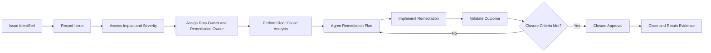
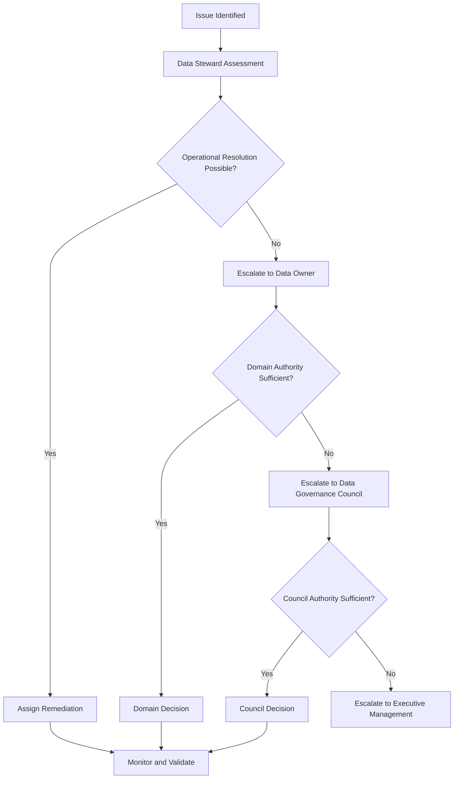

# Enterprise Data Issue Management Standard

## 1. Purpose

This standard defines the minimum requirements for identifying, recording, assessing, assigning, remediating, escalating, validating and closing Data Governance issues across HelvetiaCare Insurance Group.

The standard ensures that data issues are:

- Recorded consistently
- Assessed according to business impact
- Assigned to accountable and responsible roles
- Supported by defined remediation actions
- Resolved within appropriate timelines
- Escalated when material or overdue
- Closed only when sufficient evidence exists
- Reported through governance KPIs
- Traceable for governance review and audit

---

## 2. Scope

This standard applies to issues affecting:

- Data ownership
- Data stewardship
- Business definitions
- Metadata
- Critical data elements
- Data quality
- Data classification
- Data access
- Data retention
- Data lineage
- Data interfaces
- Data sharing
- Governance controls
- Reporting
- Analytics
- Automation
- Artificial intelligence
- Third-party data
- Governance documentation
- Governance decision evidence

The standard applies to issues identified through:

- Automated controls
- Manual reviews
- Business operations
- Customer complaints
- Reconciliations
- Reporting processes
- Governance meetings
- Project delivery
- Internal controls
- Risk assessments
- Compliance reviews
- Data Protection reviews
- Information Security monitoring
- Internal Audit
- External Audit
- Regulatory review
- Analytics or AI assessments

---

## 3. Objectives

The Data Issue Management Standard aims to:

1. Establish one consistent issue-management process.
2. Make material data risks visible.
3. Assign clear accountability and responsibility.
4. Prioritise remediation according to impact.
5. Support timely escalation.
6. Identify and address root causes.
7. Prevent recurrence.
8. Maintain auditable remediation evidence.
9. Measure issue-management effectiveness.
10. Support continuous improvement in Data Governance maturity.

---

## 4. Issue Management Principles

### 4.1 Issues must be recorded

A material data issue must not be managed solely through:

- Informal emails
- Verbal discussions
- Personal notes
- Uncontrolled spreadsheets
- Undocumented corrections
- Temporary workarounds

The issue must be entered into the approved Data Governance issue register.

### 4.2 Accountability must be explicit

Every issue must have:

- An accountable Data Owner
- A responsible Data Steward
- A remediation owner
- A target resolution date

### 4.3 Severity must reflect business impact

Issue severity must consider:

- Customer impact
- Regulatory impact
- Financial impact
- Operational impact
- Data Protection impact
- Information Security impact
- Reporting impact
- Analytics or AI impact
- Number of records affected
- Duration
- Recurrence
- Ability to detect and correct the issue

### 4.4 Root cause must be addressed

Correcting affected records alone may be insufficient.

Material issues require assessment of the underlying process, system, control, definition or accountability failure.

### 4.5 Escalation must be timely

High-severity, overdue or cross-domain issues must be escalated according to defined thresholds.

### 4.6 Closure requires evidence

An issue may be closed only when:

- Agreed actions are complete
- Results are validated
- Remaining risk is documented
- Required approval is obtained
- Supporting evidence is retained

### 4.7 Repeated issues require stronger action

Recurring issues must be assessed for:

- Inadequate root-cause analysis
- Ineffective remediation
- Weak control design
- Insufficient ownership
- Inadequate funding or resources
- Unapproved workarounds
- Broader process or system weaknesses

---

## 5. Definition of a Data Issue

A Data Issue is a documented condition in which data, metadata, ownership, controls or governance practices fail to meet an approved requirement or create an unacceptable business risk.

Examples include:

- Missing Data Owner
- Missing Data Steward
- Conflicting business definitions
- Incomplete metadata
- Missing critical data-element control
- Data-quality threshold breach
- Invalid reference values
- Duplicate customer or provider records
- Claims linked to invalid policies
- Inappropriate data access
- Data stored in an unapproved location
- Incomplete data lineage
- Failed data interface
- Unreconciled financial data
- Expired governance exception
- Missing governance evidence
- AI use case relying on unsuitable data
- Third-party data that fails agreed requirements

---

## 6. Issue Categories

Each issue must be assigned one primary category.

### 6.1 Ownership and accountability

Examples:

- No approved Data Owner
- No assigned Data Steward
- Disputed ownership
- Unclear cross-domain responsibility
- Inactive role assignment

### 6.2 Business definition and metadata

Examples:

- Conflicting definitions
- Missing glossary record
- Incomplete metadata
- Incorrect authoritative source
- Outdated business term
- Missing technical mapping

### 6.3 Data quality

Examples:

- Missing values
- Invalid values
- Duplicate records
- Incorrect relationships
- Outdated data
- Failed reconciliation
- Threshold breach

### 6.4 Data classification and handling

Examples:

- Missing classification
- Incorrect classification
- Sensitive data in an unapproved location
- Inappropriate external sharing
- Inadequate protection
- Unapproved non-production use

### 6.5 Data access

Examples:

- Access without approval
- Excessive access
- Expired temporary access
- Inactive user access
- Unreviewed privileged access
- Uncontrolled segregation conflict

### 6.6 Data lifecycle

Examples:

- Data retained beyond requirement
- Data deleted too early
- Missing disposal evidence
- Inconsistent retention rules
- Uncontrolled archive
- Missing legal-hold implementation

### 6.7 Data lineage and integration

Examples:

- Missing source-to-target mapping
- Undocumented transformation
- Failed interface
- Incomplete lineage
- Unreconciled source and target data
- Unknown downstream dependency

### 6.8 Reporting and analytics

Examples:

- Incorrect report result
- Unapproved data source
- Missing transformation documentation
- Outdated dataset
- Unsupported business interpretation
- Undocumented manual adjustment

### 6.9 Artificial intelligence

Examples:

- Unclear training-data ownership
- Inadequate data quality
- Missing lineage
- Sensitive data used without approval
- Unrepresentative dataset
- Undocumented data limitations
- Missing human oversight
- AI output relying on incorrect source data

### 6.10 Third-party data

Examples:

- External data fails quality requirements
- Supplier control evidence is missing
- Contractual use limitation is breached
- External source is outdated
- Third-party incident affects HelvetiaCare data
- Supplier remediation is overdue

### 6.11 Governance process and evidence

Examples:

- Missing approval
- Missing decision record
- Incomplete meeting minutes
- Expired standard review
- Missing control evidence
- Unapproved exception
- Overdue governance action

---

## 7. Issue Severity Levels

HelvetiaCare uses three issue-severity levels:

1. Low
2. Medium
3. High

---

## 8. Low-Severity Issue

A Low-severity issue:

- Has limited business impact
- Affects non-critical data
- Affects a small number of records
- Does not materially affect customers
- Does not materially affect regulatory or financial reporting
- Can be resolved through routine operations
- Does not require senior-management intervention

Examples:

- Minor metadata omission
- Isolated non-critical data-entry error
- Small number of outdated reference values
- Delayed completion of a low-risk governance action

### Indicative response

- Record the issue
- Assign an operational remediation owner
- Resolve through routine management
- Monitor until closure

---

## 9. Medium-Severity Issue

A Medium-severity issue:

- Affects an important business process
- Affects multiple records, users or systems
- May affect customers moderately
- May affect reporting or decision-making
- Requires coordinated remediation
- May involve several business or technology teams
- Could become High severity if unresolved

Examples:

- Repeated data-quality threshold breach
- Incomplete metadata for an important dataset
- Unresolved access-review action
- Data-interface failure with operational workaround
- Inconsistent definition used across several reports

### Indicative response

- Notify the Data Owner
- Agree a formal remediation plan
- Review progress through the Domain Governance Forum
- Escalate if overdue or impact increases

---

## 10. High-Severity Issue

A High-severity issue:

- Affects critical data
- Creates material customer impact
- Creates material regulatory or financial-reporting risk
- Affects multiple domains
- Could cause significant financial loss
- Involves Sensitive Personal or Restricted data
- Could compromise material analytics or AI outcomes
- Requires urgent senior-management attention
- Could cause significant reputational damage
- Cannot be resolved through routine operations

Examples:

- Material claims data error affecting reimbursements
- Incorrect regulatory or financial reporting
- Unauthorised access to Sensitive Personal data
- Large-scale duplicate or corrupted customer records
- Critical financial reconciliation failure
- AI use case operating on materially unsuitable data
- Persistent control failure affecting several domains

### Required response

- Notify the Data Owner promptly
- Notify the Chief Data Office
- Assess the need for specialist escalation
- Establish immediate containment
- Agree a formal remediation plan
- Review progress at each relevant governance meeting
- Escalate to the Data Governance Council
- Escalate to executive management where authority is insufficient

The Data Owner approves High-severity classification.

---

## 11. Severity Assessment Criteria

Severity must be assessed using the following dimensions:

| Dimension | Assessment considerations |
|---|---|
| Customer impact | Number of customers, seriousness and reversibility |
| Regulatory impact | Potential breach, notification or supervisory concern |
| Financial impact | Incorrect payments, losses or reporting errors |
| Operational impact | Disruption to critical or important processes |
| Data Protection | Personal or Sensitive Personal data affected |
| Information Security | Confidentiality, integrity or availability impact |
| Reporting impact | Internal, financial or regulatory reports affected |
| Analytics and AI | Decisions, predictions or automation affected |
| Data criticality | Whether critical data elements are affected |
| Volume | Number or percentage of records affected |
| Duration | Length of time the issue has existed |
| Recurrence | Whether the issue has occurred previously |
| Detectability | How easily the issue can be identified |
| Correctability | How easily the issue can be corrected |
| Cross-domain impact | Number of domains and functions affected |

---

## 12. Severity Decision Guide

| Assessment result | Indicative severity |
|---|---|
| Limited, isolated and easily corrected | Low |
| Important impact requiring coordinated remediation | Medium |
| Material customer, regulatory, financial or enterprise impact | High |

Where severity is uncertain, the higher severity should be used until sufficient assessment has been completed.

Severity may be increased or reduced when new evidence becomes available.

Any change must be documented.

---

## 13. Target Response and Resolution Times

The following illustrative targets apply:

| Severity | Initial assessment | Owner assignment | Remediation plan | Target resolution |
|---|---:|---:|---:|---:|
| Low | Within 10 working days | Within 10 working days | Within 20 working days | Within 90 calendar days |
| Medium | Within 5 working days | Within 5 working days | Within 10 working days | Within 60 calendar days |
| High | Within 1 working day | Within 1 working day | Within 5 working days | Risk-based and formally agreed |

A High-severity issue that cannot be resolved promptly must have:

- Immediate containment
- A documented interim control
- Formal senior oversight
- An approved target date
- Periodic progress reporting
- Documented residual risk

---

## 14. Issue Statuses

The approved issue statuses are:

### Identified

The issue has been detected but not yet fully assessed.

### Under Assessment

Impact, severity, ownership and root cause are being evaluated.

### Remediation Agreed

A remediation plan, owner and target date have been approved.

### In Progress

Remediation actions are being implemented.

### Blocked

Progress cannot continue because of an identified dependency or constraint.

### Awaiting Validation

Remediation has been implemented and requires confirmation.

### Awaiting Closure Approval

Validation is complete and formal closure approval is pending.

### Closed

Closure criteria have been satisfied and approved.

### Risk Accepted

The issue remains unresolved, but residual risk has been formally accepted by the appropriate authority.

### Cancelled

The issue record was created incorrectly or is no longer applicable.

### Reopened

A previously closed issue has recurred or closure evidence has proved insufficient.

---

## 15. Issue Lifecycle



---

## 16. Issue Record Requirements

Each issue record must contain:

| Field | Description |
|---|---|
| Issue ID | Unique persistent identifier |
| Issue title | Concise description |
| Issue category | Approved issue category |
| Data domain | Primary affected domain |
| Additional domains | Other affected domains |
| Date identified | Date the issue was detected |
| Identified by | Person, role, control or process |
| Source | Control, review, complaint, audit or other source |
| Description | Clear explanation of the issue |
| Affected data elements | Relevant data elements |
| Critical data element | Yes or No |
| Affected systems | Relevant systems or platforms |
| Business impact | Operational, customer, reporting or regulatory impact |
| Severity | Low, Medium or High |
| Severity rationale | Explanation of severity |
| Data classification | Highest affected classification |
| Data Owner | Accountable role |
| Data Steward | Responsible coordinator |
| Remediation owner | Person or role implementing remediation |
| Root cause | Confirmed or suspected root cause |
| Containment action | Immediate risk-reduction action |
| Remediation plan | Agreed corrective actions |
| Target date | Resolution deadline |
| Current status | Approved lifecycle status |
| Dependencies | Identified blockers or dependencies |
| Related rule | Data-quality or control reference |
| Related exception | Governance exception reference |
| Validation method | Method used to confirm remediation |
| Validation result | Outcome of validation |
| Residual risk | Remaining risk after remediation |
| Closure approver | Authorised closure decision-maker |
| Closure date | Date the issue was closed |
| Closure evidence | Supporting evidence |
| Last review date | Most recent review |
| Next review date | Scheduled next review |

---

## 17. Issue Identifier Convention

Data issues use the following identifier structure:

```text
ISSUE-<YEAR>-<NUMBER>
```

Examples:

```text
ISSUE-2026-001
ISSUE-2026-002
ISSUE-2026-003
```

Identifiers must:

- Be unique
- Remain persistent
- Not be reused
- Remain linked to supporting evidence

---

## 18. Issue Identification

Issues may be identified by:

- Data Owners
- Data Stewards
- Data Custodians
- Business users
- Data consumers
- Automated data-quality controls
- Reconciliation processes
- Access reviews
- Data Protection
- Compliance
- Information Security
- Risk Management
- Internal Control
- Internal Audit
- External Audit
- Customers
- Third parties
- Analytics teams
- AI teams

Employees and contractors must report suspected material data issues through the approved process.

---

## 19. Initial Assessment

The Data Steward coordinates the initial assessment.

The assessment must determine:

- What happened
- When it began
- How it was detected
- Which data is affected
- Which systems are affected
- Which processes are affected
- Whether customers are affected
- Whether reporting is affected
- Whether sensitive data is affected
- Whether other domains are affected
- Whether immediate containment is required
- Indicative severity
- Required specialists
- Required escalation

The assessment must avoid assuming that the visible symptom is the complete issue.

---

## 20. Containment

Containment aims to reduce immediate risk while permanent remediation is developed.

Examples include:

- Suspending a failed interface
- Preventing further record creation
- Restricting access
- Blocking an incorrect report
- Pausing an automated process
- Applying a manual review
- Isolating affected records
- Reverting to an approved source
- Disabling a compromised account
- Warning data consumers of limitations

Containment must:

- Be documented
- Have an owner
- Be proportionate
- Be monitored
- Not become an unapproved permanent solution
- Be replaced by permanent remediation where required

---

## 21. Root Cause Analysis

Root-cause analysis must identify why the issue occurred.

Approved root-cause categories include:

- Ownership gap
- Stewardship gap
- Definition ambiguity
- Incomplete metadata
- Process design
- Manual input error
- Training gap
- System configuration
- Software defect
- Interface failure
- Transformation logic
- Reference-data failure
- Access-control failure
- Control design weakness
- Control execution failure
- Change-management failure
- Third-party failure
- Legacy-data limitation
- Resource constraint
- Unapproved workaround
- Unknown

For Medium- and High-severity issues, root-cause analysis must be documented.

For recurring issues, previous remediation must be reassessed.

---

## 22. Root Cause Analysis Methods

Appropriate methods may include:

- Five Whys
- Process mapping
- Control walkthrough
- Data profiling
- Source-to-target reconciliation
- Log analysis
- Access-log review
- Change-history review
- Stakeholder interviews
- Cause-and-effect analysis
- Trend analysis
- Comparison with previous incidents

The method used should be proportionate to issue severity and complexity.

---

## 23. Remediation Plan Requirements

A remediation plan must include:

- Specific actions
- Responsible action owners
- Target dates
- Required resources
- Dependencies
- Interim controls
- Expected outcome
- Validation method
- Evidence required
- Residual risk
- Escalation route

The plan should address:

1. Immediate correction.
2. Root-cause remediation.
3. Prevention of recurrence.
4. Control improvement.
5. Documentation updates.
6. Training or communication where required.

---

## 24. Remediation Action Types

Remediation may include:

- Correcting affected records
- Reprocessing transactions
- Updating business definitions
- Completing metadata
- Assigning ownership
- Changing business processes
- Implementing validation
- Modifying system configuration
- Correcting transformation logic
- Improving reconciliation
- Restricting access
- Updating classification
- Replacing a data source
- Improving supplier controls
- Updating analytics datasets
- Retraining users
- Adding monitoring
- Automating a manual control

---

## 25. Action Management

Each remediation action must contain:

| Field | Description |
|---|---|
| Action ID | Unique identifier |
| Issue ID | Related issue |
| Action description | Required activity |
| Action owner | Responsible person or role |
| Target date | Completion deadline |
| Dependency | Required predecessor or resource |
| Status | Open, In Progress, Blocked, Completed or Cancelled |
| Evidence required | Proof of completion |
| Completion date | Actual completion date |
| Validation result | Confirmation that the action worked |

An issue may contain multiple remediation actions.

---

## 26. Validation

Validation must confirm that:

- Agreed actions were completed
- Corrected data meets requirements
- The underlying control operates
- The root cause was addressed
- No material unintended consequence was introduced
- Required documentation was updated
- Remaining exceptions are documented
- Supporting evidence is complete

Validation should be performed by a role with sufficient independence from the person who implemented the remediation.

The Data Steward coordinates validation.

---

## 27. Closure Criteria

An issue may be closed only when:

- All mandatory actions are complete
- Validation is successful
- Closure evidence is retained
- Required controls operate effectively
- Root cause is addressed or formally accepted
- Remaining risk is documented
- Related temporary exceptions are closed or separately governed
- The Data Steward recommends closure
- The Data Owner approves closure for material issues

High-severity issues require Data Owner approval.

Cross-domain High-severity issues may require Data Governance Council acknowledgement or approval.

---

## 28. Closure Evidence

Closure evidence may include:

- Corrected-data results
- Before-and-after comparisons
- Control-test results
- Updated configuration
- Updated business definition
- Updated metadata
- Reconciliation results
- Access-removal confirmation
- Updated process documentation
- Training-completion evidence
- Governance decision
- Risk-acceptance record
- Meeting minutes
- Screenshots or system records
- Audit-trail entries

Closure evidence must be:

- Complete
- Dated
- Attributable
- Protected from unauthorised alteration
- Linked to the issue record

---

## 29. Risk Acceptance

Risk acceptance may be used only when:

- Full remediation is not currently feasible
- Business activity must continue
- Risk is understood
- Interim controls exist
- Appropriate authority approves the decision
- A review date is defined

A risk-acceptance record must include:

- Issue ID
- Unresolved condition
- Business rationale
- Risk assessment
- Affected data
- Existing controls
- Additional controls
- Accountable owner
- Approval authority
- Approval date
- Expiry or review date
- Planned long-term action

Risk acceptance must not be used to avoid necessary remediation indefinitely.

---

## 30. Escalation Triggers

An issue must be escalated when:

- Severity is High
- Severity may increase
- Multiple domains are affected
- A customer or regulatory impact is possible
- Sensitive Personal or Restricted data is affected
- Financial or regulatory reporting may be incorrect
- A critical control has failed
- Ownership is disputed
- Remediation is overdue
- Required resources are unavailable
- The issue recurs
- A Data Owner refuses or cannot sponsor remediation
- Risk exceeds delegated authority
- A related governance exception expires
- An AI use case may produce unreliable or harmful outputs

---

## 31. Escalation Levels

### Operational escalation

Escalation to the Data Steward and operational management occurs where:

- Routine remediation requires coordination
- An action is delayed
- Several operational teams are involved

### Domain escalation

Escalation to the Data Owner and Domain Governance Forum occurs where:

- A Medium issue is material to the domain
- A High issue is identified
- Remediation requires business prioritisation
- Risk acceptance may be required
- Actions are overdue

### Enterprise escalation

Escalation to the Data Governance Council occurs where:

- Multiple domains are affected
- A High issue remains unresolved
- Enterprise prioritisation is required
- A material governance exception is involved
- Cross-domain ownership or definitions are disputed

### Executive escalation

Escalation to executive management occurs where:

- Risk exceeds Council authority
- Significant investment is required
- Regulatory notification may be necessary
- Material customer or financial impact exists
- Enterprise strategy or reputation is affected

---

## 32. Escalation Workflow



---

## 33. Overdue Issues

An issue is overdue when its approved target resolution date has passed and closure has not been achieved.

For an overdue issue, the Data Steward must record:

- Reason for delay
- Current risk
- Completed actions
- Outstanding actions
- Revised target date
- Additional controls
- Escalation decision
- Accountable approval

Overdue High-severity issues must be reviewed at each relevant governance meeting.

Repeated extension requires escalation.

---

## 34. Blocked Issues

An issue may be marked Blocked only when a documented dependency prevents progress.

Examples include:

- Funding approval
- System release dependency
- Supplier dependency
- Regulatory clarification
- Required specialist capacity
- Enterprise architecture decision
- Contractual dependency

Blocked status must not be used as a substitute for active management.

A blocked issue must have:

- Identified blocker
- Blocker owner
- Required decision or action
- Escalation route
- Review date
- Interim controls

---

## 35. Recurring Issues

An issue is recurring when:

- The same failure returns after closure
- Similar failures occur across multiple systems
- The same root cause affects several domains
- Previous remediation did not prevent recurrence

Recurring issues require:

- Reassessment of root cause
- Review of previous closure evidence
- Review of control design
- Consideration of enterprise-wide remediation
- Escalation to the Data Governance Council where material
- Stronger validation before closure

---

## 36. Cross-Domain Issues

A cross-domain issue affects two or more enterprise data domains.

For cross-domain issues:

- A lead Data Owner must be assigned
- Supporting Data Owners must be identified
- A lead Data Steward must coordinate the issue
- Responsibilities must be documented
- Enterprise impact must be assessed
- The Data Governance Council must resolve ownership disputes
- Closure must consider all affected domains

---

## 37. Data Issues Affecting Reporting

Where an issue may affect a report, the assessment must identify:

- Reports affected
- Reporting period
- Data elements affected
- Materiality
- Consumers
- Required correction
- Required communication
- Whether publication must be delayed
- Whether restatement is required
- Whether regulatory or external notification is required

Report owners must be informed promptly.

---

## 38. Data Issues Affecting Analytics and AI

Where an issue may affect analytics or AI, the assessment must identify:

- Dataset affected
- Use cases affected
- Models or automated processes affected
- Decisions influenced
- Data period affected
- Quality dimensions affected
- Bias or representativeness concerns
- Whether use must be paused
- Whether outputs must be reassessed
- Whether users must be notified

A material AI-related data issue may require:

- Suspension of model use
- Enhanced human review
- Dataset replacement
- Model revalidation
- Output correction
- Data and AI Centre of Excellence escalation

---

## 39. Third-Party Issues

Where a third party causes or contributes to an issue:

- The internal Data Owner remains accountable
- The supplier owner must be involved
- Contractual obligations must be reviewed
- Supplier evidence must be obtained
- Remediation actions must be tracked
- HelvetiaCare must assess whether internal controls remain sufficient
- Repeated failures may require supplier escalation or contractual action

Supplier assurances alone are not sufficient closure evidence.

---

## 40. Issue Review Cadence

| Issue type | Minimum review frequency |
|---|---|
| Low | Monthly or according to operational process |
| Medium | At least monthly |
| High | At least weekly until stabilised |
| Overdue High | At each relevant governance meeting |
| Cross-domain High | Data Governance Council monthly or more frequently |
| Risk Accepted | According to approval conditions |
| Blocked | At least monthly |
| AI-related High | According to use-case risk and operational impact |

---

## 41. Issue Reporting

### Domain reporting

Each domain reports:

- Open issues by severity
- New issues
- Closed issues
- Overdue issues
- High-severity issues
- Root-cause trends
- Remediation progress
- Risk-accepted issues
- Recurring issues
- Issues affecting critical data elements

### Enterprise reporting

The Data Governance Council receives:

- Enterprise issue summary
- Domain comparison
- Cross-domain issues
- Overdue High-severity issues
- Material risk acceptances
- Repeated root causes
- Remediation resource constraints
- Issues affecting reporting, analytics or AI
- Escalation decisions

---

## 42. Issue Management KPIs

| KPI | Description |
|---|---|
| Open issue count | Number of unresolved issues |
| High-severity issue count | Number of unresolved High issues |
| Overdue issue rate | Percentage of issues past target date |
| Average resolution time | Average duration from identification to closure |
| Remediation completion rate | Percentage of actions completed within target |
| Issue recurrence rate | Percentage of closed issues that recur |
| Root-cause completion rate | Percentage of Medium and High issues with documented root cause |
| Closure evidence coverage | Percentage of closed issues with complete evidence |
| Ownership coverage | Percentage of issues with assigned Data Owner |
| Risk-acceptance expiry compliance | Percentage reviewed before expiry |
| Cross-domain issue count | Number affecting more than one domain |
| High issues without containment | Number lacking documented interim controls |

---

## 43. Illustrative Targets

| KPI | Target |
|---|---|
| High-severity issues without a Data Owner | 0 |
| High-severity issues without containment | 0 |
| Medium and High issues with root-cause analysis | 100% |
| High-severity actions completed within target | At least 95% |
| Closed issues with complete evidence | 100% |
| Overdue High-severity issues | 0 |
| Expired risk acceptances | 0 |
| Reopened High-severity issues | 0 |
| Cross-domain issues without a lead owner | 0 |
| Material AI data issues without use-case review | 0 |

---

## 44. Roles and Responsibilities

### Data Owner

The Data Owner is accountable for:

- Approving issue severity for High issues
- Approving remediation priorities
- Sponsoring remediation
- Accepting residual risk within delegated authority
- Approving closure of material issues
- Escalating issues beyond domain authority

### Data Steward

The Data Steward is responsible for:

- Recording issues
- Coordinating initial assessment
- Recommending severity
- Maintaining the issue register
- Coordinating root-cause analysis
- Tracking remediation
- Preparing governance reporting
- Escalating overdue issues
- Coordinating validation
- Recommending closure

### Data Custodian

The Data Custodian is responsible for:

- Investigating technical causes
- Implementing technical containment
- Implementing technical remediation
- Producing technical evidence
- Supporting control validation
- Escalating technical constraints

### Data Governance Council

The Data Governance Council is accountable for:

- Resolving material cross-domain issues
- Prioritising enterprise remediation
- Reviewing overdue High-severity issues
- Approving material enterprise risk decisions
- Escalating beyond Council authority

### Control and Advisory Functions

Relevant control functions:

- Provide specialist review
- Challenge severity and risk assessments
- Recommend additional controls
- Support incident evaluation
- Retain independent escalation rights

---

## 45. RACI Summary

| Activity | Data Owner | Data Steward | Data Custodian | Data Governance Council |
|---|---|---|---|---|
| Record issue | Accountable | Responsible | Consulted | Informed |
| Assess severity | Accountable | Responsible | Consulted | Informed |
| Approve High severity | Accountable | Responsible | Consulted | Informed |
| Define containment | Accountable | Responsible | Responsible for technical actions | Informed |
| Perform root-cause analysis | Accountable | Responsible | Responsible for technical analysis | Informed |
| Approve remediation plan | Accountable | Responsible | Consulted | Informed |
| Implement technical remediation | Accountable | Consulted | Responsible | Informed |
| Validate remediation | Accountable | Responsible | Consulted | Informed |
| Approve material closure | Accountable | Responsible | Consulted | Informed |
| Resolve cross-domain issue | Consulted | Responsible | Consulted | Accountable |
| Accept material enterprise risk | Consulted | Responsible | Consulted | Accountable |

---

## 46. Issue Management Evidence

Evidence may include:

- Issue records
- Severity assessments
- Root-cause analysis
- Containment records
- Remediation plans
- Action logs
- Technical change records
- Data correction results
- Reconciliation results
- Validation reports
- Risk-acceptance decisions
- Governance meeting minutes
- Escalation records
- Closure approvals
- Audit-trail records

Evidence must be:

- Complete
- Accurate
- Dated
- Attributable
- Version-controlled where appropriate
- Protected from unauthorised alteration
- Available for governance review and audit

---

## 47. Issue Management Tooling

Issue-management tooling should support:

- Unique issue identifiers
- Required metadata fields
- Severity assessment
- Ownership assignment
- Status tracking
- Action management
- Target dates
- Automated overdue alerts
- Escalation workflows
- Evidence attachments
- Decision records
- KPI reporting
- Audit trail
- Integration with data-quality controls
- Integration with governance dashboards

The operating model may initially use a controlled CSV or lightweight application where enterprise tooling is not yet available.

---

## 48. Exceptions to This Standard

An exception to this standard must:

- Identify the affected requirement
- Include a business rationale
- Include a risk assessment
- Identify compensating controls
- Have an accountable owner
- Have an expiry date
- Include a remediation plan
- Receive appropriate approval

An issue must not be excluded from the register merely because it is commercially or operationally inconvenient to report.

---

## 49. Non-Compliance

Material non-compliance with this standard must be:

1. Recorded as a separate governance issue.
2. Assigned to an accountable owner.
3. Assessed for business and control impact.
4. Supported by a remediation plan.
5. Escalated when High severity or overdue.
6. Reported through governance KPIs.
7. Reviewed for recurring process weaknesses.

Repeated or deliberate non-compliance may be escalated to the Data Governance Council or executive management.

---

## 50. Document Control

| Field | Value |
|---|---|
| Document owner | Chief Data Office |
| Approval body | Data Governance Council |
| Version | 1.0 |
| Status | Illustrative portfolio version |
| Review frequency | Annual |
| Next review | To be determined |

---

This document forms part of a fictional portfolio project and does not represent the Data Issue Management Standard of a real insurance organisation.