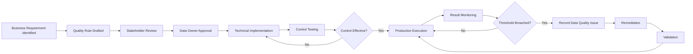
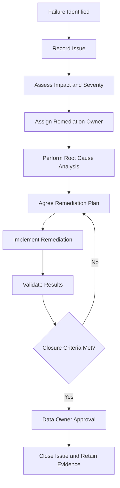

# Enterprise Data Quality Standard

## 1. Purpose

This standard defines the minimum requirements for establishing, measuring, monitoring and improving data quality across HelvetiaCare Insurance Group.

It ensures that data is sufficiently reliable for:

- Business operations
- Customer servicing
- Policy administration
- Claims processing
- Provider management
- Financial and regulatory reporting
- Management decision-making
- Analytics
- Process automation
- Artificial intelligence

The standard translates business expectations into measurable data-quality rules, thresholds, controls, issue-management processes and governance evidence.

---

## 2. Scope

This standard applies to:

- Enterprise data domains
- Critical data elements
- Operational systems
- Data warehouses and data platforms
- Reports and dashboards
- Interfaces and data transfers
- Regulatory and financial reporting data
- Analytics datasets
- Artificial intelligence datasets
- Externally sourced data
- Data processed by third-party service providers

The standard applies throughout the data lifecycle, from creation or receipt through processing, transformation, use, retention and disposal.

---

## 3. Objectives

The Data Quality Standard aims to:

1. Define consistent data-quality terminology.
2. Establish measurable business requirements.
3. Prioritise controls according to data criticality and risk.
4. Assign clear accountability for quality.
5. Detect and prevent material data-quality failures.
6. Support timely issue remediation.
7. Produce auditable evidence of control effectiveness.
8. Improve confidence in reporting, analytics and AI.
9. Enable governance KPIs and maturity measurement.
10. Promote continuous improvement.

---

## 4. Data Quality Principles

### 4.1 Data quality is defined by business need

Data quality must be assessed against the requirements of the business process, report, decision or use case that depends on the data.

A technically valid value may still be unsuitable for its intended business purpose.

### 4.2 Accountability remains with the business

The Data Owner is accountable for defining acceptable data quality.

Technology teams and Data Custodians implement and operate controls but do not independently determine business quality expectations.

### 4.3 Critical data receives stronger controls

Critical data elements require:

- Approved quality rules
- Defined thresholds
- Assigned ownership
- Monitoring
- Issue escalation
- Periodic review

### 4.4 Prevention is preferred

Preventive controls should be implemented as close as practical to the point at which data is created or received.

Detective and corrective controls remain necessary where prevention is not feasible.

### 4.5 Quality must be measurable

Data-quality expectations must be translated into measurable rules and thresholds.

Statements such as “data should be accurate” are insufficient without defined measurement logic.

### 4.6 Failures must be visible

Material quality failures must be recorded, assigned, monitored and escalated.

Undocumented correction activity does not constitute effective governance.

### 4.7 Quality must be assessed before reuse

Data must be assessed for suitability before it is reused for:

- New reporting
- New analytics
- Automation
- Artificial intelligence
- External sharing
- Regulatory purposes

### 4.8 Quality requirements evolve

Rules and thresholds must be reviewed when:

- Business processes change
- Systems change
- Regulations change
- New data uses arise
- Material incidents occur
- Existing controls prove ineffective

---

## 5. Data Quality Dimensions

HelvetiaCare uses the following core data-quality dimensions.

### 5.1 Accuracy

Accuracy measures whether data correctly represents the real-world object, event or approved source it describes.

Examples:

- A reimbursement amount matches the approved claim decision.
- A provider licence status matches the verified external record.
- A payment status reflects the latest confirmed processing event.

### 5.2 Completeness

Completeness measures whether required data is present.

Examples:

- Every active customer has a legal name.
- Every critical data element has an assigned Data Owner.
- Every claim contains a policy identifier.

### 5.3 Consistency

Consistency measures whether data is logically compatible across fields, records, systems or reporting periods.

Examples:

- A policy expiry date does not precede the inception date.
- A treatment date does not occur after the claim submission date.
- A reporting period is consistent with the accounting date.

### 5.4 Timeliness

Timeliness measures whether data is available and updated within the period required by the business process.

Examples:

- Claims status is updated within the agreed operational timeframe.
- Customer address changes are reflected in downstream systems within target.
- Financial data is available before reporting deadlines.

### 5.5 Validity

Validity measures whether data conforms to approved formats, ranges, reference values and business rules.

Examples:

- Currency codes use approved ISO values.
- Claim status uses an approved lifecycle value.
- Dates are valid calendar dates.

### 5.6 Uniqueness

Uniqueness measures whether a real-world object or event is represented without inappropriate duplication.

Examples:

- Each customer has one unique enterprise identifier.
- Each claim has one claim identifier.
- Duplicate financial transactions are prevented or detected.

### 5.7 Referential Integrity

Referential Integrity measures whether relationships between data records are valid.

Examples:

- Each active policy references a valid customer.
- Each claim references a valid policy.
- Each claim involving a provider references a valid provider record.

### 5.8 Traceability

Traceability measures whether the origin, transformation and usage of data can be reconstructed.

Examples:

- A financial amount can be traced to its source transaction.
- A report value can be traced through transformations.
- An AI dataset identifies its source systems and preparation steps.

---

## 6. Critical Data Elements

A critical data element is a data element whose failure could materially affect:

- Customers
- Business operations
- Financial reporting
- Regulatory reporting
- Compliance
- Information security
- Data protection
- Risk management
- Management decisions
- Analytics
- Artificial intelligence

Each critical data element must have:

- A unique identifier
- An approved business definition
- A data domain
- A Data Owner
- A Data Steward
- An authoritative source
- A data classification
- A criticality rationale
- At least one approved quality rule
- A quality threshold
- A control frequency
- An escalation route
- A review date

---

## 7. Data Quality Rule Requirements

Each data-quality rule must contain the following information:

| Field | Requirement |
|---|---|
| Rule ID | Unique persistent identifier |
| Rule name | Concise descriptive name |
| Business requirement | Reason the rule is required |
| Data domain | Relevant enterprise domain |
| Data element | Element being assessed |
| Quality dimension | Applicable quality dimension |
| Rule logic | Clear measurable condition |
| Threshold | Approved tolerance or target |
| Frequency | Execution frequency |
| Data Owner | Accountable business role |
| Data Steward | Responsible governance role |
| Data Custodian | Technical implementation role |
| Failure severity | Indicative severity if breached |
| Failure action | Required response |
| Evidence | Control output retained |
| Status | Draft, Active, Suspended or Retired |
| Approval date | Date of approval |
| Last review date | Most recent review |
| Next review date | Scheduled review |

---

## 8. Rule Identifier Convention

Data-quality rules use the following identifier structure:

```text
DQ-<DOMAIN>-<NUMBER>
```

Examples:

```text
DQ-CUSTOMER-001
DQ-POLICY-001
DQ-CLAIMS-001
DQ-PROVIDER-001
DQ-FINANCE-001
```

Identifiers must:

- Be unique
- Remain persistent
- Not be reused after retirement
- Be linked to the relevant critical data element

---

## 9. Rule Design Requirements

A data-quality rule must be:

- Specific
- Measurable
- Repeatable
- Understandable
- Linked to a business requirement
- Assigned to a named owner
- Capable of producing evidence
- Supported by an escalation response

A rule should avoid:

- Ambiguous language
- Undefined thresholds
- Unclear ownership
- Hidden manual assumptions
- Technical logic that cannot be explained
- Combining several unrelated conditions into one rule

---

## 10. Example Data Quality Rules

| Rule ID | Data element | Dimension | Rule logic | Target |
|---|---|---|---|---|
| DQ-CUSTOMER-001 | Customer Identifier | Uniqueness | Each active customer must have one unique identifier | 100% |
| DQ-CUSTOMER-002 | Full Legal Name | Completeness | Every active customer must have a populated legal name | At least 99% |
| DQ-POLICY-001 | Policyholder Identifier | Referential Integrity | Every active policy must reference a valid customer | 100% |
| DQ-POLICY-002 | Policy Expiry Date | Consistency | Expiry date must not precede inception date | 100% |
| DQ-CLAIMS-001 | Claim Identifier | Uniqueness | Each claim must have one unique identifier | 100% |
| DQ-CLAIMS-002 | Treatment Date | Consistency | Treatment date must not be later than submission date | At least 99.5% |
| DQ-PROVIDER-001 | Licence Status | Accuracy | Active providers must have a verified valid licence | 100% |
| DQ-PROVIDER-002 | Payment Account Identifier | Accuracy | Payment account must match the latest approved record | 100% |
| DQ-FINANCE-001 | Transaction Identifier | Uniqueness | Each transaction must have one unique identifier | 100% |
| DQ-FINANCE-002 | General Ledger Account | Validity | Ledger account must exist in the approved chart of accounts | 100% |

---

## 11. Threshold Design

A threshold defines the acceptable level of performance for a rule.

Thresholds may be expressed as:

- Percentage
- Count
- Maximum number of exceptions
- Maximum delay
- Monetary tolerance
- Zero-tolerance condition
- Statistical range
- Reconciliation difference

Thresholds must reflect:

- Business impact
- Data criticality
- Regulatory importance
- Customer impact
- Operational feasibility
- Historical performance
- Control maturity

Thresholds must not be lowered solely to make performance appear acceptable.

---

## 12. Threshold Levels

Where useful, a rule may use multiple thresholds.

### Green

Performance meets the approved target.

No escalation is required beyond routine reporting.

### Amber

Performance is below target but within a temporary tolerance.

The Data Steward must:

- Assess the cause
- Monitor the trend
- Assign corrective action where required
- Report the result

### Red

Performance breaches the approved material threshold.

The Data Steward must:

- Record a data-quality issue
- Assess severity
- Notify the Data Owner
- Assign remediation
- Escalate according to impact

Example:

| Status | Result |
|---|---|
| Green | At least 99.5% |
| Amber | 98.0% to 99.49% |
| Red | Below 98.0% |

Threshold bands must be approved by the Data Owner.

---

## 13. Control Types

### 13.1 Preventive controls

Preventive controls stop poor-quality data from entering or progressing through a process.

Examples include:

- Mandatory fields
- Input validation
- Approved reference lists
- Duplicate prevention
- Workflow approval
- Format checks
- System-enforced relationships

### 13.2 Detective controls

Detective controls identify poor-quality data after creation or processing.

Examples include:

- Duplicate reports
- Reconciliation checks
- Exception reports
- Data-quality dashboards
- Missing-value monitoring
- Referential-integrity checks
- Interface-failure alerts

### 13.3 Corrective controls

Corrective controls remediate identified failures.

Examples include:

- Data correction
- Record reprocessing
- Source-system remediation
- Interface replay
- Reference-data correction
- Root-cause remediation
- Process redesign

---

## 14. Control Frequency

Control frequency must reflect:

- Data criticality
- Rate of change
- Business usage
- Reporting deadlines
- Customer impact
- Regulatory importance
- Historical issue frequency
- Technical feasibility

Illustrative frequencies include:

| Frequency | Typical use |
|---|---|
| Real-time | Critical validation during data entry or processing |
| Event-driven | Validation triggered by a transaction or change |
| Daily | Operational records and interfaces |
| Weekly | Lower-volume operational monitoring |
| Monthly | Governance reporting and trend analysis |
| Quarterly | Threshold and rule review |
| Annual | Framework and maturity review |

---

## 15. Roles and Responsibilities

### 15.1 Data Owner

The Data Owner is accountable for:

- Defining business quality expectations
- Approving critical data elements
- Approving rules and thresholds
- Reviewing material failures
- Sponsoring remediation
- Accepting residual risk within delegated authority
- Approving closure of material issues

### 15.2 Data Steward

The Data Steward is responsible for:

- Drafting quality requirements
- Coordinating rule design
- Monitoring results
- Recording issues
- Coordinating remediation
- Preparing reporting
- Escalating material failures
- Maintaining quality evidence

### 15.3 Data Custodian

The Data Custodian is responsible for:

- Implementing approved rules
- Executing technical controls
- Producing control results
- Supporting root-cause analysis
- Implementing technical remediation
- Retaining technical evidence
- Escalating control failures

### 15.4 Data Consumers

Data consumers are responsible for:

- Using approved data sources
- Understanding documented limitations
- Reporting suspected quality issues
- Avoiding unsupported interpretation
- Assessing suitability for new uses

### 15.5 Data Governance Council

The Data Governance Council:

- Reviews enterprise quality performance
- Approves material enterprise thresholds
- Resolves cross-domain quality matters
- Prioritises material remediation
- Reviews persistent failures
- Escalates risks beyond its authority

---

## 16. Data Quality Control Lifecycle



---

## 17. Control Testing

Before production use, a data-quality control must be tested to confirm:

- Correct data source
- Correct field mapping
- Correct rule logic
- Correct threshold
- Appropriate exception output
- Appropriate frequency
- Appropriate evidence
- Appropriate escalation
- Acceptable performance impact

Testing must include:

- Positive cases
- Negative cases
- Boundary conditions
- Known exceptions
- Missing data
- Duplicate data where relevant
- Invalid reference values
- Expected control failure

Test evidence must be retained.

---

## 18. Data Quality Monitoring

Monitoring must provide sufficient information to determine:

- Rule execution status
- Number of records assessed
- Number of records passed
- Number of records failed
- Failure percentage
- Threshold status
- Trend over time
- Affected data elements
- Affected systems
- Responsible Data Steward
- Open issue references
- Remediation status

Material controls must not rely solely on informal or undocumented review.

---

## 19. Data Quality Issue Triggers

A data-quality issue must be recorded when:

- A material threshold is breached
- A critical control fails to execute
- A recurring failure is identified
- Reporting may be affected
- Customer outcomes may be affected
- Sensitive data may be incorrect
- An AI or analytics use case may be compromised
- A reconciliation difference remains unresolved
- A Data Owner requests formal remediation
- A temporary exception expires

---

## 20. Issue Severity

### Low severity

A low-severity issue:

- Has limited impact
- Affects non-critical data
- Can be resolved through routine operations
- Does not affect customers or reporting materially

### Medium severity

A medium-severity issue:

- Affects an important process
- Requires coordinated remediation
- May affect several systems or users
- May create moderate customer or reporting risk

### High severity

A high-severity issue:

- Affects critical data
- Creates material customer impact
- Creates regulatory or financial-reporting risk
- Affects multiple domains
- Could compromise significant analytics or AI outputs
- Requires urgent senior attention

The Data Owner approves high-severity classification.

---

## 21. Data Quality Issue Lifecycle



---

## 22. Issue Record Requirements

Each data-quality issue must include:

| Field | Description |
|---|---|
| Issue ID | Unique identifier |
| Issue title | Concise description |
| Data domain | Affected domain |
| Data element | Affected data element |
| Rule ID | Related quality rule |
| Date identified | Identification date |
| Description | Nature of the failure |
| Business impact | Operational, customer, reporting or regulatory impact |
| Severity | Low, Medium or High |
| Root cause | Confirmed or suspected cause |
| Data Owner | Accountable owner |
| Data Steward | Responsible coordinator |
| Remediation owner | Person or role implementing correction |
| Remediation plan | Agreed actions |
| Target date | Resolution deadline |
| Status | Current lifecycle status |
| Validation result | Evidence that remediation worked |
| Closure decision | Approval and rationale |
| Closure date | Completion date |

---

## 23. Root Cause Categories

Root causes should use consistent categories where possible:

- Process design
- Manual input error
- System configuration
- Interface failure
- Transformation logic
- Reference-data error
- Ownership gap
- Definition ambiguity
- Inadequate control
- Control execution failure
- Training gap
- Third-party data issue
- Legacy data
- Unapproved workaround
- Unknown

Root-cause analysis should identify the underlying cause rather than only the visible symptom.

---

## 24. Remediation Requirements

A remediation plan must include:

- Required action
- Responsible owner
- Target date
- Dependencies
- Required resources
- Interim controls
- Validation method
- Expected residual risk
- Escalation route

Remediation should address:

1. Immediate correction where necessary.
2. Root-cause resolution.
3. Prevention of recurrence.
4. Validation that the solution is effective.
5. Updating of documentation and controls.

---

## 25. Closure Criteria

A material data-quality issue may be closed only when:

- Agreed remediation is complete
- Corrected data has been validated
- Root cause has been addressed or accepted
- Required controls operate effectively
- Supporting evidence exists
- Remaining risk is documented
- The Data Steward recommends closure
- The Data Owner approves closure

Closure must not be based solely on the passage of time.

---

## 26. Data Quality Exceptions

A temporary exception may be approved where:

- The requirement cannot currently be met
- The business need remains valid
- Risks are understood
- Compensating controls exist
- A remediation plan exists
- An accountable owner is assigned
- An expiry date is defined

The exception must include:

- Affected rule
- Current performance
- Required target
- Business rationale
- Risk assessment
- Compensating controls
- Remediation plan
- Approval authority
- Expiry date

Repeated renewal must be escalated.

---

## 27. Data Quality KPIs

Data-quality performance may be measured through:

| KPI | Description |
|---|---|
| Rule pass rate | Percentage of records meeting approved rules |
| Critical rule coverage | Percentage of critical elements with active quality rules |
| Control execution rate | Percentage of scheduled controls executed |
| Threshold compliance | Percentage of rules meeting target |
| Open issue count | Number of unresolved quality issues |
| High-severity issue count | Number of unresolved high-severity issues |
| Issue resolution time | Average time from identification to closure |
| Overdue remediation rate | Percentage of actions past target date |
| Recurrence rate | Percentage of issues repeated after closure |
| Data-quality maturity | Assessed maturity of quality governance and controls |

---

## 28. Illustrative Targets

| KPI | Target |
|---|---|
| Critical data elements with approved quality rules | 100% |
| Scheduled controls executed | At least 99% |
| High-severity issues without an owner | 0 |
| High-severity issues resolved within target | At least 95% |
| Overdue high-severity remediation actions | 0 |
| Critical rules meeting threshold | At least 98% |
| Material issue closure with evidence | 100% |
| Recurring high-severity issues | 0 |

Targets may be adjusted according to domain risk and maturity.

---

## 29. Data Quality Reporting

### Domain reporting

Each domain should report:

- Rule performance
- Threshold breaches
- Open issues
- High-severity issues
- Overdue actions
- Root-cause trends
- Remediation progress
- Key risks
- Improvement priorities

### Enterprise reporting

The Data Governance Council should receive:

- Enterprise KPI summary
- Domain comparison
- Material cross-domain issues
- Persistent control failures
- Major exceptions
- Remediation priorities
- Escalation requests
- Maturity trends

---

## 30. Data Quality for Change Initiatives

Projects and system changes must assess:

- Affected data elements
- New quality requirements
- Changed definitions
- Data migration quality
- Source-to-target reconciliation
- Interface validation
- Historical-data treatment
- Reporting impacts
- Analytics and AI impacts
- Required control evidence

Production implementation should not proceed where unresolved material quality risks remain without approved risk acceptance.

---

## 31. Data Migration Requirements

A material data migration must include:

- Source-data profiling
- Mapping validation
- Transformation validation
- Duplicate assessment
- Completeness assessment
- Reconciliation
- Exception management
- Business validation
- Post-migration monitoring
- Retained evidence

Migration acceptance criteria must be approved before execution.

---

## 32. External and Third-Party Data

Externally sourced data must be assessed for:

- Source reliability
- Definition consistency
- Ownership
- Quality limitations
- Update frequency
- Contractual requirements
- Permitted usage
- Data protection
- Lineage
- Monitoring
- Issue escalation

Third-party assurances do not remove the responsibility to assess whether data is fit for HelvetiaCare's intended use.

---

## 33. Data Quality for Analytics and AI

Before data is used for a material analytics or AI use case, the assessment must consider:

- Data ownership
- Source reliability
- Definition consistency
- Completeness
- Accuracy
- Timeliness
- Representativeness
- Historical bias
- Missing values
- Duplicate records
- Lineage
- Transformations
- Known limitations
- Suitability for intended purpose

Material limitations must be documented and communicated to relevant users and decision-makers.

Data that is acceptable for one business use may be unsuitable for another.

---

## 34. Automation Requirements

Automated data-quality controls should:

- Use version-controlled logic
- Identify affected records
- Produce time-stamped results
- Record execution status
- Retain rule identifiers
- Support threshold evaluation
- Generate alerts where appropriate
- Support issue creation
- Be tested following material change
- Remain explainable to business stakeholders

Automation does not remove the need for:

- Business ownership
- Human review
- Exception handling
- Root-cause analysis
- Governance decisions

---

## 35. Evidence and Auditability

Evidence of compliance may include:

- Approved quality rules
- Threshold approvals
- Control configurations
- Test results
- Control-execution reports
- Quality dashboards
- Issue records
- Root-cause analysis
- Remediation plans
- Validation evidence
- Closure approvals
- Exception records
- Governance meeting records

Evidence must be:

- Complete
- Accurate
- Dated
- Attributable
- Protected from unauthorised alteration
- Retained according to applicable requirements

---

## 36. Review Frequency

| Item | Minimum review frequency |
|---|---|
| Critical data-quality rules | Quarterly |
| Quality thresholds | Quarterly |
| High-severity issues | Monthly or more frequently |
| Domain quality KPIs | Monthly |
| Control design | Following material change and annually |
| Quality exceptions | Quarterly |
| Data Quality Standard | Annual |
| Data-quality maturity | Annual |
| AI data-readiness quality assessment | Before approval and after material change |

---

## 37. Non-Compliance

Material non-compliance with this standard must be:

1. Recorded as a governance issue.
2. Assigned to an accountable owner.
3. Assessed for impact and severity.
4. Supported by a remediation plan.
5. Escalated when overdue or high-risk.
6. Reported through governance KPIs where appropriate.

Repeated or deliberate non-compliance may be escalated to the Data Governance Council or executive management.

---

## 38. Roles and Responsibilities Summary

| Activity | Data Owner | Data Steward | Data Custodian | Data Governance Council |
|---|---|---|---|---|
| Define quality expectation | Accountable | Responsible | Consulted | Informed |
| Approve quality rule | Accountable | Responsible | Consulted | Informed |
| Implement automated rule | Accountable | Consulted | Responsible | Informed |
| Execute technical control | Accountable | Consulted | Responsible | Informed |
| Monitor quality results | Accountable | Responsible | Consulted | Informed |
| Record data-quality issue | Accountable | Responsible | Consulted | Informed |
| Approve high-severity classification | Accountable | Responsible | Consulted | Informed |
| Coordinate remediation | Accountable | Responsible | Responsible for technical actions | Informed |
| Approve material issue closure | Accountable | Responsible | Consulted | Informed |
| Resolve cross-domain issue | Consulted | Responsible | Consulted | Accountable |
| Approve enterprise threshold | Consulted | Responsible | Consulted | Accountable |

---

## 39. Document Control

| Field | Value |
|---|---|
| Document owner | Chief Data Office |
| Approval body | Data Governance Council |
| Version | 1.0 |
| Status | Illustrative portfolio version |
| Review frequency | Annual |
| Next review | To be determined |

---

This document forms part of a fictional portfolio project and does not represent the Data Quality Standard of a real insurance organisation.