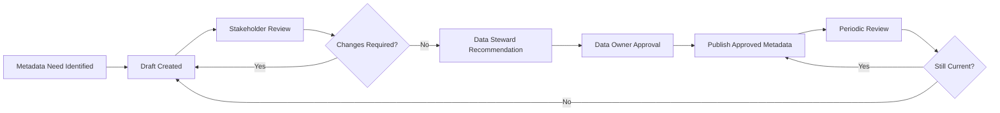

# Enterprise Metadata Standard

## 1. Purpose

This standard defines the minimum requirements for creating, maintaining, approving and using metadata across HelvetiaCare Insurance Group.

Metadata enables the organisation to understand:

- What data means
- Who owns it
- Where it originates
- Where it is stored
- How it is transformed
- How sensitive it is
- Which quality requirements apply
- How it may be used
- Which systems and processes depend on it

The standard supports consistent Data Governance, data quality, traceability, regulatory compliance, analytics, automation and responsible artificial intelligence.

---

## 2. Scope

This standard applies to metadata relating to:

- Enterprise data domains
- Business glossary terms
- Critical data elements
- Data assets
- Systems and applications
- Databases and data platforms
- Reports and dashboards
- Data interfaces
- Data-quality rules
- Data transformations
- Analytics datasets
- Artificial intelligence use cases
- External data sources
- Data-sharing arrangements

The standard applies to structured and unstructured data where metadata is necessary to support business understanding, governance, risk management or control.

---

## 3. Objectives

The Metadata Standard aims to:

1. Establish consistent metadata requirements.
2. Improve understanding of enterprise data.
3. Clarify ownership and stewardship.
4. Support common business definitions.
5. Improve traceability between business and technical data.
6. Support data-quality management.
7. Enable impact and dependency analysis.
8. Improve confidence in analytics and AI.
9. Support regulatory, risk and audit requirements.
10. Measure metadata completeness and maturity.

---

## 4. Metadata Principles

### 4.1 Metadata must support business understanding

Metadata must explain data in language understandable to relevant business users.

Technical descriptions alone are not sufficient for important business data.

### 4.2 Metadata must have clear ownership

Metadata records must identify:

- The accountable Data Owner
- The responsible Data Steward
- The relevant Data Custodian where applicable

### 4.3 Metadata must be proportionate to criticality

Critical and sensitive data requires more complete metadata than low-risk operational data.

### 4.4 Metadata must remain current

Metadata must be reviewed when:

- Business definitions change
- Systems change
- Data sources change
- Transformations change
- Data ownership changes
- New uses are introduced
- Data is retired

### 4.5 Metadata must be traceable

Material metadata changes must be version-controlled and attributable to an authorised role.

### 4.6 Metadata must support reuse

Approved metadata should be accessible to authorised users and reused across processes, systems, reporting, analytics and AI.

### 4.7 Business and technical metadata must be connected

Business definitions should be linked to relevant technical data fields, systems, interfaces and transformations.

---

## 5. Metadata Categories

HelvetiaCare recognises the following metadata categories.

### 5.1 Business metadata

Business metadata describes the meaning and business context of data.

Examples include:

- Business term
- Business definition
- Data domain
- Business purpose
- Data Owner
- Data Steward
- Criticality
- Data classification
- Permitted usage
- Quality requirement
- Related business terms

### 5.2 Technical metadata

Technical metadata describes how data is technically represented and processed.

Examples include:

- System name
- Database name
- Table name
- Field name
- Data type
- Field length
- Format
- Interface
- Transformation
- Source system
- Target system
- Technical owner
- Processing frequency

### 5.3 Operational metadata

Operational metadata describes how data-processing activities perform.

Examples include:

- Processing timestamp
- Record volume
- Interface status
- Data-quality result
- Control-execution status
- Failure count
- Processing duration
- Last successful load
- Exception status
- Reconciliation result

### 5.4 Governance metadata

Governance metadata describes the accountability, control and approval context.

Examples include:

- Approval status
- Approval date
- Review date
- Governance standard
- Data-quality rule
- Issue reference
- Exception reference
- Retention requirement
- Access restriction
- Governance decision
- Audit-trail reference

### 5.5 Lineage metadata

Lineage metadata describes how data moves and changes.

Examples include:

- Original source
- Intermediate system
- Target system
- Transformation logic
- Aggregation logic
- Manual adjustment
- Reporting destination
- Analytics use
- AI use
- External recipient

---

## 6. Mandatory Business Glossary Metadata

Each business glossary term must contain the following fields:

| Field | Requirement |
|---|---|
| Term ID | Unique and persistent identifier |
| Business term | Approved standard term |
| Definition | Clear business definition |
| Data domain | Assigned enterprise data domain |
| Data Owner | Accountable business role |
| Data Steward | Responsible governance role |
| Authoritative source | Approved source system or register |
| Sensitivity | Approved data-classification value |
| Critical data element | Yes or No |
| Status | Draft, Approved or Retired |
| Quality dimension | Primary applicable quality dimension |
| Related terms | Linked concepts where applicable |

The current portfolio implementation uses identifiers in this format:

```text
BUS-001
BUS-002
BUS-003
```

Identifiers must not be reused after a term is retired.

---

## 7. Business-Term Definition Requirements

A business definition must:

- Be written in clear business language
- Describe one concept
- Avoid circular definitions
- Avoid unexplained abbreviations
- Distinguish the term from related concepts
- Remain independent of one specific system where possible
- Reflect approved business usage
- Identify material limitations where relevant

A definition should not:

- Merely repeat the term
- Depend entirely on technical field names
- Contain unnecessary implementation details
- Combine several unrelated concepts
- Use ambiguous wording
- Contradict an approved enterprise definition

---

## 8. Business Glossary Statuses

### Draft

A Draft term:

- Is under development
- May be reviewed by stakeholders
- Must not be treated as the approved enterprise definition
- Requires an identified Data Steward

### Approved

An Approved term:

- Has been reviewed
- Has an accountable Data Owner
- May be used as the official business definition
- Must be available to relevant data consumers
- Is subject to periodic review

### Retired

A Retired term:

- Is no longer approved for new usage
- Remains traceable for historical purposes
- Must identify its replacement where applicable
- Must retain its original identifier
- Must include a retirement date and rationale

---

## 9. Required Metadata by Asset Type

### 9.1 Data domain

Each data domain must include:

- Domain identifier
- Domain name
- Description
- Business purpose
- Data Owner
- Data Steward
- Data Custodians
- Key systems
- Critical data elements
- Principal risks
- Governance controls
- Governance KPIs
- Related standards

### 9.2 Critical data element

Each critical data element must include:

- Element identifier
- Business name
- Business definition
- Data domain
- Data Owner
- Data Steward
- Authoritative source
- Technical field mapping
- Classification
- Criticality rationale
- Quality dimension
- Quality rule
- Quality threshold
- Control frequency
- Issue-escalation route
- Approval status
- Last review date

### 9.3 Data-quality rule

Each data-quality rule must include:

- Rule identifier
- Rule name
- Business requirement
- Affected data element
- Quality dimension
- Rule logic
- Threshold
- Execution frequency
- Data Owner
- Data Steward
- Data Custodian
- Failure action
- Evidence produced
- Status
- Last review date

### 9.4 System or application

Each relevant system must include:

- System identifier
- System name
- Business purpose
- System owner
- Data Custodian
- Supported data domains
- Critical data elements
- Data classification
- Upstream dependencies
- Downstream dependencies
- Interfaces
- Retention requirements
- Access-control requirements
- Current lifecycle status

### 9.5 Report or dashboard

Each material report must include:

- Report identifier
- Report name
- Business purpose
- Report owner
- Data sources
- Critical data elements
- Transformation logic
- Refresh frequency
- Data-quality controls
- Intended users
- Access restrictions
- Reporting limitations
- Approval status

### 9.6 Analytics or AI dataset

Each material analytics or AI dataset must include:

- Dataset identifier
- Dataset name
- Intended purpose
- Dataset owner
- Data sources
- Data domains
- Critical data elements
- Classification
- Quality assessment
- Lineage
- Transformation logic
- Known limitations
- Permitted usage
- Retention requirement
- Approval status
- Review date

---

## 10. Authoritative Sources

Each material business term and critical data element must identify an authoritative source.

An authoritative source is the approved system, register or process relied upon as the primary source for a defined data concept.

The authoritative source must be:

- Approved by the Data Owner
- Documented in metadata
- Supported by appropriate controls
- Accessible to authorised consumers
- Subject to data-quality monitoring
- Reviewed when systems or processes change

Where no single authoritative source exists, the metadata record must explain:

- Which sources are involved
- How conflicts are resolved
- Which source has priority
- Which reconciliation controls apply

---

## 11. Metadata Ownership

### Data Owner

The Data Owner is accountable for:

- Approving material business metadata
- Confirming authoritative sources
- Approving critical data elements
- Resolving business-definition conflicts
- Ensuring that metadata requirements are met

### Data Steward

The Data Steward is responsible for:

- Creating and maintaining business metadata
- Coordinating definition development
- Monitoring metadata completeness
- Preparing metadata for approval
- Identifying gaps and inconsistencies
- Coordinating remediation
- Maintaining approval and review records

### Data Custodian

The Data Custodian is responsible for:

- Maintaining technical metadata
- Documenting systems and interfaces
- Supporting field-level mappings
- Recording technical transformations
- Supporting lineage documentation
- Updating metadata following technical changes

### Data Architecture

Data Architecture is accountable for:

- Enterprise metadata conventions
- Lineage and architecture standards
- Cross-system metadata alignment
- Technical modelling guidance
- Resolution of material architecture conflicts

### Data Consumers

Data consumers are responsible for:

- Using approved definitions
- Reporting suspected metadata errors
- Understanding documented limitations
- Avoiding unauthorised reinterpretation of approved terms

---

## 12. Metadata Approval Workflow

Metadata approval follows this process:



The workflow must retain:

- Draft author
- Review participants
- Comments
- Approval decision
- Approval date
- Approver
- Version
- Review date
- Change history

---

## 13. Metadata Change Management

A metadata change must be assessed for impact where it could affect:

- Business processes
- Reports
- Regulatory reporting
- Interfaces
- Data-quality rules
- Analytics
- Artificial intelligence
- Access controls
- Retention requirements
- Downstream systems
- Training materials

Material changes require:

1. A documented change request.
2. Stakeholder consultation.
3. Impact assessment.
4. Data Owner approval.
5. Updated metadata.
6. Communication to affected users.
7. Updated technical mappings where required.
8. Retention of the previous version.

---

## 14. Metadata Quality Requirements

Metadata quality is assessed using the following dimensions.

### Completeness

Required metadata fields are populated.

### Accuracy

Metadata correctly reflects the business concept, system or process.

### Consistency

Metadata uses approved terminology and does not conflict with related records.

### Timeliness

Metadata is updated within an agreed period following a change.

### Uniqueness

Each concept or asset has one persistent identifier.

### Validity

Metadata values use approved formats and reference values.

### Traceability

Changes, approvals and relationships can be reconstructed.

---

## 15. Metadata Quality Controls

Required controls include:

- Mandatory-field validation
- Duplicate-term detection
- Identifier-format validation
- Approved-domain validation
- Approved-status validation
- Classification-value validation
- Ownership-completeness checks
- Critical-element completeness checks
- Periodic review-date monitoring
- Orphaned-reference detection
- Cross-domain conflict review
- Version-history retention

Automated controls should be used where practical.

Manual review remains necessary for business meaning and contextual accuracy.

---

## 16. Metadata KPIs

Metadata performance may be measured through:

| KPI | Description |
|---|---|
| Metadata completeness | Percentage of required metadata fields populated |
| Ownership coverage | Percentage of governed assets with an assigned Data Owner |
| Stewardship coverage | Percentage of governed assets with an assigned Data Steward |
| Approved-definition coverage | Percentage of priority terms with Approved status |
| Critical-element metadata coverage | Percentage of critical elements with complete mandatory metadata |
| Authoritative-source coverage | Percentage of priority terms linked to an approved source |
| Review timeliness | Percentage of metadata reviews completed within target |
| Duplicate-term rate | Percentage of identified duplicate or conflicting terms |
| Lineage coverage | Percentage of critical data flows with documented lineage |
| Metadata issue resolution | Percentage of metadata issues resolved within target |

---

## 17. Minimum Targets

The following illustrative targets apply:

| KPI | Target |
|---|---|
| Data Owner coverage | 100% |
| Data Steward coverage | 100% |
| Critical data-element metadata completeness | 100% |
| Approved definition coverage for critical terms | 100% |
| Authoritative-source coverage for critical elements | 100% |
| Overall mandatory metadata completeness | At least 95% |
| Metadata reviews completed within target | At least 95% |
| Unresolved high-severity metadata issues | 0 |
| Duplicate approved enterprise terms | 0 |

Targets may be adjusted according to risk and maturity.

---

## 18. Metadata Review Frequency

| Metadata type | Minimum review frequency |
|---|---|
| Critical data elements | Quarterly |
| Enterprise business terms | Annual |
| Data ownership assignments | Annual |
| Technical system metadata | Following material change and annually |
| Data lineage | Following material change and annually |
| Data-quality rules | Quarterly |
| Analytics and AI datasets | Before approval and following material change |
| Retired terms | At retirement and when replacement relationships change |

High-risk or rapidly changing assets may require more frequent review.

---

## 19. Metadata Issues

A metadata issue must be recorded when:

- Required metadata is missing
- Ownership is unclear
- Definitions conflict
- An authoritative source is unknown
- Technical mappings are incorrect
- Lineage is incomplete
- Approved metadata is outdated
- A critical element lacks required controls
- A retired term remains in active use
- Metadata errors could affect reporting, analytics or AI

Each issue must include:

- Issue identifier
- Affected metadata record
- Data domain
- Description
- Business impact
- Severity
- Responsible Data Steward
- Accountable Data Owner
- Remediation action
- Target date
- Status
- Closure evidence

---

## 20. Metadata Exceptions

Exceptions to this standard must:

- Identify the affected requirement
- Include a business rationale
- Include a risk assessment
- Identify compensating controls
- Have an accountable owner
- Have an expiry date
- Include a remediation plan
- Receive appropriate approval

A lack of available tooling is not, by itself, sufficient justification for a permanent exception.

---

## 21. Metadata for Analytics and AI

Before data is approved for a material analytics or AI use case, metadata must provide sufficient information about:

- Data ownership
- Data origin
- Business meaning
- Classification
- Quality
- Lineage
- Transformations
- Limitations
- Permitted use
- Retention
- Relevant controls

The use case must not proceed where material metadata gaps prevent an appropriate assessment of:

- Data suitability
- Legal or regulatory constraints
- Quality limitations
- Bias or representativeness concerns
- Traceability
- Accountability

---

## 22. Tooling Requirements

Metadata tooling should support:

- Business glossary management
- Data-domain management
- Ownership and stewardship records
- Technical metadata ingestion
- Search and discovery
- Data lineage
- Approval workflows
- Version history
- Data-quality integration
- Issue management
- Reporting and KPIs
- Access controls
- Audit trails
- APIs or automated integration where appropriate

The operating model must remain valid even where some activities are initially supported through controlled spreadsheets or lightweight applications.

---

## 23. Evidence and Auditability

Evidence of compliance with this standard may include:

- Approved glossary records
- Metadata exports
- Ownership registers
- Approval histories
- Review records
- Lineage diagrams
- Technical mappings
- Data-quality results
- Issue records
- Exception records
- Change records
- KPI reports
- Audit-trail entries

Evidence must remain complete, attributable, dated and protected from unauthorised alteration.

---

## 24. Roles and Responsibilities Summary

| Activity | Data Owner | Data Steward | Data Custodian | Data Architecture |
|---|---|---|---|---|
| Approve business definition | Accountable | Responsible | Consulted | Consulted |
| Maintain business glossary | Accountable | Responsible | Consulted | Consulted |
| Maintain technical metadata | Consulted | Responsible | Responsible | Accountable |
| Confirm authoritative source | Accountable | Responsible | Consulted | Consulted |
| Document lineage | Consulted | Responsible | Responsible | Accountable |
| Monitor metadata completeness | Accountable | Responsible | Consulted | Consulted |
| Approve critical-element metadata | Accountable | Responsible | Consulted | Consulted |
| Implement metadata integration | Consulted | Consulted | Responsible | Accountable |
| Resolve domain metadata issue | Accountable | Responsible | Consulted | Consulted |
| Resolve cross-domain conflict | Consulted | Responsible | Informed | Accountable |

---

## 25. Non-Compliance

Material non-compliance with this standard must be:

1. Recorded as a governance issue.
2. Assigned to an accountable owner.
3. Assessed for business and control impact.
4. Supported by a remediation plan.
5. Escalated when overdue or high-risk.
6. Reported through governance KPIs where appropriate.

Repeated non-compliance may result in escalation to the Data Governance Council.

---

## 26. Document Control

| Field | Value |
|---|---|
| Document owner | Chief Data Office |
| Approval body | Data Governance Council |
| Version | 1.0 |
| Status | Illustrative portfolio version |
| Review frequency | Annual |
| Next review | To be determined |

---

This document forms part of a fictional portfolio project and does not represent the metadata standard of a real insurance organisation.
