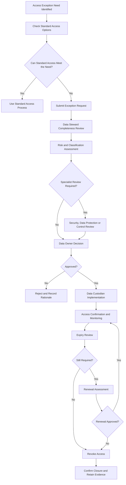
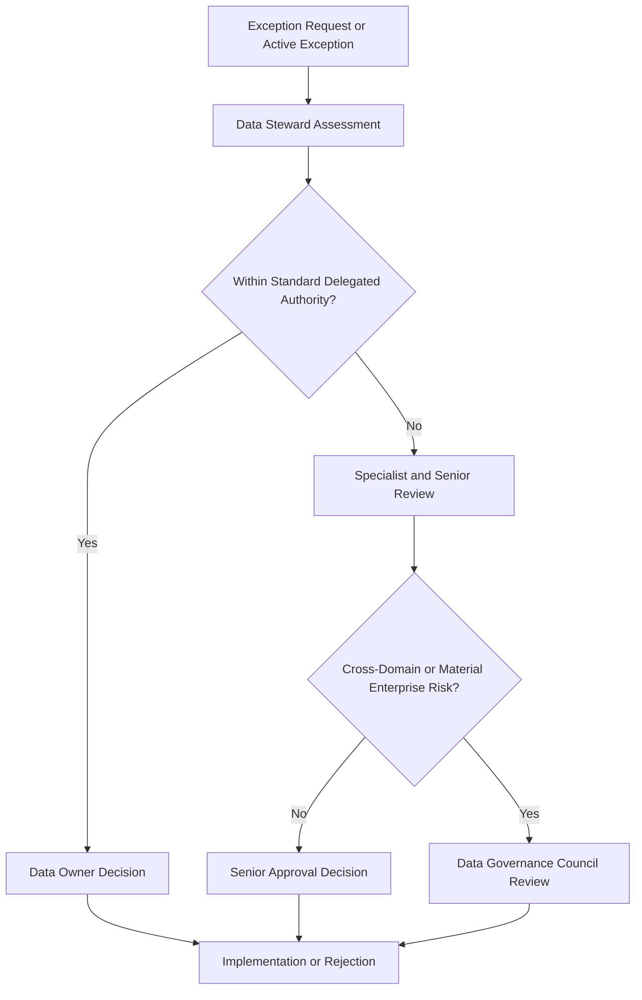

# Data Access Exception Workflow

## 1. Purpose

This workflow defines how temporary exceptions to standard enterprise data-access requirements are requested, assessed, approved, implemented, monitored, renewed and closed within HelvetiaCare Insurance Group.

The workflow ensures that an access exception:

- Supports a legitimate business need
- Is used only where standard access cannot meet the requirement
- Is proportionate to data classification and risk
- Has explicit accountability
- Includes compensating controls
- Has a defined expiry date
- Is technically implemented as approved
- Is periodically reviewed
- Is revoked promptly when no longer required
- Remains traceable for governance and audit purposes

An access exception must not be used to bypass normal access governance for convenience.

---

## 2. Scope

This workflow applies to exceptions involving:

- Access beyond a standard role
- Temporary elevated access
- Temporary privileged access
- Bulk data export
- Access across several data domains
- Access to Personal data
- Access to Sensitive Personal data
- Access to Restricted data
- External-party access
- Production-data access in a non-production environment
- Emergency access requiring retrospective approval
- Temporary segregation-of-duties conflicts
- Service-account access outside the standard profile
- Access required while a permanent role is being designed
- Access that cannot be implemented through the approved role catalogue

This workflow does not replace:

- Standard joiner, mover and leaver access
- Routine role-based access requests
- Approved emergency-access procedures
- Security incident containment
- Legal or regulatory disclosure processes

---

## 3. Workflow Triggers

The workflow begins when:

- A standard role does not provide the required access
- A temporary project requires additional data access
- A user requires access across several systems or domains
- A bulk export is necessary
- A production issue requires temporary elevated access
- A supplier or consultant requires temporary access
- A segregation-of-duties conflict cannot be avoided
- A system limitation prevents standard access implementation
- A temporary workaround is required while a permanent solution is developed
- Emergency access has been used and requires retrospective governance review

---

## 4. Core Principles

### 4.1 Standard access remains the default

The requester must first determine whether the requirement can be satisfied through:

- An existing role
- A lower level of access
- Read-only access
- A controlled report
- A smaller dataset
- A masked or pseudonymised dataset
- A supervised process
- A standard temporary-access request

An exception may proceed only where these options are insufficient.

### 4.2 Exceptions must be temporary

Every exception must have:

- A start date
- An expiry date
- A named owner
- A closure or remediation plan

Permanent exceptions are not permitted.

### 4.3 Least privilege still applies

The exception must grant only the minimum permissions, systems, records and duration required.

### 4.4 Higher classifications require stronger approval

Exceptions involving Sensitive Personal or Restricted data require specialist review and enhanced controls.

### 4.5 Compensating controls are mandatory

Where a standard control cannot be applied, the exception must define controls that reduce the resulting risk.

### 4.6 The business remains accountable

The Data Owner remains accountable for access to governed data, including access delivered through an exception.

### 4.7 Exception approval does not authorise unrelated usage

The user or account may use the access only for the documented purpose.

---

## 5. Roles

### Requester

The Requester:

- Identifies the business need
- Explains why standard access is insufficient
- Defines the requested scope and duration
- Provides supporting evidence
- Accepts the applicable usage conditions

The Requester may be the intended user or a business sponsor.

### Line Manager

The Line Manager confirms:

- The request supports the user’s responsibilities
- The user is appropriately trained
- The requested duration is reasonable
- The access is not requested merely for convenience
- The user understands the conditions

### Business Sponsor

The Business Sponsor is accountable for the operational need where the requester is:

- A contractor
- A consultant
- A supplier
- A service account
- A project team
- An automated process

### Data Steward

The Data Steward is responsible for:

- Registering the request
- Confirming the data domain and classification
- Reviewing the requested data scope
- Coordinating the risk assessment
- Identifying required reviewers
- Monitoring conditions and expiry
- Maintaining exception evidence
- Coordinating renewal or closure

### Data Owner

The Data Owner is accountable for:

- Confirming the business justification
- Approving access to the governed data
- Confirming that scope and duration are proportionate
- Approving compensating controls
- Accepting residual risk within delegated authority
- Approving renewal where justified
- Confirming closure for material exceptions

### Data Custodian

The Data Custodian is responsible for:

- Confirming technical feasibility
- Implementing only the approved permissions
- Applying technical restrictions
- Enabling logging and monitoring
- Recording implementation evidence
- Revoking access at expiry or closure
- Confirming revocation

### Information Security

Information Security is consulted where:

- Restricted data is involved
- Privileged access is requested
- A system-administration capability is involved
- Authentication controls differ from the standard
- External access is requested
- Production data is used outside production
- A security risk is identified

### Data Protection

Data Protection is consulted where:

- Personal data is involved in a new or unusual purpose
- Sensitive Personal data is involved
- External-party access is requested
- Data is exported or copied
- Production data is used in testing
- The scope of access is unusually broad

### Compliance, Legal and Risk Management

These functions are consulted where:

- Regulatory obligations may be affected
- Contractual restrictions apply
- Legal privilege or investigation data is involved
- Residual risk exceeds normal business authority
- A material control conflict exists

### Data Governance Council

The Data Governance Council reviews:

- Material cross-domain exceptions
- Repeated exception renewals
- High-risk exceptions exceeding delegated authority
- Exceptions involving unresolved ownership disputes
- Exceptions that indicate a structural access-control weakness

---

## 6. Required Request Information

Each exception request must include:

| Field | Requirement |
|---|---|
| Exception ID | Unique persistent identifier |
| Request date | Date submitted |
| Requester | Person submitting the request |
| User or account | Intended access recipient |
| Employment or contract status | Relationship with HelvetiaCare |
| Line Manager or sponsor | Accountable operational sponsor |
| Data domain | Relevant enterprise domain |
| System or platform | Resource requiring access |
| Data classification | Highest applicable classification |
| Access requested | Read, create, amend, approve, export or administer |
| Business purpose | Specific activity requiring access |
| Standard access gap | Why normal access is insufficient |
| Data scope | Records, fields, reports or datasets involved |
| Start date | Date access should begin |
| Expiry date | Mandatory end date |
| Segregation conflict | Yes or No, with details |
| External access | Yes or No |
| Production data outside production | Yes or No |
| Risks | Identified access and data risks |
| Compensating controls | Controls reducing the exception risk |
| Permanent remediation | Long-term solution where applicable |
| Data Owner | Accountable owner |
| Required reviewers | Security, Data Protection or other functions |
| Status | Current workflow status |

Requests with incomplete mandatory information must be returned.

---

## 7. Exception Identifier Convention

Access exceptions use:

```text
ACCESS-EXC-<YEAR>-<NUMBER>
```

Examples:

```text
ACCESS-EXC-2026-001
ACCESS-EXC-2026-002
ACCESS-EXC-2026-003
```

An identifier must:

- Be unique
- Remain persistent
- Never be reused
- Remain linked to approval and closure evidence

---

## 8. Workflow Overview



---

## 9. Workflow Steps

### Step 1 — Identify the access requirement

The Requester defines:

- The activity to be performed
- The data required
- The system required
- The permission required
- The intended start date
- The intended duration
- The consequences if access is not granted

The request must be specific.

The following justification is insufficient:

```text
Access may be useful for future work.
```

An acceptable justification explains the precise task, data scope and required period.

---

### Step 2 — Assess standard options

Before submitting an exception, the Requester and Line Manager must assess whether the need can be satisfied through:

- An existing access role
- A new standard role request
- Read-only access
- A limited report
- A one-time controlled extract
- Supervised access
- Masked data
- Synthetic data
- A smaller data population
- A standard temporary-access process

The assessment result must be recorded.

---

### Step 3 — Submit the exception request

The Requester completes all mandatory request information.

The request must explain:

- Why normal access is insufficient
- Why the requested permissions are necessary
- Why the requested duration is proportionate
- Which alternative options were considered
- Which risks arise
- Which compensating controls are proposed

The initial status is:

```text
Submitted
```

---

### Step 4 — Perform the completeness review

The Data Steward verifies that the request includes:

- Clear business purpose
- Identified user or account
- Data domain
- Data classification
- Access level
- Data scope
- Start and expiry dates
- Line Manager or sponsor
- Data Owner
- Standard-access gap
- Risk assessment
- Compensating controls
- Remediation plan where applicable

An incomplete request receives status:

```text
Information Required
```

---

### Step 5 — Assess classification and data scope

The Data Steward confirms:

- The relevant data domain
- The highest data classification
- Whether critical data elements are involved
- Whether Personal data is involved
- Whether Sensitive Personal data is involved
- Whether Restricted data is involved
- Whether several domains are involved
- Whether the scope can be reduced
- Whether direct identifiers can be removed
- Whether access can be read-only

The classification determines the minimum review and approval level.

---

### Step 6 — Assess access risk

The risk assessment must consider:

- Data sensitivity
- Access level
- Volume
- Ability to export
- Ability to amend
- Ability to approve
- Privileged capability
- External connectivity
- User employment or contract status
- Duration
- Segregation-of-duties conflicts
- Monitoring capability
- Business impact of misuse
- Customer impact
- Regulatory impact
- Technical reversibility
- Ability to revoke access promptly

The assessment outcome must be documented as:

- Low
- Medium
- High

A High-risk assessment requires enhanced approval and monitoring.

---

## 10. Access-Risk Decision Guide

### Low risk

Typical characteristics:

- Internal or limited Confidential data
- Read-only access
- Narrow data scope
- Short duration
- Internal user
- Standard authentication
- No export capability
- No segregation conflict

### Medium risk

Typical characteristics:

- Personal data
- Broader data scope
- Export capability
- External consultant access
- Access across several systems
- Temporary elevated permissions
- Limited segregation conflict with compensating controls

### High risk

Typical characteristics:

- Sensitive Personal or Restricted data
- Privileged access
- Bulk export
- Ability to amend or approve material transactions
- External-party access to sensitive data
- Production data in non-production
- Significant segregation conflict
- Weak monitoring or revocation capability
- Material customer, financial or regulatory impact

Where classification is uncertain, the higher provisional risk must be used.

---

## 11. Compensating Controls

Each exception must define controls proportionate to risk.

Examples include:

- Read-only permissions
- Record-level restrictions
- Field masking
- Pseudonymisation
- Export disabled
- Download disabled
- Time-limited technical access
- Multi-factor authentication
- Privileged-access management
- Four-eyes supervision
- Managerial review
- Activity logging
- Daily log review
- Session recording
- Approved device restriction
- Network-location restriction
- Controlled working hours
- Manual reconciliation
- Independent transaction review
- Automatic expiry
- Secure deletion after use

Compensating controls must be:

- Specific
- Implementable
- Assigned to an owner
- Evidenced
- Monitored
- Removed or closed when the exception ends

---

## 12. Segregation-of-Duties Assessment

The assessment must identify whether the exception would allow the user to:

- Create and approve the same transaction
- Create and approve the same payment
- Create and approve the same claim adjustment
- Request and approve their own access
- Administer access and review that access
- Create a provider and change payment details
- Develop and deploy an unreviewed production change
- Amend data and independently certify its accuracy

Where a conflict exists, the request must include:

- Conflict description
- Business justification
- Duration
- Independent monitoring
- Compensating control
- Reviewer
- Review frequency
- Closure plan

An uncontrolled segregation conflict must not be approved.

---

## 13. Specialist Review Requirements

### Data Protection review

Required where:

- Sensitive Personal data is accessed
- Personal data is used for a new purpose
- External-party access is requested
- Data is copied outside the source environment
- Production data is used in non-production
- A large population of individuals is involved

### Information Security review

Required where:

- Restricted data is accessed
- Privileged access is requested
- External connectivity is used
- Authentication requirements are altered
- Monitoring capability is limited
- Production administration is involved
- Service-account privileges are expanded

### Compliance or Legal review

Required where:

- Regulatory restrictions apply
- Contractual limitations apply
- Investigation material is involved
- Legal privilege may apply
- Cross-border restrictions require assessment

Specialist review outcomes must be retained.

---

## 14. Data Owner Decision

The Data Owner reviews:

- Business purpose
- Standard-access alternatives
- Data classification
- Data scope
- Access level
- Risk assessment
- Compensating controls
- Duration
- Specialist recommendations
- Residual risk
- Long-term remediation plan

The Data Owner may:

- Approve
- Approve with conditions
- Reject
- Request amendments
- Escalate

The decision must include:

- Decision
- Rationale
- Approved access scope
- Approved permissions
- Start date
- Expiry date
- Mandatory controls
- Monitoring requirements
- Closure conditions
- Renewal conditions

---

## 15. Approval Matrix

| Exception type | Minimum approval | Additional review |
|---|---|---|
| Limited Internal read access | Line Manager and Data Owner | Data Steward |
| Confidential elevated access | Data Owner | Data Steward and System Owner |
| Personal data exception | Data Owner | Data Protection where required |
| Sensitive Personal exception | Data Owner | Data Protection and Information Security where applicable |
| Restricted data exception | Data Owner and senior authority | Information Security and relevant control functions |
| Privileged access exception | System Owner and Data Owner | Information Security |
| Bulk export exception | Data Owner | Data Protection or Information Security according to classification |
| External-party exception | Business Sponsor and Data Owner | Security, Data Protection, Procurement or Legal |
| Production data in non-production | Data Owner and System Owner | Data Protection and Information Security |
| Material segregation conflict | Data Owner | Risk, Compliance or Information Security |
| Cross-domain High-risk exception | Relevant Data Owners | Data Governance Council or delegated authority |

---

## 16. Implementation

The Data Custodian must verify:

- The request is approved
- The approval remains valid
- The approved user or account is correctly identified
- The approved role and permissions are clear
- The start and expiry dates are recorded
- Compensating controls are technically feasible
- Required logging is enabled
- Required authentication is enabled
- Conflicting permissions are identified
- Automatic expiry is configured where possible

The Data Custodian must implement only the approved access.

Any technical deviation requires renewed approval.

---

## 17. Implementation Evidence

Implementation evidence must include:

- User or account identifier
- System
- Role or permissions granted
- Data scope
- Implementation date
- Implementing Data Custodian
- Expiry configuration
- Authentication controls
- Logging controls
- Export restrictions
- Monitoring configuration
- Confirmation sent to the requester and approvers

The status changes to:

```text
Active
```

---

## 18. User Conditions

Before using the access, the user must confirm that they will:

- Use access only for the approved purpose
- Follow data-classification requirements
- Avoid unauthorised copying
- Avoid sharing credentials
- Avoid sharing data with unauthorised recipients
- Store exported data only in approved locations
- Report suspected misuse or compromise
- Delete temporary data when required
- Stop using the access when the purpose ends
- Support monitoring and review

---

## 19. Monitoring

Monitoring must be proportionate to risk.

It may include:

- Access-log review
- Privileged-session monitoring
- Export monitoring
- Record-change review
- Managerial attestation
- Daily or weekly activity review
- Exception reports
- Segregation-conflict monitoring
- Data-volume monitoring
- Unusual-access alerts
- Inactivity monitoring
- Review of generated files

The exception record must identify:

- Monitoring owner
- Monitoring frequency
- Evidence produced
- Escalation threshold
- Action following a breach

---

## 20. Monitoring Frequency

| Risk level | Minimum monitoring |
|---|---|
| Low | At expiry or through routine review |
| Medium | At least monthly and at expiry |
| High | Weekly or more frequently according to risk |
| Privileged | Continuous logging and periodic review |
| Emergency | Review after each use |
| Sensitive Personal bulk access | Enhanced monitoring throughout the access period |
| External-party access | At least monthly and at expiry |

---

## 21. Exception Statuses

The workflow uses the following statuses:

- Draft
- Submitted
- Information Required
- Under Assessment
- Specialist Review
- Awaiting Approval
- Approved
- Approved with Conditions
- Rejected
- Implemented
- Active
- Renewal Under Review
- Expired
- Revocation Pending
- Closed
- Cancelled

Status changes must be dated and attributable.

---

## 22. Expiry Review

Before the expiry date, the Data Steward confirms:

- Whether the business need remains
- Whether the user or account remains active
- Whether access has been used
- Whether conditions were satisfied
- Whether monitoring identified concerns
- Whether a permanent solution is available
- Whether the access scope can be reduced
- Whether renewal is justified

The review should begin sufficiently early to avoid unapproved continuation.

---

## 23. Renewal

A renewal is not automatic.

A renewal request must include:

- Original Exception ID
- Current business need
- Evidence of access usage
- Monitoring results
- Control breaches, if any
- Progress toward the permanent solution
- Revised expiry date
- Revised risk assessment
- Updated compensating controls
- Reason standard access remains insufficient

Repeated renewal requires stronger challenge.

---

## 24. Renewal Escalation

The request must be escalated where:

- The exception has already been renewed
- Permanent remediation is overdue
- The scope has increased
- The classification has increased
- Monitoring identified misuse
- A segregation conflict remains
- Sensitive Personal or Restricted data remains involved
- The exception indicates a structural role-design weakness
- The Data Owner cannot accept the residual risk

A third renewal should normally require Data Governance Council or equivalent senior review.

---

## 25. Revocation

Access must be revoked when:

- The expiry date is reached
- The business need ends
- The user changes role
- Employment or contract ends
- The project ends
- Conditions are breached
- Monitoring identifies unacceptable activity
- The Data Owner withdraws approval
- A security or Data Protection incident occurs
- A permanent access solution replaces the exception

The Data Custodian must record:

- Revocation trigger
- Access removed
- Revocation date and time
- Implementing person
- Confirmation evidence
- Remaining data or files requiring deletion
- Outstanding closure actions

---

## 26. Closure

An exception may be closed only when:

- Access has been revoked
- Technical permissions are removed
- Temporary exports are deleted or retained under an approved requirement
- Compensating controls are closed
- Outstanding monitoring is complete
- Any observed issues are recorded separately
- The Data Steward confirms the record is complete
- The Data Owner confirms closure for material exceptions

The final status is:

```text
Closed
```

---

## 27. Closure Evidence

Closure evidence may include:

- Access-removal confirmation
- Updated access report
- Account-disablement evidence
- Export-deletion confirmation
- Session-log review
- Final managerial attestation
- Final Data Owner confirmation
- Replacement role implementation
- Related issue record
- Lessons-learned record

Evidence must be:

- Complete
- Dated
- Attributable
- Protected from unauthorised alteration
- Linked to the Exception ID

---

## 28. Emergency Access Retrospective Review

Where emergency access was granted before normal approval, the retrospective review must confirm:

- Emergency reason
- Requester
- Approver
- Access granted
- Duration
- Actions performed
- Logs reviewed
- Data accessed or changed
- Whether access was proportionate
- Whether misuse occurred
- Whether follow-up remediation is required
- Whether the access has been revoked

The review must not convert unjustified access into an approved exception retrospectively.

---

## 29. Control Breach

A control breach occurs where:

- Access exceeds the approved scope
- Access continues after expiry
- Data is exported without approval
- Required monitoring does not occur
- Credentials are shared
- Conditions are not followed
- Data is stored in an unapproved location
- A segregation conflict is exploited
- External access lacks active sponsorship
- Temporary data is not deleted

A material breach requires:

- Immediate containment
- Data Owner notification
- Information Security or Data Protection notification where applicable
- Revocation consideration
- Formal Data Governance issue registration
- Root-cause assessment

---

## 30. Escalation Triggers

An exception must be escalated when:

- Risk is High
- Restricted data is involved
- Sensitive Personal data is accessed at scale
- Privileged access is involved
- A material segregation conflict exists
- Several domains are affected
- External-party access is unusually broad
- Monitoring cannot be implemented
- Automatic expiry cannot be configured
- The exception is repeatedly renewed
- Conditions are breached
- Permanent remediation is overdue
- Residual risk exceeds the Data Owner’s authority

---

## 31. Escalation Path



---

## 32. Exception Register

The Data Steward maintains an exception register containing:

- Exception ID
- User or account
- Sponsor
- Data domain
- System
- Classification
- Access scope
- Risk rating
- Data Owner
- Approval date
- Start date
- Expiry date
- Monitoring owner
- Current status
- Renewal count
- Permanent remediation
- Closure date

The register must support:

- Expiry alerts
- Overdue-action reporting
- Renewal monitoring
- High-risk exception reporting
- Evidence links
- Governance KPIs

---

## 33. Workflow KPIs

| KPI | Description |
|---|---|
| Active exception count | Number of currently active access exceptions |
| High-risk exception count | Number assessed as High risk |
| Expired active access | Number remaining technically active after expiry |
| Renewal rate | Percentage of exceptions renewed |
| Repeated renewal count | Number renewed more than once |
| Automatic-expiry coverage | Percentage configured to expire automatically |
| Monitoring completion | Percentage of required reviews completed |
| Revocation timeliness | Percentage revoked within target |
| Closure evidence coverage | Percentage closed with complete evidence |
| Permanent-remediation completion | Percentage resolved through a standard access solution |
| Control-breach count | Number of breaches associated with exceptions |
| External exception count | Number involving external parties |

---

## 34. Illustrative Targets

| KPI | Target |
|---|---|
| Active access after exception expiry | 0 |
| Exceptions without a Data Owner | 0 |
| High-risk exceptions without monitoring | 0 |
| Sensitive Personal exceptions without specialist review | 0 |
| Restricted exceptions without Information Security review | 0 |
| Temporary access configured with an expiry | 100% |
| Revocations completed within target | 100% |
| Closed exceptions with complete evidence | 100% |
| Repeated renewals without senior review | 0 |
| Material segregation conflicts without compensating controls | 0 |

---

## 35. RACI Summary

| Activity | Data Owner | Data Steward | Data Custodian | Line Manager or Sponsor | Information Security | Data Protection |
|---|---|---|---|---|---|---|
| Define business need | Consulted | Consulted | Informed | Responsible | Informed | Informed |
| Assess standard options | Accountable | Responsible | Consulted | Responsible | Consulted | Consulted |
| Register exception | Accountable | Responsible | Informed | Consulted | Informed | Informed |
| Confirm classification | Accountable | Responsible | Consulted | Informed | Consulted | Consulted |
| Assess access risk | Accountable | Responsible | Consulted | Consulted | Consulted | Consulted |
| Approve business access exception | Accountable | Responsible | Consulted | Consulted | Consulted | Consulted |
| Review privileged or Restricted access | Consulted | Responsible | Consulted | Informed | Accountable | Informed |
| Review Sensitive Personal access | Accountable | Responsible | Consulted | Consulted | Consulted | Consulted |
| Implement approved access | Accountable | Consulted | Responsible | Informed | Consulted | Informed |
| Monitor exception | Accountable | Responsible | Responsible for technical monitoring | Consulted | Consulted | Consulted |
| Approve renewal | Accountable | Responsible | Consulted | Consulted | Consulted | Consulted |
| Revoke access | Accountable | Consulted | Responsible | Responsible for trigger | Consulted | Informed |
| Confirm closure | Accountable | Responsible | Consulted | Informed | Consulted | Consulted |

---

## 36. Required Evidence

The workflow must retain:

- Original exception request
- Standard-access alternatives assessment
- Business justification
- Classification assessment
- Risk assessment
- Segregation-of-duties assessment
- Specialist reviews
- Compensating controls
- Approval decision
- Implementation evidence
- User acknowledgement
- Monitoring evidence
- Renewal decisions
- Revocation evidence
- Closure approval
- Related issue records
- Permanent-remediation evidence

---

## 37. Non-Compliance

Material non-compliance with this workflow must be:

1. Contained promptly.
2. Reported to the relevant Data Owner.
3. Assessed according to classification and impact.
4. Recorded as a Data Governance or security issue.
5. Supported by remediation.
6. Escalated where High risk or overdue.
7. Considered when future exception requests are reviewed.

Repeated use of exceptions to avoid standard role design must be escalated as a structural governance issue.

---

## 38. Document Control

| Field | Value |
|---|---|
| Workflow owner | Chief Data Office |
| Process coordinator | Relevant Data Steward |
| Accountable authority | Relevant Data Owner |
| Technical implementer | Relevant Data Custodian |
| Specialist reviewers | Information Security, Data Protection and other control functions |
| Escalation authority | Data Governance Council |
| Version | 1.0 |
| Status | Illustrative portfolio version |
| Review frequency | Annual |

---

This workflow forms part of a fictional portfolio project and does not represent the access-exception process of a real insurance organisation.