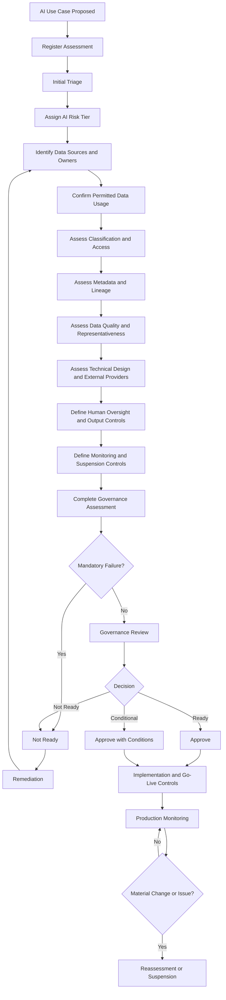

# AI Use Case Assessment Workflow

## 1. Purpose

This workflow defines how artificial intelligence use cases are proposed, assessed, approved, conditionally approved, monitored, reassessed, suspended and retired within HelvetiaCare Insurance Group.

The workflow ensures that every material AI use case has:

- A legitimate and documented business purpose
- A named Business Owner
- Clearly identified Data Owners and Data Stewards
- An appropriate AI risk tier
- Approved and traceable data sources
- Appropriate data classification and access controls
- Documented data-quality and representativeness assessments
- Defined human oversight
- Documented limitations
- Appropriate monitoring
- A formal governance decision
- Retained evidence and an audit trail

This workflow operationalises the AI Data Readiness Standard as part of the broader assessment of the complete AI use case.

---

## 2. Scope

This workflow applies to:

- Generative AI
- Predictive models
- Classification models
- Recommendation systems
- Natural-language processing
- Document extraction
- Fraud-detection tools
- Claims-support tools
- Customer-service assistants
- Decision-support systems
- AI-enabled workflow automation
- Retrieval-augmented generation
- Knowledge bases used by AI
- Vector databases
- Model-training datasets
- Fine-tuning datasets
- AI evaluation datasets
- External AI platforms
- Third-party AI solutions
- Embedded AI functionality in enterprise applications

The workflow applies whether the AI capability is:

- Developed internally
- Purchased from a supplier
- Hosted in the cloud
- Used experimentally
- Used in production
- Employee-facing
- Customer-facing
- Human-supervised
- Partially automated
- Fully automated

This workflow does not replace:

- Information Security assessment
- Data Protection assessment
- Legal or Compliance review
- Model validation
- Technology architecture review
- Procurement or supplier assessment
- Production change management

These reviews must be integrated where relevant.

---

## 3. Workflow Triggers

The workflow begins when:

- A new AI use case is proposed
- An existing prototype is proposed for production
- A new dataset is added to an existing use case
- A material data source changes
- An external AI provider is introduced
- The intended business purpose changes
- The affected customer or user population changes
- The degree of automation increases
- Sensitive Personal or Restricted data is introduced
- A model or retrieval architecture changes materially
- A High-severity data issue is identified
- Data quality falls below an approved threshold
- A scheduled reassessment becomes due
- An approved use case is proposed for reuse in another business process

---

## 4. Core Principles

### 4.1 Business purpose must be explicit

An AI use case must address a documented business need.

Experimentation without a defined purpose may occur only in an approved controlled environment.

### 4.2 Business accountability remains with humans

Every use case must have a named Business Owner.

The use of AI does not transfer accountability to:

- The model
- The technology provider
- The development team
- The dataset
- The system output

### 4.3 Data availability does not create permission

Data may be used only where:

- The business purpose is approved
- The data usage is permitted
- Ownership is confirmed
- Access is authorised
- Classification requirements are met
- Retention conditions are defined

### 4.4 Assessment must be proportionate to risk

Higher-risk use cases require:

- More complete evidence
- More senior approval
- Stronger human oversight
- More frequent monitoring
- More frequent reassessment

### 4.5 Mandatory requirements cannot be averaged away

A high overall score cannot compensate for a critical failure involving:

- Missing ownership
- Prohibited data usage
- Unauthorised Sensitive Personal data
- Material data-quality failure
- Missing critical lineage
- Inadequate human oversight
- Uncontrolled external processing
- Inability to suspend the use case

### 4.6 Limitations must be visible

Known limitations must be documented and communicated to:

- Business users
- Human reviewers
- Data Owners
- Data Stewards
- Technical teams
- Decision-makers
- Relevant governance bodies

### 4.7 Approval is conditional on continued compliance

An approved use case must be reassessed when material conditions change.

---

## 5. Roles

### Business Owner

The Business Owner is accountable for:

- Defining the business purpose
- Confirming expected business value
- Identifying affected processes and decisions
- Identifying affected customers or users
- Defining acceptable operational performance
- Ensuring appropriate human oversight
- Sponsoring required remediation
- Accepting accountability for deployment

### Data Owner

Each relevant Data Owner is accountable for:

- Approving use of data from their domain
- Confirming authoritative sources
- Approving data-quality expectations
- Confirming classification
- Reviewing material data limitations
- Approving remediation priorities
- Confirming continued suitability of the data

### Data Steward

The Data Steward is responsible for:

- Coordinating the data-readiness assessment
- Maintaining the data inventory
- Confirming business metadata
- Coordinating data-quality assessment
- Recording known limitations
- Tracking data-related remediation
- Maintaining approval evidence
- Monitoring reassessment dates

### Data Custodian

The Data Custodian is responsible for:

- Documenting technical data sources
- Supporting lineage documentation
- Documenting transformations
- Implementing approved access controls
- Producing data-quality results
- Maintaining dataset versions
- Producing processing evidence
- Implementing technical remediation

### AI Product Owner or Technical Lead

The AI Product Owner or Technical Lead is responsible for:

- Describing the proposed AI functionality
- Documenting technical architecture
- Identifying model and dataset dependencies
- Defining system outputs
- Supporting testing
- Defining operational monitoring
- Implementing approved conditions

### Data and AI Centre of Excellence

The Data and AI Centre of Excellence is responsible for:

- Coordinating the assessment method
- Supporting AI risk tiering
- Reviewing AI-specific risks
- Challenging unsupported assumptions
- Reviewing readiness evidence
- Supporting monitoring design
- Recommending the governance decision

### Control and Advisory Functions

Relevant functions may include:

- Data Protection
- Information Security
- Compliance
- Risk Management
- Legal
- Model Risk
- Internal Control
- Procurement
- Third-Party Risk Management

These functions review matters within their respective mandates.

### Data Governance Council

The Data Governance Council reviews:

- Tier 3 use cases
- Material cross-domain use cases
- Material unresolved data risks
- High-risk conditional approvals
- High-severity AI data issues
- Disputed ownership
- Decisions exceeding delegated authority

---

## 6. AI Risk Tiers

### Tier 1 — Limited risk

Typical characteristics:

- Uses Internal or low-risk Confidential data
- Does not materially affect customers
- Does not make or recommend material decisions
- Does not use Sensitive Personal or Restricted data
- Has limited operational impact
- Includes straightforward human review

Examples:

- Internal document summarisation
- Approved enterprise-policy search
- Drafting assistance using controlled content
- Glossary-description suggestions reviewed by a Data Steward

### Tier 2 — Moderate risk

Typical characteristics:

- Uses important operational data
- May use Personal data
- Influences business decisions
- Supports customer or claims processes
- Combines multiple data sources
- Requires structured human oversight
- Could create moderate harm if materially incorrect

Examples:

- Claims-document classification
- Customer-service response assistance
- Provider anomaly detection
- AI-assisted data-quality issue classification

### Tier 3 — High risk

Typical characteristics:

- Uses Sensitive Personal or Restricted data
- Influences material customer outcomes
- Supports high-impact decisions
- Affects claims, coverage, payments or reporting
- Uses complex combined or derived data
- Could create significant harm
- Requires senior governance review

Examples:

- AI-supported claims approval
- Health-risk prediction
- Fraud detection affecting customer treatment
- Automated prioritisation of sensitive cases
- AI-supported regulatory reporting

The assigned tier must include a documented rationale.

---

## 7. Required Assessment Information

Each assessment must contain:

| Field | Requirement |
|---|---|
| Assessment ID | Unique persistent identifier |
| Use-case name | Approved use-case name |
| Business purpose | Intended business outcome |
| Business Owner | Accountable use-case owner |
| AI risk tier | Tier 1, Tier 2 or Tier 3 |
| Intended users | People or systems using the output |
| Affected decisions | Decisions influenced by the use case |
| Degree of automation | Advisory, partially automated or automated |
| Data domains | Relevant enterprise data domains |
| Data Owners | Accountable domain roles |
| Data Steward | Coordinating governance role |
| Data Custodians | Supporting technical roles |
| Data sources | Systems, documents, files or external sources |
| Dataset versions | Versions assessed |
| Data classification | Highest applicable classification |
| Personal data | Yes or No |
| Sensitive Personal data | Yes or No |
| Restricted data | Yes or No |
| External processing | Yes or No |
| Critical data elements | Relevant governed data elements |
| Data-quality result | Assessment against approved thresholds |
| Lineage status | Complete, Partial or Missing |
| Known limitations | Documented weaknesses |
| Human oversight | Review and intervention controls |
| Output handling | Classification, retention and permitted use |
| Monitoring plan | Post-approval controls |
| Overall assessment | Assessment summary |
| Mandatory failures | Critical unmet requirements |
| Decision | Ready, Conditionally Ready or Not Ready |
| Review date | Required reassessment date |

---

## 8. Assessment Identifier Convention

AI use-case assessments use:

```text
AI-UC-<YEAR>-<NUMBER>
```

Examples:

```text
AI-UC-2026-001
AI-UC-2026-002
AI-UC-2026-003
```

An Assessment ID must:

- Be unique
- Remain persistent
- Never be reused
- Remain linked to all evidence and decisions

---

## 9. Workflow Overview



---

## 10. Step 1 — Register the Use Case

The Business Owner submits:

- Use-case name
- Business purpose
- Expected users
- Affected business process
- Decisions influenced
- Expected benefits
- Intended degree of automation
- Proposed data sources
- Intended customer or user population
- Proposed AI provider or technology
- Expected implementation date
- Proposed human oversight

The Data Steward or assessment coordinator creates the assessment record.

Initial status:

```text
Draft
```

---

## 11. Step 2 — Perform Initial Triage

The initial triage determines:

- Whether the proposal is genuinely an AI use case
- Whether a similar approved use case already exists
- Whether the use case is experimental or intended for production
- Which governance assessments are required
- Which Data Owners must participate
- Whether external processing is involved
- Whether Personal, Sensitive Personal or Restricted data may be involved
- Whether immediate specialist consultation is required

The assessment coordinator identifies the required reviewers.

---

## 12. Step 3 — Assign the AI Risk Tier

The Data and AI Centre of Excellence coordinates tiering.

The assessment considers:

- Data classification
- Customer impact
- Decision impact
- Degree of automation
- Scale
- Reversibility
- Financial impact
- Regulatory impact
- Sensitive-data usage
- External-provider involvement
- Ability to provide human review
- Potential for harmful or incorrect output

The assigned tier must be approved by the appropriate authority.

---

## 13. Step 4 — Identify Data Sources and Owners

The Data Steward and Data Custodian identify:

- Data domains
- Source systems
- External data
- Documents
- APIs
- Knowledge bases
- Data extracts
- Historical datasets
- Reference data
- Derived data
- AI-generated data reused as input

Each material source must record:

- Source name
- Source owner
- Data domain
- Authoritative-source status
- Classification
- Extraction or access method
- Refresh frequency
- Intended use
- Known limitations

For every material data domain, the assessment must confirm:

- Data Owner
- Data Steward
- Data Custodian
- Ownership scope
- Escalation route

Unresolved data ownership is a mandatory failure.

---

## 14. Step 5 — Confirm Permitted Data Usage

The assessment must determine:

- Whether the proposed business purpose is authorised
- Whether reuse is compatible with the original purpose
- Whether contractual restrictions apply
- Whether external-provider terms permit processing
- Whether data may be used for model training
- Whether prompts or conversations may be retained
- Whether outputs may be stored or reused
- Whether geographic processing restrictions apply
- Whether retention requirements are defined
- Whether data may be shared with third parties

Unclear or prohibited usage results in:

```text
Not Ready
```

---

## 15. Step 6 — Assess Classification and Access

The assessment must confirm the classification of:

- Source data
- Combined datasets
- Derived data
- Prompt content
- Retrieved documents
- Model input
- Model output
- Logs
- Conversation history
- Evaluation data

The highest applicable classification governs the use case unless effective segregation exists.

The access assessment must confirm:

- Approved user roles
- Least-privilege access
- Service-account controls
- Export restrictions
- Download restrictions
- External-party access
- Privileged access
- Authentication
- Logging
- Access-review frequency
- Revocation
- Temporary-access expiry

Access must comply with the Enterprise Data Access Standard.

---

## 16. Step 7 — Assess Metadata and Lineage

The Data Steward verifies that each material dataset includes:

- Dataset identifier
- Dataset name
- Business description
- Business purpose
- Data domains
- Data Owners
- Data Steward
- Data Custodian
- Authoritative sources
- Classification
- Critical data elements
- Quality requirements
- Known limitations
- Permitted usage
- Retention
- Dataset version
- Review date

The Data Custodian documents lineage covering:

- Original source
- Extraction
- Intermediate systems
- Transformations
- Filters
- Aggregations
- Enrichment
- Manual adjustments
- Dataset creation
- Model input
- Retrieval index
- Output destination
- Downstream reuse

Tier 2 and Tier 3 use cases require end-to-end lineage for material data elements.

Missing critical lineage is a mandatory failure for Tier 3.

---

## 17. Step 8 — Assess Data Quality

The assessment must evaluate applicable dimensions:

- Accuracy
- Completeness
- Consistency
- Timeliness
- Validity
- Uniqueness
- Referential Integrity
- Traceability
- Representativeness

For each material assessment, record:

| Field | Description |
|---|---|
| Data element | Element assessed |
| Quality dimension | Applicable dimension |
| Requirement | Required business condition |
| Measurement method | Assessment logic |
| Current result | Measured result |
| Threshold | Approved target |
| Status | Green, Amber or Red |
| Use-case impact | Effect on reliability |
| Remediation | Required corrective action |
| Owner | Responsible role |
| Evidence | Supporting result |

### Green

The approved threshold is met.

### Amber

The requirement is not fully met, but the risk may be managed through:

- Restricted scope
- Additional review
- Enhanced monitoring
- Remediation
- Conditional approval

### Red

A material requirement is not met.

A Red result requires formal review and may result in:

- Data exclusion
- Remediation
- Restricted deployment
- Rejection
- Suspension

---

## 18. Step 9 — Assess Representativeness and Historical Context

The assessment must consider:

- Population coverage
- Geographic coverage
- Product coverage
- Historical period
- Customer groups
- Provider groups
- Rare events
- Missing groups
- Seasonal patterns
- Sampling methods
- Changes in business processes
- Changes in data capture

The assessment must also consider whether historical data reflects:

- Previous business policies
- Legacy-system constraints
- Past manual decisions
- Historical exclusions
- Inconsistent data capture
- Previous errors
- Operational workarounds
- Regulatory changes

Historical records must not automatically be treated as objective ground truth.

Material limitations must identify:

- Affected populations
- Potential output impact
- Required restrictions
- Human-review controls
- Remediation
- Monitoring

---

## 19. Step 10 — Assess Transformations and Dataset Versions

Each material transformation must document:

- Input source
- Output field or dataset
- Transformation logic
- Business rationale
- Technical owner
- Business reviewer
- Version
- Test evidence
- Known limitations
- Status

Each material dataset version must record:

- Dataset version
- Creation date
- Source versions
- Data period
- Transformation version
- Quality-assessment result
- Approval status
- Known limitations
- Applicable use cases

The deployed use case must be traceable to the dataset version assessed and approved.

---

## 20. Step 11 — Assess External AI Providers

Where an external provider is involved, the assessment must consider:

- Provider identity
- Service description
- Processing location
- Sub-processors
- Data retention
- Data deletion
- Provider access
- Security controls
- Model-training conditions
- Data reuse conditions
- Contractual restrictions
- Incident notification
- Service availability
- Output ownership
- Audit or assurance evidence
- Exit arrangements

Sensitive Personal or Restricted data must not be submitted to an external AI provider without explicit approval.

---

## 21. Step 12 — Assess Retrieval-Augmented Generation

For a Retrieval-Augmented Generation use case, the assessment must document:

- Approved source documents
- Content owners
- Source classification
- Indexing process
- Chunking approach
- Metadata filters
- Refresh frequency
- Access-control inheritance
- Retrieval testing
- Source-attribution method
- Retired-content handling
- Conflicting-document handling
- Logging and monitoring

The retrieval system must not provide access to information that the user cannot access in the original source.

---

## 22. Step 13 — Define Human Oversight

Human oversight must be proportionate to risk.

It may include:

- Mandatory review before action
- Four-eyes approval
- Specialist review
- Exception-based review
- Sampling
- Low-confidence escalation
- Manual override
- Suspension authority
- Customer-facing confirmation

The assessment must identify:

- Human reviewer
- Required competence
- Information available to the reviewer
- Review frequency
- Decision authority
- Escalation route
- Evidence retained
- Conditions requiring intervention

Tier 3 use cases require documented and testable human-oversight controls.

---

## 23. Step 14 — Assess Output Handling

AI outputs must be assessed for:

- Classification
- Accuracy limitations
- Confidentiality
- Personal or Sensitive Personal content
- Potential sensitive inference
- Permitted storage
- Permitted sharing
- Retention
- Human-review requirements
- Downstream use

An AI output is not automatically approved enterprise data.

Where outputs are retained or reused, they require:

- Ownership
- Classification
- Metadata
- Quality controls
- Traceability
- Retention requirements

---

## 24. Step 15 — Define Monitoring

The monitoring plan must consider:

- Source-data changes
- Data-quality results
- Missing-value trends
- Duplicate rates
- Population changes
- Data drift
- Classification changes
- Access changes
- Retrieval performance
- External-provider changes
- Human-review findings
- Output errors
- Incidents and issues
- Conditional-approval actions

The plan must identify:

- Monitoring control
- Monitoring owner
- Frequency
- Threshold
- Evidence
- Escalation trigger
- Suspension trigger

---

## 25. Mandatory Readiness Failures

The use case must receive `Not Ready` status where any of the following remains unresolved:

- No named Business Owner
- No accountable Data Owner for material data
- Prohibited or unclear data usage
- Unauthorised Sensitive Personal or Restricted data
- Missing critical lineage for a Tier 3 use case
- Material Red data-quality result without approved mitigation
- Uncontrolled external processing
- Inadequate human oversight for a material decision
- No ability to monitor material risk
- No ability to suspend the use case
- Unresolved High-severity data issue
- Missing approval required by the risk tier

---

## 26. Assessment Statuses

The workflow uses:

- Draft
- Under Triage
- Under Assessment
- Information Required
- Specialist Review
- Remediation Required
- Awaiting Approval
- Ready
- Conditionally Ready
- Not Ready
- Suspended
- Retired

Status changes must be dated and attributable.

---

## 27. Decision Outcomes

### Ready

All mandatory requirements are satisfied.

The use case may proceed subject to standard implementation controls.

### Conditionally Ready

The use case may proceed subject to:

- Documented conditions
- Interim controls
- Named action owners
- Target dates
- Enhanced monitoring
- An expiry or review date

### Not Ready

The use case may not proceed because material requirements remain unmet.

### Suspended

Previous approval is temporarily withdrawn because:

- A material issue occurred
- A source became unreliable
- Quality deteriorated
- Usage became unauthorised
- Monitoring failed
- Human oversight stopped operating
- Material conditions changed without assessment

### Retired

The use case is no longer active and must follow closure requirements.

---

## 28. Approval Requirements

### Tier 1

Minimum approval:

- Business Owner
- Relevant Data Owner
- Data Steward confirmation

### Tier 2

Minimum approval:

- Business Owner
- Relevant Data Owner
- Data Steward
- Data and AI Centre of Excellence
- Data Protection or Information Security where applicable

### Tier 3

Minimum approval:

- Business Owner
- Relevant Data Owners
- Data and AI Centre of Excellence
- Data Protection
- Information Security
- Compliance or Risk Management where applicable
- Data Governance Council or delegated senior authority

---

## 29. Conditional Approval

Conditional approval may be granted only where:

- The business value justifies controlled progression
- Material risks are understood
- Interim controls exist
- Required remediation is defined
- Owners and deadlines are assigned
- Monitoring is enhanced
- The approval has an expiry date

The decision must record:

- Conditions
- Risk rationale
- Interim controls
- Required actions
- Action owners
- Target dates
- Review date
- Suspension triggers

Conditional approval must not become a permanent substitute for remediation.

---

## 30. Implementation and Go-Live Controls

Before production use, the implementation team must confirm:

- The approved version is being deployed
- Approved datasets are being used
- Access controls are implemented
- Human oversight is operational
- Monitoring is configured
- Logging is enabled
- Retention is configured
- External-provider conditions are satisfied
- Conditional actions required before launch are complete
- Suspension authority is defined
- Required training is complete

Production deployment evidence must be retained.

---

## 31. Reassessment Triggers

The use case must be reassessed when:

- A new data source is introduced
- A source is removed
- A material transformation changes
- Data classification changes
- A new population is included
- The business purpose changes
- The degree of automation changes
- The use case moves from pilot to production
- The AI risk tier changes
- A material incident occurs
- A High-severity issue is identified
- A provider changes
- Processing location changes
- Human oversight changes
- The model is materially retrained
- A governance exception expires

---

## 32. Review Frequency

| Use-case tier | Minimum review frequency |
|---|---|
| Tier 1 | Annually or following material change |
| Tier 2 | At least annually and following material change |
| Tier 3 | At least every six months and following material change |
| Conditionally Ready | According to approval conditions |
| Suspended | Before reactivation |
| External AI provider | Following material provider or contractual change |
| Retrieval-Augmented Generation | Following material knowledge-base change |

---

## 33. Suspension Workflow

A use case must be considered for suspension where:

- A critical source fails
- A High-severity data issue is identified
- Sensitive-data usage is no longer authorised
- Critical lineage is lost
- Quality deteriorates materially
- A dataset changes without assessment
- External-provider conditions change materially
- Human oversight stops operating
- Outputs may cause material customer, financial or reporting harm

Suspension requires:

1. A documented trigger.
2. Notification of the Business Owner.
3. Notification of relevant Data Owners.
4. Immediate containment.
5. Assessment of affected outputs.
6. A remediation or retirement decision.
7. Formal approval before reactivation.

---

## 34. Retirement and Closure

When an AI use case is retired, the owner must confirm:

- Production use has stopped
- User access is removed
- Service accounts are disabled
- Scheduled processing is stopped
- Temporary data is deleted
- Retained data follows approved retention requirements
- Provider services are terminated where applicable
- Outputs are archived or deleted appropriately
- Open issues are resolved or transferred
- Closure evidence is retained

Final status:

```text
Retired
```

---

## 35. Required Evidence

The workflow must retain:

- Use-case proposal
- Assessment record
- Risk-tier rationale
- Data inventory
- Ownership confirmation
- Permitted-use assessment
- Classification assessment
- Access assessment
- Data-quality results
- Representativeness assessment
- Lineage documentation
- Transformation records
- Dataset-version records
- External-provider assessment
- Human-oversight design
- Output-handling assessment
- Monitoring plan
- Specialist reviews
- Approval decision
- Conditional actions
- Implementation evidence
- Reassessment records
- Suspension decisions
- Retirement evidence

Evidence must be:

- Complete
- Accurate
- Dated
- Attributable
- Version-controlled
- Protected from unauthorised alteration
- Available for governance review

---

## 36. Workflow KPIs

| KPI | Description |
|---|---|
| Assessment coverage | Percentage of material AI use cases assessed |
| Ownership coverage | Percentage with confirmed Business and Data Owners |
| Data-source coverage | Percentage with complete source inventories |
| Quality-assessment coverage | Percentage with completed quality assessment |
| Lineage coverage | Percentage with documented material lineage |
| Classification coverage | Percentage with approved classification |
| Conditional-action completion | Percentage completed within target |
| Reassessment timeliness | Percentage reassessed within target |
| Suspended use cases | Number suspended for governance reasons |
| High-severity AI issues | Number of unresolved High issues |
| Human-oversight coverage | Percentage with documented oversight |
| External-provider approval | Percentage with approved provider assessment |

---

## 37. Illustrative Targets

| KPI | Target |
|---|---|
| Material AI use cases with completed assessment | 100% |
| AI use cases with named Business Owner | 100% |
| AI datasets with confirmed Data Owners | 100% |
| Tier 2 and Tier 3 use cases with documented lineage | 100% |
| Tier 3 use cases with defined human oversight | 100% |
| Sensitive AI datasets with approved classification | 100% |
| Conditional actions completed within target | At least 95% |
| Overdue Tier 3 reassessments | 0 |
| High-severity AI issues without containment | 0 |
| Unapproved external AI processing | 0 |

---

## 38. RACI Summary

| Activity | Business Owner | Data Owner | Data Steward | Data Custodian | Data and AI Centre of Excellence |
|---|---|---|---|---|---|
| Define business purpose | Accountable | Consulted | Consulted | Informed | Responsible |
| Assign AI risk tier | Accountable | Consulted | Consulted | Informed | Responsible |
| Identify data sources | Consulted | Accountable | Responsible | Responsible | Consulted |
| Approve data usage | Consulted | Accountable | Responsible | Informed | Consulted |
| Confirm classification | Consulted | Accountable | Responsible | Consulted | Consulted |
| Assess data quality | Consulted | Accountable | Responsible | Responsible | Consulted |
| Document lineage | Informed | Consulted | Responsible | Responsible | Accountable |
| Define human oversight | Accountable | Consulted | Responsible | Informed | Responsible |
| Implement access controls | Informed | Accountable | Consulted | Responsible | Consulted |
| Recommend readiness | Consulted | Consulted | Responsible | Consulted | Accountable |
| Approve deployment | Accountable | Accountable for data | Responsible | Consulted | Responsible |
| Monitor the use case | Accountable | Accountable for data | Responsible | Responsible | Consulted |
| Suspend the use case | Accountable | Consulted | Responsible | Responsible for technical action | Consulted |

---

## 39. Non-Compliance

Material non-compliance with this workflow must be:

1. Recorded as a Data Governance issue.
2. Assigned to an accountable owner.
3. Assessed according to data and use-case risk.
4. Supported by containment and remediation.
5. Escalated where High severity or overdue.
6. Considered as a potential suspension trigger.
7. Reported through governance KPIs.
8. Reviewed for control improvement.

A Tier 3 use case must not proceed through undocumented approval or exception.

---

## 40. Document Control

| Field | Value |
|---|---|
| Workflow owner | Data and AI Centre of Excellence |
| Business accountable role | Relevant Business Owner |
| Data accountable roles | Relevant Data Owners |
| Process coordinator | Relevant Data Steward |
| Approval authority | According to AI risk tier |
| Escalation authority | Data Governance Council |
| Version | 1.0 |
| Status | Illustrative portfolio version |
| Review frequency | Annual |

---

This workflow forms part of a fictional portfolio project and does not represent the AI governance process of a real insurance organisation.