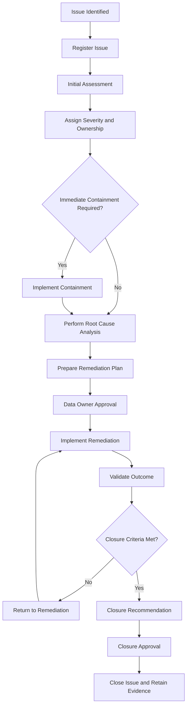
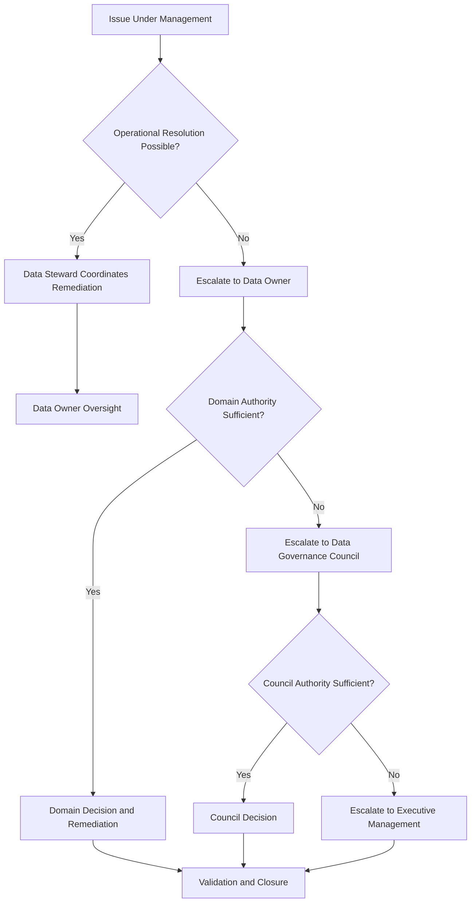

# Data Issue Management Workflow

## 1. Purpose

This workflow defines how Data Governance issues are identified, recorded, assessed, assigned, remediated, escalated, validated and closed within HelvetiaCare Insurance Group.

The workflow operationalises the Enterprise Data Issue Management Standard and ensures that every material issue has:

- A unique identifier
- A documented business impact
- An approved severity
- An accountable Data Owner
- A responsible Data Steward
- A remediation owner
- A target resolution date
- An escalation route
- Validation evidence
- Formal closure approval

---

## 2. Scope

This workflow applies to issues affecting:

- Data ownership
- Data stewardship
- Business definitions
- Metadata
- Critical data elements
- Data quality
- Data classification
- Data access
- Data retention
- Data lineage
- Data interfaces
- Reports and dashboards
- Analytics datasets
- Artificial intelligence use cases
- Third-party data
- Governance controls
- Governance documentation and evidence

The workflow applies regardless of whether the issue is identified manually or through an automated control.

---

## 3. Workflow Triggers

The workflow begins when an issue is identified through:

- A data-quality control
- A reconciliation
- A business-process failure
- A customer complaint
- A reporting review
- An access review
- A metadata review
- A governance meeting
- A project or system change
- An analytics or AI assessment
- An audit or control review
- A third-party notification
- A security or Data Protection incident
- A governance exception review

---

## 4. Roles

### Issue Reporter

The Issue Reporter identifies and submits the issue.

The reporter may be:

- A business user
- A Data Owner
- A Data Steward
- A Data Custodian
- A control function
- A project team
- An analytics or AI team
- An auditor
- A third-party representative
- An automated control

### Data Steward

The Data Steward is responsible for:

- Registering the issue
- Coordinating the initial assessment
- Recommending severity
- Identifying affected data and systems
- Assigning or proposing remediation ownership
- Monitoring target dates
- Coordinating escalation
- Preparing governance reporting
- Coordinating validation
- Recommending closure

### Data Owner

The Data Owner is accountable for:

- Confirming business impact
- Approving High-severity classification
- Approving remediation priorities
- Sponsoring remediation
- Accepting residual risk within delegated authority
- Approving closure of material issues
- Escalating matters beyond domain authority

### Remediation Owner

The Remediation Owner is responsible for implementing the agreed corrective actions.

The role may be held by:

- A business-process owner
- A Data Custodian
- A technology team
- A project manager
- A supplier manager
- A reporting owner
- An analytics or AI team

### Data Custodian

The Data Custodian:

- Investigates technical causes
- Implements technical containment
- Implements approved technical remediation
- Produces control evidence
- Supports validation

### Control and Advisory Functions

Relevant control functions:

- Review matters within their mandates
- Challenge severity and risk assessments
- Recommend additional controls
- Participate in closure review where required
- Retain independent escalation rights

### Data Governance Council

The Data Governance Council:

- Reviews material cross-domain issues
- Resolves ownership conflicts
- Prioritises enterprise remediation
- Reviews overdue High-severity issues
- Approves material enterprise risk decisions
- Escalates matters beyond its authority

---

## 5. Required Issue Information

Each issue record must contain:

| Field | Requirement |
|---|---|
| Issue ID | Unique persistent identifier |
| Issue title | Concise description |
| Issue category | Approved category |
| Primary data domain | Main affected domain |
| Additional domains | Other affected domains |
| Date identified | Date the issue was detected |
| Identified by | Person, role or control |
| Issue source | Control, complaint, review, audit or other source |
| Description | Clear explanation of the issue |
| Affected data elements | Relevant data elements |
| Critical data element | Yes or No |
| Affected systems | Relevant systems or platforms |
| Business impact | Customer, operational, reporting or regulatory impact |
| Severity | Low, Medium or High |
| Severity rationale | Reason for the assigned severity |
| Data classification | Highest affected classification |
| Data Owner | Accountable role |
| Data Steward | Responsible coordinator |
| Remediation owner | Role implementing corrective action |
| Root cause | Confirmed or suspected cause |
| Containment action | Immediate risk-reduction action |
| Remediation plan | Approved corrective actions |
| Target date | Resolution deadline |
| Current status | Approved lifecycle status |
| Dependencies | Blockers or required decisions |
| Validation method | Method used to confirm remediation |
| Validation result | Outcome of validation |
| Residual risk | Remaining risk after remediation |
| Closure approver | Authorised decision-maker |
| Closure date | Date the issue was closed |
| Closure evidence | Supporting evidence |

---

## 6. Issue Identifier Convention

Issues use the following format:

```text
ISSUE-<YEAR>-<NUMBER>
```

Examples:

```text
ISSUE-2026-001
ISSUE-2026-002
ISSUE-2026-003
```

An Issue ID must:

- Be unique
- Remain persistent
- Never be reused
- Remain linked to supporting evidence

---

## 7. Approved Issue Categories

The primary issue category must be one of the following:

- Ownership and Accountability
- Business Definition and Metadata
- Data Quality
- Data Classification and Handling
- Data Access
- Data Lifecycle
- Data Lineage and Integration
- Reporting and Analytics
- Artificial Intelligence
- Third-Party Data
- Governance Process and Evidence

A secondary category may be recorded where appropriate.

---

## 8. Workflow Overview



---

## 9. Workflow Steps

### Step 1 — Identify the issue

The Issue Reporter records:

- What was observed
- When it was observed
- Where it occurred
- Which data or system may be affected
- Immediate known impact
- Available supporting evidence
- Whether urgent containment may be required

The reporter does not need to determine the final root cause or severity.

---

### Step 2 — Register the issue

The Data Steward creates the issue record.

The initial record must contain at least:

- Issue ID
- Issue title
- Date identified
- Identified by
- Primary data domain
- Initial description
- Initial status
- Assigned Data Steward

Initial status:

```text
Identified
```

The Data Steward confirms receipt to the Issue Reporter.

---

### Step 3 — Perform the initial assessment

The Data Steward coordinates an initial assessment to determine:

- Data affected
- Systems affected
- Processes affected
- Customers affected
- Reports affected
- Data classification
- Critical data elements affected
- Potential regulatory or financial impact
- Potential analytics or AI impact
- Whether other domains are affected
- Whether immediate containment is required
- Indicative severity
- Required specialist involvement

The status changes to:

```text
Under Assessment
```

---

### Step 4 — Assign severity

The Data Steward recommends one of the following severities:

- Low
- Medium
- High

The severity assessment must consider:

- Customer impact
- Regulatory impact
- Financial impact
- Operational impact
- Reporting impact
- Data Protection impact
- Information Security impact
- Analytics or AI impact
- Data criticality
- Number of records affected
- Duration
- Recurrence
- Detectability
- Correctability
- Cross-domain impact

The Data Owner approves High-severity classification.

---

## 10. Severity Decision Guide

### Low

A Low-severity issue:

- Has limited impact
- Affects non-critical data
- Affects a small number of records
- Can be resolved through routine operations
- Does not materially affect customers or reporting

### Medium

A Medium-severity issue:

- Affects an important process
- Requires coordinated remediation
- May affect several systems or teams
- May affect customers or reporting moderately
- Could become High severity if unresolved

### High

A High-severity issue:

- Affects critical data
- Creates material customer impact
- Creates material financial or regulatory risk
- Affects multiple domains
- Involves Sensitive Personal or Restricted data
- Could materially compromise analytics or AI outputs
- Requires urgent senior attention

Where severity is uncertain, the higher provisional severity must be used until the assessment is complete.

---

## 11. Target Timelines

| Severity | Initial assessment | Owner assignment | Remediation plan | Indicative resolution |
|---|---:|---:|---:|---:|
| Low | 10 working days | 10 working days | 20 working days | 90 calendar days |
| Medium | 5 working days | 5 working days | 10 working days | 60 calendar days |
| High | 1 working day | 1 working day | 5 working days | Formally agreed according to risk |

A High-severity issue that cannot be resolved promptly must have:

- Immediate containment
- Interim controls
- Formal senior oversight
- An approved target date
- Frequent progress reporting
- Documented residual risk

---

## 12. Assign Ownership

The issue must have:

- One accountable Data Owner
- One coordinating Data Steward
- One remediation owner
- Supporting Data Custodians where relevant

For a cross-domain issue:

- A lead Data Owner must be assigned
- Supporting Data Owners must be identified
- A lead Data Steward must coordinate the issue
- Responsibilities must be documented

Ownership disputes must be escalated to the Data Governance Council.

---

## 13. Immediate Containment

Containment is required where continued operation could increase harm.

Examples include:

- Pausing an incorrect report
- Suspending a failed interface
- Blocking new invalid records
- Restricting access
- Disabling an automated process
- Isolating affected records
- Applying temporary manual review
- Reverting to an approved source
- Warning data consumers
- Suspending an AI use case

Each containment action must include:

- Action description
- Responsible owner
- Implementation date
- Scope
- Expected duration
- Monitoring requirements
- Replacement or exit plan

Containment must not become an undocumented permanent workaround.

---

## 14. Root Cause Analysis

The Data Steward coordinates root-cause analysis for:

- All Medium issues where recurrence is possible
- All High issues
- All recurring issues
- Material cross-domain issues

Approved root-cause categories include:

- Ownership gap
- Stewardship gap
- Definition ambiguity
- Incomplete metadata
- Process design
- Manual input error
- Training gap
- System configuration
- Software defect
- Interface failure
- Transformation logic
- Reference-data failure
- Access-control failure
- Control-design weakness
- Control-execution failure
- Change-management failure
- Third-party failure
- Legacy-data limitation
- Resource constraint
- Unapproved workaround
- Unknown

The analysis must distinguish between:

- The visible symptom
- The immediate cause
- The underlying root cause

---

## 15. Root Cause Analysis Methods

Appropriate methods may include:

- Five Whys
- Process mapping
- Data profiling
- Source-to-target reconciliation
- Control walkthrough
- Log review
- Change-history review
- Access-log review
- Stakeholder interviews
- Cause-and-effect analysis
- Trend analysis
- Comparison with previous issues

The method must be proportionate to severity and complexity.

---

## 16. Prepare the Remediation Plan

The remediation plan must include:

- Specific corrective actions
- Action owners
- Target dates
- Dependencies
- Required resources
- Interim controls
- Validation method
- Required evidence
- Expected residual risk
- Escalation route

The plan should address:

1. Immediate correction
2. Root-cause remediation
3. Prevention of recurrence
4. Control improvement
5. Documentation updates
6. Training or communication where required

---

## 17. Remediation Actions

Remediation may include:

- Correcting affected records
- Reprocessing transactions
- Updating business definitions
- Completing metadata
- Assigning ownership
- Updating classifications
- Restricting or revoking access
- Changing business processes
- Implementing validation rules
- Correcting system configuration
- Correcting transformation logic
- Improving reconciliation
- Replacing a data source
- Updating reports
- Updating analytics datasets
- Suspending or reassessing an AI use case
- Improving supplier controls
- Introducing automated monitoring

---

## 18. Action Management

Each remediation action must contain:

| Field | Description |
|---|---|
| Action ID | Unique identifier |
| Issue ID | Related issue |
| Action description | Required activity |
| Action owner | Responsible person or role |
| Target date | Completion deadline |
| Dependency | Required predecessor or resource |
| Status | Open, In Progress, Blocked, Completed or Cancelled |
| Evidence required | Proof of completion |
| Completion date | Actual completion date |
| Validation result | Confirmation that the action worked |

An issue may contain several remediation actions.

---

## 19. Data Owner Approval

The Data Owner reviews:

- Severity
- Business impact
- Root cause
- Containment
- Remediation plan
- Target dates
- Resource requirements
- Residual risk
- Escalation requirements

The Data Owner may:

- Approve the plan
- Approve with conditions
- Request amendments
- Escalate the issue
- Accept residual risk within delegated authority

The decision must be recorded.

---

## 20. Implement Remediation

The Remediation Owner implements the approved actions.

During implementation:

- Progress must be updated
- Delays must be recorded
- Dependencies must be tracked
- New risks must be escalated
- Technical or business evidence must be retained
- Changes must follow applicable change-management controls

The status changes to:

```text
In Progress
```

Where progress cannot continue, the issue may be marked:

```text
Blocked
```

Blocked status must include:

- Blocking dependency
- Blocker owner
- Required action or decision
- Escalation route
- Review date
- Interim controls

---

## 21. Validate the Outcome

When remediation is complete, the status changes to:

```text
Awaiting Validation
```

Validation must confirm:

- Required actions were completed
- Corrected data meets the approved requirement
- The root cause was addressed
- The control operates effectively
- No material unintended consequences were introduced
- Documentation was updated
- Remaining limitations are recorded
- Evidence is complete

Validation should be performed by a role with sufficient independence from the person who implemented the remediation.

---

## 22. Validation Evidence

Validation evidence may include:

- Before-and-after data comparisons
- Reconciliation reports
- Data-quality control results
- Test results
- Updated system configuration
- Updated glossary or metadata records
- Access-removal confirmation
- Updated process documentation
- Training-completion evidence
- Supplier evidence
- Analytics or AI reassessment
- Governance decision records

The validation result must be documented as:

- Successful
- Partially successful
- Unsuccessful
- Further remediation required

---

## 23. Closure Criteria

An issue may be closed only when:

- Mandatory actions are complete
- Validation is successful
- Closure evidence is retained
- The underlying control operates effectively
- Root cause has been addressed or formally accepted
- Remaining risk is documented
- Related temporary exceptions are closed or separately governed
- The Data Steward recommends closure
- The required authority approves closure

High-severity issues require Data Owner approval.

Material cross-domain issues may require Data Governance Council acknowledgement or approval.

---

## 24. Closure Workflow

When closure criteria are satisfied:

1. The Data Steward prepares a closure recommendation.
2. The Data Owner or authorised approver reviews the evidence.
3. The approver confirms closure or requests further remediation.
4. The final decision is recorded.
5. The issue status changes to `Closed`.
6. The closure date is recorded.
7. Supporting evidence is retained.
8. Relevant governance reports are updated.

Closure must not be based only on the passage of time.

---

## 25. Closure Decision Outcomes

| Decision | Meaning |
|---|---|
| Closed | All closure criteria are satisfied |
| Further Remediation Required | Additional actions are necessary |
| Risk Accepted | Remaining risk is formally accepted |
| Reopened | The issue has recurred or closure was insufficient |
| Cancelled | The record was created incorrectly or is no longer applicable |

---

## 26. Risk Acceptance

Risk acceptance may be used only when:

- Full remediation is not currently feasible
- Business activity must continue
- Risk is understood
- Interim controls exist
- Appropriate authority approves the decision
- A review or expiry date is defined

The record must include:

- Unresolved condition
- Business rationale
- Risk assessment
- Affected data
- Existing and additional controls
- Accountable owner
- Approval authority
- Approval date
- Review or expiry date
- Planned long-term action

Risk acceptance must not be used to avoid remediation indefinitely.

---

## 27. Escalation Triggers

An issue must be escalated when:

- Severity is High
- Severity may increase
- Several domains are affected
- Material customer impact is possible
- Regulatory or financial reporting may be affected
- Sensitive Personal or Restricted data is involved
- A critical control fails
- Ownership is disputed
- Remediation is overdue
- Required resources are unavailable
- The issue recurs
- Risk exceeds delegated authority
- A related governance exception expires
- An AI use case may generate unreliable or harmful outputs

---

## 28. Escalation Path



---

## 29. Overdue Issues

An issue becomes overdue when its approved target date passes without closure.

The Data Steward must record:

- Reason for delay
- Current risk
- Actions completed
- Actions outstanding
- Revised target date
- Additional interim controls
- Escalation decision
- Accountable approval

Overdue High-severity issues must be reviewed at every relevant governance meeting.

Repeated extension requires stronger escalation.

---

## 30. Recurring Issues

An issue is recurring when:

- The same failure returns after closure
- Similar failures occur across systems or domains
- The same root cause affects multiple processes
- Previous remediation did not prevent recurrence

Recurring issues require:

- Reassessment of root cause
- Review of previous closure evidence
- Review of control design
- Consideration of enterprise-wide remediation
- Stronger validation
- Data Governance Council escalation where material

A previously closed issue may be marked:

```text
Reopened
```

---

## 31. Issues Affecting Reports

Where a report may be affected, the assessment must identify:

- Reports affected
- Reporting period
- Data elements affected
- Materiality
- Report consumers
- Correction required
- Communication required
- Whether publication must be delayed
- Whether restatement is required
- Whether specialist or regulatory escalation is required

The Report Owner must be informed promptly.

---

## 32. Issues Affecting Analytics or AI

Where analytics or AI may be affected, the assessment must identify:

- Datasets affected
- Use cases affected
- Models or automated processes affected
- Decisions influenced
- Data periods affected
- Quality dimensions affected
- Bias or representativeness concerns
- Whether use must be paused
- Whether outputs require reassessment
- Whether users must be notified

A material AI data issue may require:

- Suspension of the use case
- Enhanced human review
- Dataset replacement
- Readiness reassessment
- Model revalidation
- Output correction
- Data and AI Centre of Excellence escalation

---

## 33. Third-Party Issues

Where a third party causes or contributes to the issue:

- The internal Data Owner remains accountable
- The supplier owner must participate
- Contractual obligations must be reviewed
- Supplier evidence must be obtained
- Remediation actions must be tracked internally
- Repeated failures must be escalated
- Supplier assurances alone are not sufficient closure evidence

---

## 34. Issue Review Cadence

| Issue type | Minimum review frequency |
|---|---|
| Low | Monthly or according to the operational process |
| Medium | At least monthly |
| High | At least weekly until stabilised |
| Overdue High | At every relevant governance meeting |
| Cross-domain High | Monthly or more frequently |
| Risk Accepted | According to approval conditions |
| Blocked | At least monthly |
| AI-related High | According to operational and customer risk |

---

## 35. Workflow Statuses

The workflow uses these statuses:

- Identified
- Under Assessment
- Remediation Agreed
- In Progress
- Blocked
- Awaiting Validation
- Awaiting Closure Approval
- Closed
- Risk Accepted
- Cancelled
- Reopened

Status changes must be dated and attributable to an authorised role.

---

## 36. Workflow KPIs

| KPI | Description |
|---|---|
| Open issue count | Number of unresolved issues |
| High-severity issue count | Number of unresolved High issues |
| Overdue issue rate | Percentage past the approved target date |
| Average resolution time | Average time from identification to closure |
| Remediation completion rate | Percentage of actions completed within target |
| Issue recurrence rate | Percentage of closed issues that recur |
| Root-cause completion | Percentage of Medium and High issues with documented root cause |
| Closure evidence coverage | Percentage of closed issues with complete evidence |
| Ownership coverage | Percentage with assigned Data Owner and Data Steward |
| Cross-domain issue count | Number affecting more than one domain |

---

## 37. Illustrative Targets

| KPI | Target |
|---|---|
| High-severity issues without a Data Owner | 0 |
| High-severity issues without containment | 0 |
| Medium and High issues with root-cause analysis | 100% |
| High-severity actions completed within target | At least 95% |
| Closed material issues with complete evidence | 100% |
| Overdue High-severity issues | 0 |
| Cross-domain issues without a lead owner | 0 |
| Reopened High-severity issues | 0 |
| Material AI data issues without use-case review | 0 |

---

## 38. RACI Summary

| Activity | Data Owner | Data Steward | Data Custodian | Remediation Owner | Data Governance Council |
|---|---|---|---|---|---|
| Register issue | Accountable | Responsible | Consulted | Informed | Informed |
| Perform initial assessment | Accountable | Responsible | Consulted | Consulted | Informed |
| Approve High severity | Accountable | Responsible | Consulted | Informed | Informed |
| Define containment | Accountable | Responsible | Responsible for technical actions | Responsible for assigned actions | Informed |
| Perform root-cause analysis | Accountable | Responsible | Responsible for technical analysis | Consulted | Informed |
| Approve remediation plan | Accountable | Responsible | Consulted | Consulted | Informed |
| Implement remediation | Accountable | Consulted | Responsible for technical actions | Responsible | Informed |
| Validate remediation | Accountable | Responsible | Consulted | Consulted | Informed |
| Approve material closure | Accountable | Responsible | Consulted | Informed | Informed |
| Resolve cross-domain issue | Consulted | Responsible | Consulted | Consulted | Accountable |
| Accept material enterprise risk | Consulted | Responsible | Consulted | Informed | Accountable |

---

## 39. Required Evidence

The workflow must retain:

- Original issue report
- Initial assessment
- Severity assessment
- Ownership assignment
- Containment records
- Root-cause analysis
- Remediation plan
- Action records
- Technical or business change evidence
- Validation results
- Risk-acceptance records
- Escalation records
- Governance decisions
- Closure recommendation
- Closure approval
- Final audit-trail entries

Evidence must be:

- Complete
- Accurate
- Dated
- Attributable
- Protected from unauthorised alteration
- Accessible for governance review and audit

---

## 40. Document Control

| Field | Value |
|---|---|
| Workflow owner | Chief Data Office |
| Process coordinator | Relevant Data Steward |
| Accountable authority | Relevant Data Owner |
| Cross-domain escalation authority | Data Governance Council |
| Version | 1.0 |
| Status | Illustrative portfolio version |
| Review frequency | Annual |

---

This workflow forms part of a fictional portfolio project and does not represent the issue-management process of a real insurance organisation.