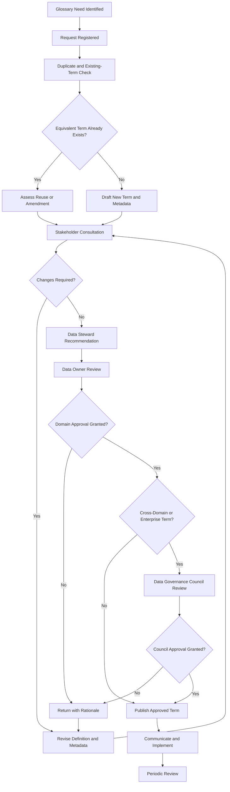

# Business Glossary Approval Workflow

## 1. Purpose

This workflow defines how new business terms, amended definitions and retired terms are proposed, reviewed, approved, published and maintained within the HelvetiaCare Insurance Group business glossary.

The workflow ensures that glossary terms are:

- Clearly defined
- Assigned to an enterprise data domain
- Supported by accountable ownership
- Reviewed by relevant stakeholders
- Approved by the appropriate authority
- Published with complete metadata
- Version-controlled
- Periodically reviewed
- Traceable for governance and audit purposes

---

## 2. Scope

This workflow applies to:

- New business terms
- Changes to approved definitions
- Changes to term ownership
- Changes to data-domain assignment
- Changes to authoritative sources
- Changes to data classification
- Changes to critical-data-element status
- Retirement of obsolete terms
- Resolution of conflicting definitions
- Enterprise terms used across multiple data domains

The workflow applies to terms recorded in:

```text
glossary/business_glossary.csv
```

---

## 3. Workflow Trigger

The workflow begins when one of the following occurs:

- A new business concept is introduced
- A project requires a new definition
- An existing definition is unclear
- Two teams use conflicting definitions
- A system or process changes
- A new report, dataset or AI use case requires governed terminology
- A Data Quality issue identifies a definition gap
- A term is no longer valid
- An authoritative source changes
- A periodic glossary review identifies required updates

---

## 4. Roles

### Requester

The Requester identifies the need for a new or amended business term.

The Requester may be:

- A business subject-matter expert
- A Data Steward
- A Data Owner
- A project team
- A reporting team
- A Data Custodian
- A Data Architect
- An analytics or AI team
- A control function

### Data Steward

The Data Steward is responsible for:

- Recording the request
- Checking for existing or duplicate terms
- Drafting or coordinating the definition
- Completing required metadata
- Coordinating stakeholder consultation
- Preparing the approval recommendation
- Publishing the approved term
- Maintaining version history

### Data Owner

The Data Owner is accountable for:

- Approving domain business definitions
- Confirming the assigned data domain
- Confirming the authoritative source
- Approving classification and criticality
- Resolving domain-level definition conflicts
- Approving retirement of domain terms

### Business Subject-Matter Experts

Business subject-matter experts:

- Validate the business meaning
- Identify operational implications
- Review related terms
- Confirm that the definition is understandable
- Identify affected processes and reports

### Data Custodian

The Data Custodian:

- Confirms relevant technical mappings
- Identifies source systems
- Reviews field-level implications
- Supports lineage and system-impact analysis

### Data Architecture

Data Architecture:

- Reviews cross-system consistency
- Supports technical metadata alignment
- Identifies cross-domain dependencies
- Advises on enterprise terminology

### Control Functions

Data Protection, Compliance, Information Security and other control functions are consulted when the term affects their mandates.

### Data Governance Council

The Data Governance Council approves or resolves:

- Enterprise-wide terms
- Material cross-domain conflicts
- Disputed ownership
- Material unresolved definition issues

---

## 5. Required Glossary Metadata

Each glossary request must include:

| Field | Requirement |
|---|---|
| Term ID | Unique identifier assigned during registration |
| Business term | Proposed standard term |
| Definition | Clear business definition |
| Data domain | Assigned enterprise data domain |
| Data Owner | Accountable business role |
| Data Steward | Responsible governance role |
| Authoritative source | Approved source system or register |
| Sensitivity | Approved classification value |
| Critical data element | Yes or No |
| Status | Draft, Approved or Retired |
| Quality dimension | Primary applicable quality dimension |
| Related terms | Relevant linked concepts |
| Requester | Person or role submitting the request |
| Request date | Date the request was raised |
| Business rationale | Reason the term is required |
| Effective date | Date the approved definition takes effect |
| Review date | Date of the next scheduled review |

---

## 6. Definition Quality Criteria

A proposed definition must:

- Describe one business concept
- Use clear business language
- Avoid circular wording
- Avoid unexplained abbreviations
- Distinguish the term from related concepts
- Remain independent of one specific technical field where possible
- Reflect actual approved business usage
- Avoid combining unrelated concepts
- Identify material limitations where necessary

A definition must not merely repeat the business term.

Example of an unacceptable definition:

```text
Policy Identifier means the identifier of a policy.
```

Example of an acceptable definition:

```text
The unique identifier assigned to an insurance policy within the Policy Administration System.
```

---

## 7. Workflow Overview



---

## 8. Workflow Steps

### Step 1 — Identify the glossary need

The Requester identifies:

- Proposed business term
- Business reason
- Relevant process, system, report or use case
- Suggested data domain
- Known related terms
- Required timeline

The Requester submits the request to the relevant Data Steward.

---

### Step 2 — Register the request

The Data Steward creates a glossary request record.

The record includes:

- Request identifier
- Requester
- Request date
- Proposed term
- Business rationale
- Proposed data domain
- Affected processes or systems
- Initial status

Initial status:

```text
Draft
```

---

### Step 3 — Check existing terms

The Data Steward searches the business glossary for:

- Exact matches
- Similar terms
- Synonyms
- Retired terms
- Cross-domain equivalents
- Conflicting definitions

The Data Steward determines whether the request requires:

- Reuse of an existing approved term
- Amendment of an existing term
- Reactivation or replacement of a retired term
- Creation of a new term
- Escalation of a definition conflict

Duplicate approved terms must not be created.

---

### Step 4 — Draft the definition

The Data Steward works with business subject-matter experts to prepare:

- Proposed business term
- Proposed definition
- Data-domain assignment
- Data Owner
- Data Steward
- Authoritative source
- Sensitivity classification
- Critical-data-element status
- Quality dimension
- Related terms

The draft must satisfy the definition-quality criteria in this workflow.

---

### Step 5 — Assess impact

The Data Steward identifies whether the proposed term affects:

- Existing glossary terms
- Business processes
- Reports
- Regulatory reporting
- Systems
- Interfaces
- Data-quality rules
- Data lineage
- Analytics
- Artificial intelligence
- Training material
- Existing documentation

Material impacts must be documented.

---

### Step 6 — Consult stakeholders

The Data Steward coordinates consultation with relevant stakeholders.

Consultation may include:

- Data Owner
- Business subject-matter experts
- Data Custodians
- Data Architecture
- Reporting teams
- Analytics and AI teams
- Data Protection
- Compliance
- Information Security
- Other affected Data Stewards

Stakeholders review:

- Accuracy
- Clarity
- Domain allocation
- Authoritative source
- Technical mapping
- Classification
- Criticality
- Downstream impact

---

### Step 7 — Resolve comments

The Data Steward records comments and updates the proposed term.

Each material comment must be:

- Accepted
- Rejected with rationale
- Deferred for additional review
- Escalated where agreement cannot be reached

The Data Steward maintains a record of significant changes.

---

### Step 8 — Recommend approval

When consultation is complete, the Data Steward submits the term to the Data Owner.

The recommendation includes:

- Final proposed definition
- Completed metadata
- Stakeholders consulted
- Material comments
- Unresolved concerns
- Impact assessment
- Recommended decision

---

### Step 9 — Data Owner decision

The Data Owner may:

- Approve
- Approve with conditions
- Reject
- Request amendments
- Escalate a cross-domain matter

The decision must include:

- Decision
- Rationale
- Conditions
- Effective date
- Review date
- Required implementation actions

---

### Step 10 — Cross-domain escalation

A term must be escalated to the Data Governance Council when:

- It applies across multiple domains
- Data ownership is disputed
- Definitions conflict across domains
- The term has material enterprise-wide impact
- Relevant Data Owners cannot agree
- An enterprise standard requires clarification

The Council may:

- Approve the enterprise definition
- Assign a lead Data Owner
- Require further consultation
- Reject the proposal
- Approve a temporary definition pending further work

---

### Step 11 — Publish the term

Following approval, the Data Steward:

- Changes the status to `Approved`
- Records the approval date
- Records the approver
- Assigns the effective date
- Confirms the review date
- Updates related terms
- Retains the previous version where applicable
- Publishes the term in the business glossary

The approved record must be accessible to relevant authorised users.

---

### Step 12 — Communicate and implement

The Data Steward communicates material glossary changes to affected stakeholders.

Implementation may require:

- Updating reports
- Updating system labels
- Updating data-quality rules
- Updating technical mappings
- Updating training material
- Updating analytics datasets
- Updating AI knowledge bases
- Updating policies or procedures
- Retiring conflicting terminology

Material implementation actions must have owners and target dates.

---

### Step 13 — Review the term

Approved terms must be reviewed:

- At least annually
- Following a material process change
- Following a material system change
- When the authoritative source changes
- When the data classification changes
- When a conflict is identified
- Before use in a material new analytics or AI use case
- Following a related Data Governance issue

The review determines whether the term remains:

- Current
- Accurate
- Clearly owned
- Properly classified
- Linked to the correct source
- Consistent with related terms

---

## 9. Amendment Workflow

An amendment follows the same workflow as a new term.

The amendment request must additionally identify:

- Existing Term ID
- Current definition
- Proposed definition
- Reason for change
- Affected users and systems
- Effective date
- Migration or communication requirements

The existing Term ID must remain unchanged.

A new version must be recorded.

---

## 10. Retirement Workflow

A term may be retired when:

- It is no longer used
- It has been replaced
- The underlying product or process no longer exists
- The definition is obsolete
- It duplicates another approved term

Before retirement, the Data Steward must confirm:

- Replacement term, where applicable
- Affected reports and systems
- Affected data-quality rules
- Affected analytics or AI use cases
- Required communication
- Historical traceability

A retired term:

- Retains its Term ID
- Receives status `Retired`
- Records a retirement date
- Records a retirement rationale
- Links to its replacement where applicable
- Must not be reused as a new Term ID

---

## 11. Decision Outcomes

Approved decision outcomes are:

| Decision | Meaning |
|---|---|
| Approved | Term may be published and used |
| Approved with conditions | Term may be used subject to documented actions |
| Amendment required | Proposal must be revised and resubmitted |
| Rejected | Proposal is not accepted |
| Escalated | Decision requires a higher governance authority |
| Retired | Existing term is no longer approved for new use |

---

## 12. Target Completion Times

Illustrative targets are:

| Activity | Target |
|---|---:|
| Register request | 2 working days |
| Complete duplicate check | 5 working days |
| Prepare initial draft | 10 working days |
| Complete stakeholder consultation | 15 working days |
| Data Owner decision | 5 working days |
| Publish approved term | 3 working days |
| Escalate unresolved conflict | 5 working days |
| Communicate material change | 5 working days after approval |

Complex cross-domain matters may require longer timelines.

Any delay must be recorded with:

- Reason
- Revised target
- Responsible owner
- Escalation decision

---

## 13. Approval Evidence

Each approved term must retain:

- Original request
- Draft definition
- Stakeholder comments
- Impact assessment
- Data Steward recommendation
- Data Owner decision
- Council decision where applicable
- Approval date
- Effective date
- Version
- Change history
- Implementation actions
- Review date

Evidence must be:

- Complete
- Dated
- Attributable
- Protected from unauthorised alteration
- Accessible for governance review

---

## 14. Glossary Request Statuses

The workflow uses the following statuses:

- Draft
- Duplicate Check
- Under Consultation
- Amendment Required
- Awaiting Data Owner Approval
- Awaiting Council Approval
- Approved
- Approved with Conditions
- Rejected
- Published
- Retired
- Cancelled

---

## 15. Escalation Triggers

The request must be escalated when:

- Ownership is disputed
- Two domains use conflicting definitions
- An enterprise term lacks agreement
- A Data Owner decision is overdue
- The definition affects regulatory or financial reporting
- The definition materially affects customers
- The classification is disputed
- An AI or analytics use case requires urgent clarification
- A material glossary issue remains unresolved

---

## 16. Control Requirements

The workflow must include controls for:

- Unique Term IDs
- Duplicate-term detection
- Mandatory metadata
- Approved domain values
- Approved classification values
- Approved status values
- Data Owner assignment
- Data Steward assignment
- Definition approval
- Version history
- Review-date monitoring
- Retirement traceability

Automated validation should be used where practical.

Business meaning must remain subject to human review and approval.

---

## 17. Workflow KPIs

| KPI | Description |
|---|---|
| Approval cycle time | Average time from request to approval |
| First-time approval rate | Percentage approved without rework |
| Duplicate request rate | Percentage matching an existing term |
| Metadata completeness | Percentage with all required metadata |
| Approved-term coverage | Percentage of priority terms approved |
| Overdue review rate | Percentage past the scheduled review date |
| Definition conflict count | Number of unresolved conflicting definitions |
| Conditional-action completion | Percentage completed within target |
| Retirement implementation | Percentage of retired terms removed from active use |
| Cross-domain decision time | Average time to resolve enterprise conflicts |

---

## 18. Illustrative Targets

| KPI | Target |
|---|---|
| Approved terms with complete mandatory metadata | 100% |
| Approved terms with assigned Data Owner | 100% |
| Approved terms with assigned Data Steward | 100% |
| Duplicate approved enterprise terms | 0 |
| Priority-term reviews completed on time | At least 95% |
| Material glossary conflicts without an owner | 0 |
| Approved terms without retained decision evidence | 0 |
| Retired terms without a recorded rationale | 0 |

---

## 19. RACI Summary

| Activity | Data Owner | Data Steward | Data Custodian | Data Architecture | Data Governance Council |
|---|---|---|---|---|---|
| Register request | Informed | Responsible | Informed | Informed | Informed |
| Check for duplicates | Accountable | Responsible | Consulted | Consulted | Informed |
| Draft business definition | Accountable | Responsible | Consulted | Consulted | Informed |
| Confirm technical mapping | Consulted | Responsible | Responsible | Accountable | Informed |
| Conduct stakeholder consultation | Accountable | Responsible | Consulted | Consulted | Informed |
| Approve domain term | Accountable | Responsible | Consulted | Consulted | Informed |
| Resolve cross-domain conflict | Consulted | Responsible | Informed | Consulted | Accountable |
| Publish approved term | Accountable | Responsible | Consulted | Informed | Informed |
| Review approved term | Accountable | Responsible | Consulted | Consulted | Informed |
| Retire term | Accountable | Responsible | Consulted | Consulted | Informed |

---

## 20. Document Control

| Field | Value |
|---|---|
| Workflow owner | Chief Data Office |
| Process coordinator | Relevant Data Steward |
| Approval authority | Relevant Data Owner |
| Escalation authority | Data Governance Council |
| Version | 1.0 |
| Status | Illustrative portfolio version |
| Review frequency | Annual |

---

This workflow forms part of a fictional portfolio project and does not represent the governance process of a real insurance organisation.